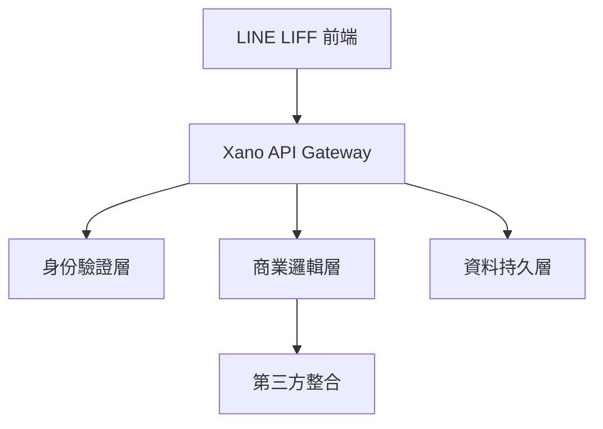
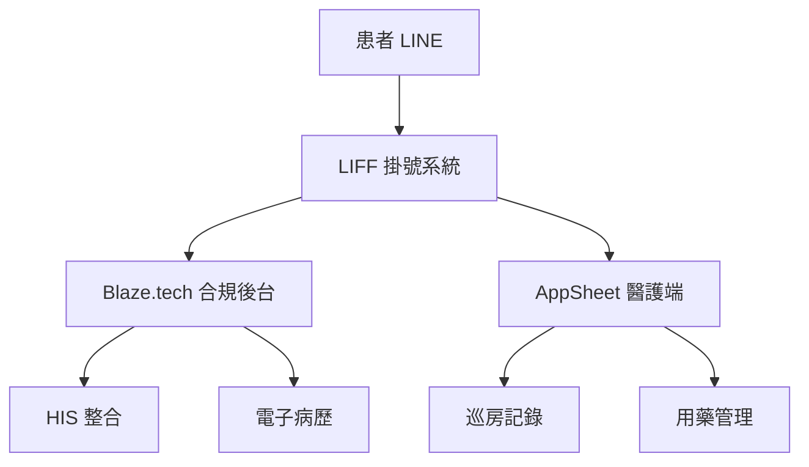
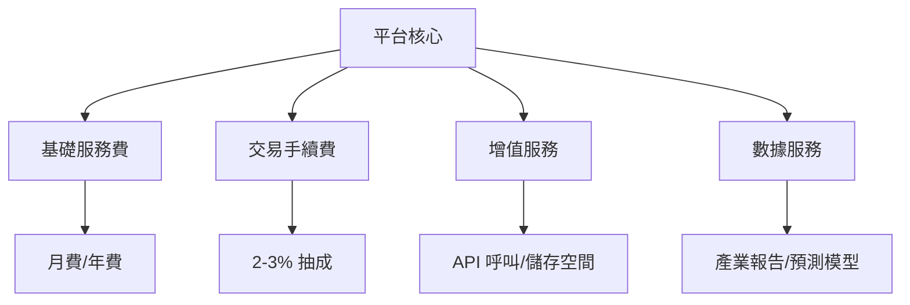
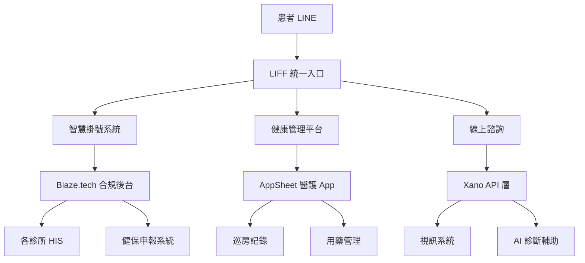
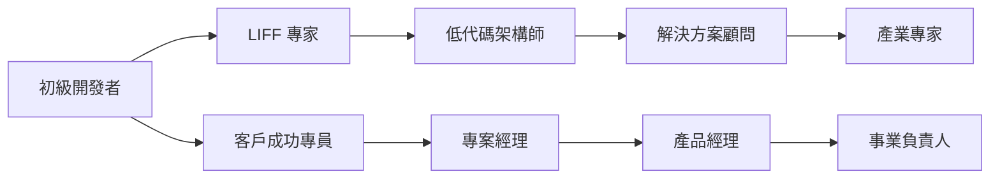

# LINE LIFF × 低代碼平台完全指南 2025：打造百萬商機的終極攻略

> 當低代碼開發市場預計在 2034 年達到 823.7 億美元的驚人規模，而 LINE 在台灣擁有超過 2,100 萬用戶，這兩股力量的結合正在創造前所未有的商業機會。本指南整合了最新的市場趨勢、技術發展和實戰經驗，為你打造從零到百萬營收的完整路線圖。

## 📊 2025 年市場數據速覽

- **低代碼市場規模**：2025 年達 388 億美元，年增長率 32.2%
- **企業採用率**：70% 的新應用將使用低代碼技術開發
- **開發效率提升**：比傳統開發快 10 倍，成本降低 70%
- **LINE 台灣滲透率**：超過 90%，日活躍用戶 1,800 萬

## 第一部分：基礎概念與市場機會

### 什麼是 LINE LIFF？

LINE LIFF（LINE Front-end Framework）是 LINE 提供的前端框架平台，讓開發者能在 LINE 聊天室內直接運行網頁應用程式。

**2025 最新功能更新：**
- LIFF v2.26：支援更多原生功能
- Pluggable SDK：可減少 34% 檔案大小
- 實時相機處理：支援證件掃描等應用
- 改進的自動登入流程
- TypeScript 完整支援

### 低代碼平台新格局

**2025 年低代碼平台分類：**

| 類別 | 代表平台 | 特色 | 適用場景 |
|------|----------|------|----------|
| **通用型** | Bubble, OutSystems | 功能全面 | 各類應用 |
| **企業級** | Creatio, Mendix | CRM/ERP 整合 | 大型企業 |
| **行動優先** | FlutterFlow, Adalo | 原生 App 體驗 | 行動應用 |
| **後端專精** | Xano, Supabase | API 優先 | 複雜邏輯 |
| **現場作業** | AppSheet, TrackVia | 離線功能 | 工業應用 |
| **合規特化** | Blaze.tech | 內建合規 | 金融醫療 |

## 第二部分：15 大低代碼平台 × LINE LIFF 深度剖析

### 1. **Bubble** - 全能型開發平台
**技術規格：**
- 視覺化邏輯設計器
- 內建資料庫（PostgreSQL）
- 原生 API 支援
- 支援自訂程式碼

**LIFF 整合優勢：**
```javascript
// Bubble 內建的 LINE LIFF 整合
bubble_fn_liff_init = function() {
    liff.init({
        liffId: bubble_fn_text(properties.liff_id)
    }).then(() => {
        if (liff.isLoggedIn()) {
            liff.getProfile().then(profile => {
                bubble_fn_trigger_event('profile_loaded', {
                    userId: profile.userId,
                    displayName: profile.displayName
                });
            });
        }
    });
}
```

**商業案例：美容連鎖「美麗新世界」**
- 20 間分店統一預約系統
- 開發時間：3 週
- 成本：25 萬
- ROI：6 個月回本，年省人力 150 萬

### 2. **Xano** - 無代碼後端霸主
**技術規格：**
- GraphQL/REST API 自動生成
- 內建身份驗證系統
- 檔案儲存與 CDN
- 支援複雜的商業邏輯

**最佳實踐架構：**


### 3. **FlutterFlow** - 跨平台應用開發
**獨特優勢：**
- 一次開發，多平台部署
- 可匯出原生 Flutter 程式碼
- 支援離線功能
- 豐富的動畫效果

**雙軌運行策略：**
1. LIFF 版本：輕量級，快速存取
2. 原生 App：完整功能，推播通知

### 4. **Creatio** - 企業級 CRM 解決方案
**年營收成長：50%+**

**企業應用場景：**
- B2B 銷售管理平台
- 客戶生命週期管理
- 行銷自動化引擎
- 服務工單系統

### 5. **AppSheet (Google)** - 現場作業神器
**核心特色：**
- 與 Google Workspace 深度整合
- 強大的離線功能
- 條碼/QR Code 掃描
- GPS 定位追蹤

**製造業應用案例：**
```javascript
// 設備巡檢流程
function equipmentInspection() {
    // 1. 掃描設備 QR Code
    const equipmentId = AppSheet.scanQRCode();
    
    // 2. 載入檢查清單
    const checklist = AppSheet.loadChecklist(equipmentId);
    
    // 3. 離線資料同步
    AppSheet.syncOfflineData();
    
    // 4. 透過 LIFF 發送異常通知
    if (hasAbnormality) {
        liff.sendMessages([{
            type: 'text',
            text: `設備 ${equipmentId} 發現異常，請立即處理！`
        }]);
    }
}
```

### 6. **Blaze.tech** - 合規產業首選
**合規認證：**
- SOC 2 Type II
- HIPAA（醫療）
- PCI DSS（金融）
- ISO 27001

**金融保險應用：**
- 線上投保流程
- 理賠申請追蹤
- KYC 身份驗證
- 風險評估系統

### 7. **Adalo** - 行動應用快速開發
**特色功能：**
- 原生推播通知
- 動態清單與篩選
- 自訂動作與觸發器
- 第三方服務整合

### 8. **UI Bakery** - 內部工具專家
**適用場景：**
- 管理儀表板
- 數據分析平台
- 內部審批系統
- 營運監控中心

### 9. **Retool** - 開發者友善平台
**技術優勢：**
- 支援 SQL 查詢
- JavaScript 自訂邏輯
- 40+ 資料源連接器
- Git 版本控制

### 10. **Glide** - 試算表驅動開發
**快速原型利器：**
- Google Sheets 即時同步
- 5 分鐘建立 MVP
- 適合非技術人員
- 成本極低

### 11. **OutSystems** - 企業級低代碼領導者
**大型專案首選：**
- 完整的生命週期管理
- 企業級安全性
- 可擴展架構
- 24/7 技術支援

### 12. **Mendix** - SAP 生態系整合
**ERP 整合專家：**
- SAP 預建連接器
- 企業流程自動化
- 多租戶架構
- DevOps 工具鏈

### 13. **ServiceNow App Engine** - IT 服務管理
**ITSM 整合：**
- 事件管理自動化
- 變更管理流程
- 資產管理系統
- SLA 監控

### 14. **Zoho Creator** - 中小企業全方位
**整合優勢：**
- Zoho 生態系整合
- 合理的價格方案
- 豐富的模板庫
- 多語言支援

### 15. **Caspio** - 資料庫應用平台
**資料管理專長：**
- 視覺化資料庫設計
- 複雜報表生成
- 資料匯入匯出
- API 開放平台

## 第三部分：產業別最佳實踐方案

### 🏥 醫療產業解決方案

**推薦組合：LINE LIFF + Blaze.tech + AppSheet**

**系統架構：**


**關鍵功能實現：**
1. **智慧掛號系統**
   - AI 症狀初篩
   - 醫師推薦算法
   - 即時候診通知

2. **遠距醫療平台**
   - 視訊看診整合
   - 電子處方箋
   - 藥品配送追蹤

3. **健康管理助手**
   - 慢性病追蹤
   - 用藥提醒
   - 健檢報告解讀

**合規要點：**
- 病歷資料加密儲存
- 稽核軌跡完整記錄
- 符合衛福部遠距醫療規範

### 🏭 製造業智慧工廠

**推薦組合：LINE LIFF + UI Bakery + AppSheet + Xano**

**四層架構設計：**
1. **現場層**：AppSheet 離線巡檢
2. **通訊層**：LIFF 即時通知
3. **管理層**：UI Bakery 監控儀表板
4. **資料層**：Xano API 整合

**實際案例：「智造科技」導入成果**
- 設備稼動率提升 25%
- 維修響應時間縮短 60%
- 品質異常減少 40%
- 年節省成本 500 萬

### 🛍️ 新零售 O2O 體驗

**推薦組合：LINE LIFF + Bubble + FlutterFlow**

**全通路整合方案：**
```javascript
// 智慧零售客戶旅程
class SmartRetailJourney {
    // 線上瀏覽
    async browseProducts() {
        const recommendations = await AI.getPersonalizedProducts(userId);
        return LIFF.displayProducts(recommendations);
    }
    
    // AR 試穿
    async virtualTryOn(productId) {
        const arSession = await FlutterFlow.startARSession();
        return arSession.tryProduct(productId);
    }
    
    // 門市庫存查詢
    async checkStoreInventory(productId, location) {
        const stores = await Bubble.getNearbyStores(location);
        return stores.map(store => store.checkStock(productId));
    }
    
    // 一鍵購買
    async quickPurchase(items) {
        const order = await Bubble.createOrder(items);
        const payment = await LINE_Pay.process(order.total);
        await LIFF.sendOrderConfirmation(order);
        return order;
    }
}
```

### 🎓 教育科技創新

**推薦組合：LINE LIFF + Adalo + Creatio**

**智慧教育生態系：**
1. **學生端（LIFF + Adalo）**
   - 互動式學習內容
   - 遊戲化成就系統
   - 即時測驗回饋
   - 學習社群互動

2. **教師端（Creatio）**
   - 課程內容管理
   - 學習數據分析
   - 個人化教學建議
   - 家長溝通平台

3. **管理端（UI Bakery）**
   - 全校數據儀表板
   - 資源調配系統
   - 績效評估報告

### 💰 金融科技應用

**推薦組合：LINE LIFF + Creatio + Blaze.tech**

**數位金融服務平台：**

**核心模組：**
1. **智能理財顧問**
   ```python
   # AI 投資組合建議
   def getInvestmentAdvice(user_profile):
       risk_assessment = analyzeRiskTolerance(user_profile)
       market_analysis = getCurrentMarketTrends()
       
       portfolio = AI.generatePortfolio(
           risk_level=risk_assessment,
           market_conditions=market_analysis,
           investment_goals=user_profile.goals
       )
       
       return {
           'recommended_portfolio': portfolio,
           'expected_return': calculateExpectedReturn(portfolio),
           'risk_metrics': assessPortfolioRisk(portfolio)
       }
   ```

2. **快速貸款審核**
   - 線上申請流程
   - AI 信用評估
   - 即時審核結果
   - 數位簽約

3. **保險理賠自動化**
   - 拍照上傳理賠
   - AI 損失評估
   - 快速理賠給付

## 第四部分：技術實戰指南

### 快速開始：3 小時打造第一個應用

**Step 1：環境準備（30 分鐘）**
```bash
# 安裝必要工具
npm install -g @line/liff-cli
npm install -g ngrok

# 建立專案
mkdir my-liff-app && cd my-liff-app
npm init -y
npm install @line/liff express
```

**Step 2：選擇低代碼平台（30 分鐘）**

**決策矩陣：**
| 需求 | 推薦平台 | 原因 |
|------|----------|------|
| 快速 MVP | Glide | 5 分鐘上線 |
| 複雜邏輯 | Bubble | 完整功能 |
| 企業應用 | Creatio | 可擴展性 |
| 行動優先 | FlutterFlow | 原生體驗 |
| 後端 API | Xano | 強大靈活 |

**Step 3：整合開發（2 小時）**

**基礎整合模板：**
```html
<!DOCTYPE html>
<html>
<head>
    <meta name="viewport" content="width=device-width, initial-scale=1.0">
    <title>我的 LIFF 應用</title>
    <script src="https://static.line-scdn.net/liff/edge/2/sdk.js"></script>
</head>
<body>
    <div id="app">
        <!-- 低代碼平台生成的內容 -->
        <iframe id="lowcode-app" src="" style="width:100%; height:100vh; border:none;"></iframe>
    </div>
    
    <script>
        // LIFF 初始化
        window.onload = function() {
            liff.init({
                liffId: 'YOUR_LIFF_ID'
            }).then(() => {
                if (liff.isLoggedIn()) {
                    // 取得用戶資料
                    liff.getProfile().then(profile => {
                        // 傳遞資料給低代碼平台
                        const iframe = document.getElementById('lowcode-app');
                        iframe.src = `https://your-lowcode-app.com?userId=${profile.userId}&name=${profile.displayName}`;
                        
                        // 建立雙向通訊
                        window.addEventListener('message', function(e) {
                            if (e.data.action === 'sendMessage') {
                                liff.sendMessages([{
                                    type: 'text',
                                    text: e.data.message
                                }]);
                            }
                        });
                    });
                } else {
                    liff.login();
                }
            });
        };
    </script>
</body>
</html>
```

### 進階整合技巧

#### 1. 資料同步策略

**即時同步架構：**
```javascript
class DataSyncManager {
    constructor(liffApp, lowCodePlatform) {
        this.liff = liffApp;
        this.platform = lowCodePlatform;
        this.syncQueue = [];
    }
    
    // 雙向資料綁定
    setupTwoWayBinding() {
        // LIFF → 低代碼平台
        this.liff.on('profileUpdate', (data) => {
            this.platform.updateUser(data);
        });
        
        // 低代碼平台 → LIFF
        this.platform.on('dataChange', (data) => {
            this.syncToLIFF(data);
        });
    }
    
    // 離線同步佇列
    async syncToLIFF(data) {
        if (navigator.onLine) {
            await this.liff.updateData(data);
        } else {
            this.syncQueue.push(data);
        }
    }
    
    // 網路恢復時同步
    async syncPendingData() {
        while (this.syncQueue.length > 0) {
            const data = this.syncQueue.shift();
            await this.liff.updateData(data);
        }
    }
}
```

#### 2. 效能優化最佳實踐

**1. Pluggable SDK 使用（減少 34% 大小）**
```javascript
// 只載入需要的模組
import liff from '@line/liff/core';
import getProfile from '@line/liff/get-profile';
import sendMessages from '@line/liff/send-messages';

liff.use(new getProfile());
liff.use(new sendMessages());
```

**2. 懶加載策略**
```javascript
// 動態載入低代碼平台元件
const loadLowCodeComponent = async (componentName) => {
    const module = await import(`./components/${componentName}`);
    return module.default;
};

// 使用 Intersection Observer 實現視窗內載入
const observer = new IntersectionObserver((entries) => {
    entries.forEach(entry => {
        if (entry.isIntersecting) {
            loadLowCodeComponent(entry.target.dataset.component);
        }
    });
});
```

**3. 快取策略**
```javascript
// Service Worker 快取
self.addEventListener('install', (event) => {
    event.waitUntil(
        caches.open('liff-app-v1').then((cache) => {
            return cache.addAll([
                '/',
                '/static/css/main.css',
                '/static/js/app.js',
                '/offline.html'
            ]);
        })
    );
});
```

#### 3. 安全性強化

**多層次安全架構：**
```javascript
class SecurityManager {
    // 1. 輸入驗證
    validateInput(data) {
        const schema = Joi.object({
            userId: Joi.string().alphanum().required(),
            action: Joi.string().valid('view', 'edit', 'delete'),
            data: Joi.object()
        });
        
        return schema.validate(data);
    }
    
    // 2. API 請求簽名
    signRequest(request) {
        const timestamp = Date.now();
        const signature = crypto
            .createHmac('sha256', process.env.API_SECRET)
            .update(`${request.method}${request.url}${timestamp}`)
            .digest('hex');
            
        request.headers['X-Timestamp'] = timestamp;
        request.headers['X-Signature'] = signature;
        
        return request;
    }
    
    // 3. 資料加密
    encryptSensitiveData(data) {
        const cipher = crypto.createCipher('aes-256-cbc', process.env.ENCRYPTION_KEY);
        let encrypted = cipher.update(JSON.stringify(data), 'utf8', 'hex');
        encrypted += cipher.final('hex');
        return encrypted;
    }
}
```

## 第五部分：商業模式與營收策略

### 五大營收模式深度分析

#### 1. SaaS 訂閱制 2.0

**進階定價策略：**

| 方案 | 功能 | 定價 | 附加價值 |
|------|------|------|----------|
| **Starter** | 基礎功能 + 100 用戶 | NT$2,000/月 | 免費遷移服務 |
| **Growth** | + API + 自動化 + 1,000 用戶 | NT$8,000/月 | 專屬客戶成功經理 |
| **Scale** | + 白標 + 無限用戶 | NT$25,000/月 | 優先技術支援 |
| **Enterprise** | 完全客製化 | 客製報價 | SLA 保證 |

**創新收費模式：**
1. **使用量計費**：按 API 呼叫次數
2. **價值計費**：按節省成本的百分比
3. **成果計費**：按達成的 KPI 收費
4. **混合模式**：基礎費 + 使用量

#### 2. 垂直產業解決方案

**高價值產業 TOP 5：**

**1. 醫美產業（市場規模：600 億/年）**
- 平均客單價：30-50 萬/診所
- 關鍵需求：預約管理、會員經營、術後追蹤
- 獨特價值：AI 膚質分析、個人化療程建議

**2. 連鎖餐飲（市場規模：800 億/年）**
- 平均客單價：20-30 萬/年
- 關鍵需求：多店管理、會員整合、數據分析
- 獨特價值：智慧推薦、動態定價

**3. 補教產業（市場規模：1,200 億/年）**
- 平均客單價：50-80 萬/年
- 關鍵需求：招生管理、課程安排、家長溝通
- 獨特價值：學習成效追蹤、個人化教學

**4. 健身產業（市場規模：400 億/年）**
- 平均客單價：15-25 萬/年
- 關鍵需求：會員管理、課程預約、教練排班
- 獨特價值：運動數據分析、飲食建議

**5. 寵物產業（市場規模：300 億/年）**
- 平均客單價：10-20 萬/年
- 關鍵需求：預約美容、健康管理、社群互動
- 獨特價值：寵物健康 AI、走失協尋

#### 3. 平台生態系統

**四層營收模型：**



**生態系營收預測：**
- Year 1：500 萬（100 商家）
- Year 2：2,000 萬（500 商家）
- Year 3：8,000 萬（2,000 商家）

#### 4. 企業數位轉型顧問

**服務套餐：**

**1. 數位健檢（NT$50,000）**
- 現況評估
- 機會分析
- 轉型路線圖

**2. MVP 開發（NT$200,000-500,000）**
- 需求分析
- 原型開發
- 用戶測試

**3. 全面導入（NT$1,000,000+）**
- 系統開發
- 員工培訓
- 持續優化

**4. 長期陪跑（NT$50,000/月）**
- 技術支援
- 功能更新
- 數據分析

#### 5. 技術授權與白標

**授權模式：**
1. **源碼授權**：一次性 300-500 萬
2. **品牌授權**：年費 100-200 萬
3. **技術授權**：按營收 5-10%
4. **區域代理**：加盟費 + 分潤

### 成本結構優化

**智慧成本管理：**

| 成本項目 | 傳統模式 | 優化後 | 節省 |
|----------|----------|---------|------|
| 開發人力 | 60% | 30% | 50% |
| 平台費用 | 10% | 5% | 50% |
| 行銷獲客 | 20% | 15% | 25% |
| 營運支援 | 10% | 10% | 0% |
| **毛利率** | **40%** | **60%** | **+50%** |

## 第六部分：2025-2026 未來趨勢與機會

### 技術趨勢預測

#### 1. AI 原生整合

**AI 驅動的 LIFF 應用：**
```python
class AIEnhancedLIFF:
    def __init__(self):
        self.nlp_engine = NLPEngine()
        self.recommendation_ai = RecommendationAI()
        self.predictive_analytics = PredictiveAnalytics()
    
    async def processUserInput(self, message):
        # 自然語言理解
        intent = await self.nlp_engine.analyze(message)
        
        # 智慧回應生成
        if intent.type == 'product_inquiry':
            products = await self.recommendation_ai.suggest(
                user_profile=intent.user,
                context=intent.context
            )
            return self.generateProductCards(products)
        
        # 預測性行動
        elif intent.type == 'service_request':
            prediction = await self.predictive_analytics.forecast(
                user_behavior=intent.user.history,
                request_type=intent.request
            )
            return self.proactiveServiceOffer(prediction)
```

#### 2. Web3 與區塊鏈應用

**去中心化會員系統：**
- NFT 會員卡
- 智能合約忠誠度計劃
- 跨平台積分互通
- DeFi 支付整合

#### 3. 空間計算與 AR/VR

**沉浸式購物體驗：**
- AR 虛擬試穿
- VR 展廳瀏覽
- 3D 產品展示
- 空間定位服務

#### 4. 邊緣運算優化

**5G + 邊緣運算：**
- 毫秒級響應
- 本地資料處理
- 降低延遲 90%
- 提升隱私保護

### 新興市場機會

#### 1. 銀髮經濟（市場規模：2,000 億）
**解決方案：**
- 簡化介面設計
- 語音操作支援
- 健康監測整合
- 緊急通報系統

#### 2. 永續發展（ESG）
**應用場景：**
- 碳足跡追蹤
- 循環經濟平台
- 綠色積分系統
- 永續報告自動化

#### 3. 元宇宙商務
**創新應用：**
- 虛擬商店
- 數位分身客服
- NFT 商品
- 虛實整合體驗

#### 4. 智慧城市服務
**公共服務數位化：**
- 市民服務一站通
- 智慧停車系統
- 公共設施預約
- 災害應變通報

## 第七部分：實戰案例集

### 成功案例一：「智慧診所聯盟」醫療數位轉型

**背景挑戰：**
- 50 間診所聯盟
- 預約系統各自為政
- 病歷資料無法互通
- 醫護人力短缺

**解決方案：**
- **技術組合**：LIFF + Blaze.tech + AppSheet + Xano
- **開發時間**：12 週
- **總投資**：280 萬

**系統架構：**


**創新功能：**

1. **AI 預診系統**
```python
def ai_pre_diagnosis(symptoms):
    # 症狀分析
    symptom_vector = nlp_model.encode(symptoms)
    
    # 疾病預測
    predictions = disease_model.predict(symptom_vector)
    
    # 科別推薦
    department = recommend_department(predictions)
    
    # 醫師配對
    doctor = match_doctor(department, patient_history)
    
    return {
        'possible_conditions': predictions[:3],
        'recommended_department': department,
        'suggested_doctor': doctor,
        'urgency_level': calculate_urgency(predictions)
    }
```

2. **智慧藥物管理**
- 用藥提醒推播
- 藥物交互作用警示
- 慢性處方箋自動續領
- 藥局配送追蹤

**成效數據：**
- 看診效率提升 45%
- 病患等待時間減少 60%
- 醫護行政工作減少 70%
- 年度營收成長 35%

### 成功案例二：「美食王國」連鎖餐飲革新

**背景挑戰：**
- 200 間加盟店
- 會員資料分散
- 行銷活動難以統一
- 食材管理混亂

**解決方案：**
- **技術組合**：LIFF + Bubble + FlutterFlow + Creatio
- **開發時間**：8 週
- **總投資**：180 萬

**多層次系統設計：**

1. **顧客端（LIFF + Bubble）**
```javascript
// 智慧點餐系統
class SmartOrderingSystem {
    async recommendMenu(userId) {
        const userPreferences = await getUserPreferences(userId);
        const orderHistory = await getOrderHistory(userId);
        const currentWeather = await getWeatherData();
        const timeOfDay = new Date().getHours();
        
        // AI 推薦邏輯
        const recommendations = await AI.recommendDishes({
            preferences: userPreferences,
            history: orderHistory,
            weather: currentWeather,
            time: timeOfDay
        });
        
        return recommendations;
    }
    
    async processGroupOrder(groupId) {
        const members = await getGroupMembers(groupId);
        const preferences = await Promise.all(
            members.map(m => getUserPreferences(m.id))
        );
        
        // 團體點餐優化
        return optimizeGroupOrder(preferences);
    }
}
```

2. **門市端（FlutterFlow）**
- 即時訂單管理
- 庫存自動更新
- 員工排班系統
- 營業數據分析

3. **總部端（Creatio）**
- 全國營運儀表板
- 供應鏈管理
- 行銷活動管理
- 加盟商管理

**創新行銷功能：**

1. **遊戲化集點**
```javascript
// 趣味集點系統
const gamificationSystem = {
    // AR 集點遊戲
    async scanARMarker(markerId) {
        const points = calculatePoints(markerId);
        const badges = checkNewBadges(userId, points);
        
        if (badges.length > 0) {
            await sendLineNotification({
                type: 'flex',
                altText: '恭喜獲得新徽章！',
                contents: createBadgeFlexMessage(badges)
            });
        }
        
        return { points, badges, nextReward };
    },
    
    // 社交挑戰
    async createChallenge(challengeData) {
        const challenge = await Challenge.create(challengeData);
        await inviteFriends(challenge.id);
        return setupLeaderboard(challenge);
    }
};
```

2. **動態定價引擎**
- 根據時段調整價格
- 天氣連動優惠
- 庫存清理特價
- 個人化折扣

**營運成效：**
- 會員成長率 180%
- 平均客單價提升 40%
- 食材浪費減少 50%
- 加盟店滿意度 92%

### 成功案例三：「未來學院」教育科技平台

**背景挑戰：**
- 傳統補習班轉型
- 少子化衝擊
- 線上教育競爭
- 家長參與度低

**解決方案：**
- **技術組合**：LIFF + Adalo + UI Bakery + Xano
- **開發時間**：10 週
- **總投資**：220 萬

**三端整合架構：**

1. **學生學習端**
```python
class AdaptiveLearningEngine:
    def __init__(self):
        self.knowledge_graph = KnowledgeGraph()
        self.learning_path_ai = LearningPathAI()
        
    async def generatePersonalizedPath(self, student_id):
        # 分析學習風格
        learning_style = await self.analyzeLearningStyle(student_id)
        
        # 評估知識缺口
        knowledge_gaps = await self.assessKnowledgeGaps(student_id)
        
        # 生成個人化路徑
        path = self.learning_path_ai.generate(
            style=learning_style,
            gaps=knowledge_gaps,
            goals=student.learning_goals
        )
        
        # 動態調整難度
        path.difficulty = self.adaptiveDifficulty(
            current_performance=student.performance,
            target_challenge=0.7  # 70% 成功率最佳
        )
        
        return path
```

2. **教師教學端**
- AI 助教功能
- 自動批改系統
- 學習分析報告
- 互動教材製作

3. **家長監護端**
- 即時進度追蹤
- 學習成效視覺化
- 親師溝通平台
- 教育資源分享

**特色功能展示：**

1. **AI 作業批改**
```javascript
// 智慧批改系統
async function gradeAssignment(submission) {
    const results = {
        score: 0,
        feedback: [],
        suggestions: []
    };
    
    // 不同題型批改邏輯
    for (const answer of submission.answers) {
        switch (answer.type) {
            case 'multiple_choice':
                results.score += gradeMultipleChoice(answer);
                break;
                
            case 'essay':
                const essayAnalysis = await AI.analyzeEssay(answer.content);
                results.score += essayAnalysis.score;
                results.feedback.push(essayAnalysis.feedback);
                results.suggestions.push(...essayAnalysis.improvements);
                break;
                
            case 'math_problem':
                const mathResult = await analyzeMathSteps(answer);
                results.score += mathResult.score;
                if (mathResult.errors.length > 0) {
                    results.feedback.push(generateMathFeedback(mathResult));
                }
                break;
        }
    }
    
    // 生成個人化建議
    results.nextSteps = await generateLearningRecommendations(
        submission.studentId,
        results
    );
    
    return results;
}
```

2. **互動式虛擬教室**
- 3D 虛擬教室
- 即時互動白板
- 分組討論室
- 遊戲化學習

**教育成效：**
- 學習成效提升 55%
- 學生續班率 90%
- 家長滿意度 95%
- 教師工作效率提升 40%

## 第八部分：風險管理與永續經營

### 技術風險管理 2.0

#### 1. 平台依賴風險緩解

**多平台策略：**
```javascript
// 平台抽象層設計
class PlatformAbstractionLayer {
    constructor() {
        this.platforms = {
            primary: new BubbleAdapter(),
            secondary: new XanoAdapter(),
            backup: new CustomCodeAdapter()
        };
    }
    
    async executeFunction(functionName, params) {
        try {
            // 優先使用主平台
            return await this.platforms.primary[functionName](params);
        } catch (primaryError) {
            console.warn('Primary platform failed:', primaryError);
            
            try {
                // 自動切換到備用平台
                return await this.platforms.secondary[functionName](params);
            } catch (secondaryError) {
                // 最後使用自建系統
                return await this.platforms.backup[functionName](params);
            }
        }
    }
}
```

#### 2. 資安防護升級

**零信任架構：**
```python
class ZeroTrustSecurity:
    def authenticate_request(self, request):
        # 1. 設備驗證
        if not self.verify_device(request.device_id):
            raise SecurityException("Unknown device")
            
        # 2. 用戶身份驗證
        user = self.verify_user_identity(request.user_token)
        
        # 3. 行為分析
        if self.detect_anomaly(user, request):
            self.trigger_mfa(user)
            
        # 4. 權限檢查
        if not self.check_permissions(user, request.resource):
            raise SecurityException("Insufficient permissions")
            
        # 5. 資料加密
        request.data = self.encrypt_sensitive_data(request.data)
        
        return True
```

#### 3. 效能監控與優化

**智慧效能管理：**
```javascript
// 自動效能優化系統
class PerformanceOptimizer {
    constructor() {
        this.metrics = new MetricsCollector();
        this.analyzer = new PerformanceAnalyzer();
        this.optimizer = new AutoOptimizer();
    }
    
    async monitorAndOptimize() {
        // 收集效能指標
        const metrics = await this.metrics.collect({
            responseTime: true,
            errorRate: true,
            throughput: true,
            resourceUsage: true
        });
        
        // 分析瓶頸
        const bottlenecks = this.analyzer.identify(metrics);
        
        // 自動優化
        for (const bottleneck of bottlenecks) {
            switch (bottleneck.type) {
                case 'slow_query':
                    await this.optimizer.optimizeQuery(bottleneck.query);
                    break;
                case 'memory_leak':
                    await this.optimizer.fixMemoryLeak(bottleneck.component);
                    break;
                case 'api_throttling':
                    await this.optimizer.implementCaching(bottleneck.endpoint);
                    break;
            }
        }
    }
}
```

### 法規遵循全攻略

#### 產業別合規要求

| 產業 | 主要法規 | 關鍵要求 | 解決方案 |
|------|----------|----------|----------|
| **醫療** | 醫療法、個資法 | 病歷保存、醫師驗證 | Blaze.tech + 加密儲存 |
| **金融** | 金管會規範 | KYC、AML、交易記錄 | Creatio + 區塊鏈 |
| **教育** | 兒少保護法 | 家長同意、內容審查 | 年齡驗證 + 內容過濾 |
| **電商** | 消保法 | 七天鑑賞、退換貨 | 自動化退貨流程 |

### 永續經營策略

#### 1. 技術債務管理

**預防性維護計劃：**
- 每季程式碼審查
- 自動化測試覆蓋率 > 80%
- 技術債務指標追蹤
- 定期重構排程

#### 2. 團隊培育計劃

**人才發展路徑：**


#### 3. 客戶成功體系

**客戶生命週期管理：**
1. **Onboarding（0-30 天）**
   - 專人導入支援
   - 教育訓練課程
   - 快速成功案例

2. **Adoption（30-90 天）**
   - 使用數據分析
   - 優化建議
   - 功能擴展

3. **Expansion（90+ 天）**
   - 升級方案建議
   - 新功能搶先體驗
   - 推薦獎勵計劃

4. **Advocacy（180+ 天）**
   - 案例分享
   - 共同行銷
   - 策略夥伴

## 第九部分：執行藍圖 - 從 0 到 1000 萬營收

### Phase 1：產品驗證期（0-3 個月）

**目標：**
- 完成 MVP 開發
- 獲得 10 個付費客戶
- 月營收 10 萬

**關鍵行動：**
```markdown
Week 1-2: 市場研究
□ 選定目標產業（建議：美容/餐飲）
□ 訪談 20 個潛在客戶
□ 競品分析報告
□ 確定核心價值主張

Week 3-4: MVP 開發
□ 選擇低代碼平台組合
□ 開發核心功能（預約/會員/支付）
□ 建立 LIFF 整合
□ 內部測試與優化

Week 5-8: 客戶獲取
□ 建立銷售簡報
□ 免費試用方案
□ 早鳥優惠定價
□ 取得首批付費客戶

Week 9-12: 產品迭代
□ 收集客戶回饋
□ 功能優化更新
□ 建立客服體系
□ 準備規模化
```

### Phase 2：成長加速期（3-6 個月）

**目標：**
- 50 個付費客戶
- 月營收 50 萬
- 建立可複製模式

**成長策略：**
1. **產品策略**
   - 開發第二個垂直解決方案
   - API 開放平台
   - 行動 App 版本

2. **銷售策略**
   - 建立銷售團隊（2-3 人）
   - 合作夥伴計劃
   - 推薦獎勵機制

3. **行銷策略**
   - 內容行銷（部落格、影片）
   - 社群經營（FB、LINE 社群）
   - 線上研討會

### Phase 3：規模擴張期（6-12 個月）

**目標：**
- 200 個付費客戶
- 月營收 200 萬
- 團隊規模 10 人

**擴張計劃：**
```python
# 自動化銷售漏斗
class SalesFunnel:
    stages = [
        'awareness',      # 內容行銷、廣告
        'interest',       # 免費資源下載
        'consideration',  # 產品 Demo
        'intent',         # 免費試用
        'evaluation',     # 客製化提案
        'purchase'        # 成交
    ]
    
    def optimize_conversion(self, stage):
        if stage == 'awareness':
            return self.content_marketing_automation()
        elif stage == 'interest':
            return self.lead_nurturing_campaign()
        elif stage == 'consideration':
            return self.automated_demo_booking()
        # ... 其他階段優化
```

### Phase 4：市場領導期（12+ 個月）

**目標：**
- 500+ 付費客戶
- 月營收 500 萬+
- 產業領導地位

**戰略布局：**
1. **橫向擴張**
   - 新產業解決方案
   - 國際市場（東南亞）
   - 企業級客戶

2. **縱向整合**
   - 收購互補技術
   - 策略投資
   - 生態系建設

3. **創新研發**
   - AI 實驗室
   - 區塊鏈應用
   - 元宇宙布局

## 第十部分：資源工具包

### 開發者工具箱

**必備工具清單：**
```yaml
開發環境:
  IDE: 
    - VS Code (免費)
    - Cursor (AI 輔助)
  版本控制:
    - Git + GitHub
    - GitLab (CI/CD)
  API 測試:
    - Postman
    - Insomnia

低代碼平台帳號:
  免費試用:
    - Bubble (14 天)
    - Glide (免費版)
    - Appsmith (開源)
  付費訂閱:
    - Xano ($99/月起)
    - FlutterFlow ($30/月起)
    - Creatio (聯繫報價)

LINE 開發資源:
  官方文件:
    - LINE Developers
    - LIFF Playground
  SDK 與工具:
    - @line/liff
    - LIFF CLI
    - LINE Bot Designer

監控與分析:
  效能監控:
    - Google Analytics
    - Sentry
  用戶分析:
    - Mixpanel
    - Amplitude
```

### 商業資源

**必讀資料：**
1. LINE 官方文件（繁中版）
2. 各低代碼平台教學資源
3. 產業研究報告
4. 競品分析工具

**社群資源：**
- LINE 開發者社群（Facebook）
- 低代碼開發者論壇
- 產業交流群組
- 定期線下聚會

### 法律文件模板

**基礎合約範本：**
1. 服務合約書
2. 保密協議（NDA）
3. 個資使用同意書
4. SLA 服務水準協議
5. 智慧財產權協議

### 財務規劃工具

**營收預測模型：**
```excel
=== SaaS 營收預測公式 ===
MRR (月經常性收入) = 客戶數 × ARPU (每用戶平均收入)
ARR (年經常性收入) = MRR × 12
CAC (客戶獲取成本) = 總行銷費用 ÷ 新客戶數
LTV (客戶終身價值) = ARPU × 客戶平均生命週期
LTV:CAC 比率 = LTV ÷ CAC (目標 > 3:1)
```

## 結語：開啟你的百萬商機之旅

在這個數位轉型的關鍵時刻，LINE LIFF 與低代碼平台的結合為台灣的創業者和開發者提供了前所未有的機遇。透過本指南，你已經掌握了：

✅ **15 個低代碼平台的深度剖析**
✅ **8 大產業的應用場景與解決方案**
✅ **5 種經過驗證的商業模式**
✅ **從 0 到 1000 萬的執行藍圖**
✅ **完整的技術實作指南**
✅ **風險管理與合規策略**

**記住成功的三大關鍵：**
1. **選對市場**：深耕一個你了解的產業
2. **快速迭代**：用 MVP 驗證，快速調整
3. **價值優先**：專注解決真實的商業問題

**立即行動：**
1. 下載本指南的實作範例程式碼
2. 選擇一個低代碼平台開始免費試用
3. 在 LINE Developers 建立你的第一個 LIFF App
4. 找到 3 個潛在客戶進行訪談
5. 30 天內推出你的 MVP

這不只是一個技術趨勢，更是一個改變遊戲規則的商業機會。當別人還在觀望時，你已經可以開始行動。

**加入我們的社群：**
- LINE 社群：@liff-lowcode-tw
- Discord：[邀請連結]
- 每月實體聚會：台北/台中/高雄

讓我們一起，用 LINE LIFF 與低代碼平台，打造屬於台灣的數位奇蹟！

---

*本指南持續更新中，歡迎提供意見與回饋。*

**版權聲明：** 本指南採用 CC BY-NC-SA 4.0 授權，歡迎非商業分享。

**最後更新：** 2025 年 6 月 12 日

**作者團隊：** LINE LIFF 低代碼創新實驗室

**特別感謝：** 所有提供案例的企業夥伴與社群貢獻者