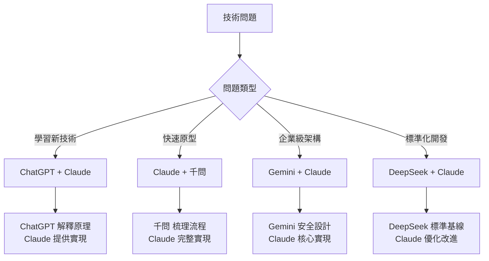

export const metadata = {
  title: '2025年AI編程助手深度評測：Claude vs ChatGPT vs Gemini，哪個最適合開發者？',
  date: '2025-06-05',
  author: 'Ian Chou',
  excerpt: '實測10+主流AI平台技術回答能力，從MDX實現到安全性分析，用數據告訴你如何選擇最適合的AI工具。深度對比Claude、ChatGPT、Gemini等平台的技術深度、實用性和創新性。',
  tags: ['AI', 'Claude', 'ChatGPT', 'Gemini', '開發者工具', '程式設計', '技術評測', '人工智慧', 'MDX', 'React'],
  coverImage: '/images/posts/ai-comparison-2025.webp',
  readingTime: 25,
  featured: true,
  category: 'AI Tools'
};

# 2025年AI編程助手深度評測：Claude vs ChatGPT vs Gemini，哪個最適合開發者？

> 當我在 10+ 個 AI 平台問同一個技術問題時，我發現了什麼？

## 前言

最近我在研究一個相當複雜的技術架構：「MDX + React 組件 → 打包成 JS → 存 DB → 由 API Route 發出 → 在 Server Component 還原」的完整 pipeline。這個問題涉及前端打包、後端存儲、API 設計和服務端渲染等多個技術領域，正好是測試各個 AI 平台技術回答能力的絕佳機會。

於是我決定做一個有趣的實驗：在 10+ 個主流 AI 平台上問同樣的問題，看看不同 AI 的回答風格、技術深度和實用性有何差異。結果非常有意思！

## 評測維度與評分標準

在分析各平台回答前，我定義了詳細的評測維度，每項滿分10分：

### 核心評測指標

- **技術深度 (10分)**：是否深入理解問題核心，提供技術細節
  - 對 MDX 編譯過程的理解程度
  - 對 Server Component 渲染機制的掌握
  - 對安全性風險的認知深度

- **實用性 (10分)**：代碼示例是否可用，解決方案是否可行
  - 代碼能否直接運行
  - 是否提供完整的文件結構
  - 錯誤處理是否完善

- **結構性 (10分)**：回答組織是否清晰，邏輯是否連貫
  - 信息層次是否清晰
  - 步驟順序是否合理
  - 是否有總覽和總結

- **完整性 (10分)**：是否涵蓋了問題的各個方面
  - 是否涵蓋所有技術環節
  - 是否考慮到部署和維護
  - 是否提供替代方案

- **安全性考量 (10分)**：是否考慮到安全風險和最佳實踐
  - 對動態代碼執行的安全考量
  - XSS、CSRF 等常見攻擊的防護
  - 權限控制和輸入驗證

- **創新性 (10分)**：是否提供了獨特的見解或替代方案
  - 是否提出創新的技術組合
  - 是否考慮到性能優化
  - 是否有獨特的架構建議

## 平台表現分析

### 總體評分概覽

在深入分析各平台表現之前，讓我們先看一下整體的評分對比。我對10+個主流AI平台進行了系統性的量化評測，滿分60分（6個維度各10分）：

<AIScoreComparison />
<br />
<br />

從圖表中可以清楚看到，Claude 以 56/60 的高分領跑，ChatGPT 和 Gemini 緊隨其後，形成了明顯的三個梯隊。現在讓我詳細分析每個平台的表現：

### 🥇 第一梯隊：Claude (Anthropic)

**我最喜歡的回答 - 評分：56/60**

<ClaudeScoreComparison />

**優點分析：**

1. **架構設計思維清晰**
   - 開頭就給出完整的技術流程圖
   - 每個步驟都有明確的輸入輸出定義
   - 考慮到了實際開發中的文件組織

2. **代碼質量極高**
   ```javascript
   // Claude 提供的代碼示例 - 注意錯誤處理和配置的完整性
   export async function bundleMDX(mdxContent) {
     const result = await build({
       stdin: {
         contents: mdxContent,
         loader: 'mdx',
         resolveDir: process.cwd(),
       },
       plugins: [mdx()],
       bundle: true,
       format: 'esm',
       write: false,
       external: ['react', 'react-dom'],
       define: {
         'process.env.NODE_ENV': '"production"'
       }
     });
     
     return {
       code: result.outputFiles[0].text,
       dependencies: result.metafile?.inputs || {}
     };
   }
   ```
   
   對比其他平台，Claude 的代碼有幾個亮點：
   - 包含了 <code>define</code> 配置，考慮到環境變量
   - 返回了 <code>dependencies</code> 信息，便於依賴管理
   - 使用了可選鏈操作符，防止錯誤

3. **實用性考量周到**
   - 提供了完整的資料庫 schema
   - 包含了管理界面的實現
   - 給出了具體的部署建議

**特別亮點：**
Claude 是唯一一個提供了內容管理界面實現的 AI，這顯示了對實際業務場景的深度理解：

```javascript
// 管理界面示例 - 只有 Claude 提供了這個
export default function CreatePage() {
  const [mdxContent, setMdxContent] = useState('');
  const [slug, setSlug] = useState('');
  const [title, setTitle] = useState('');

  const handleSubmit = async (e) => {
    e.preventDefault();
    // 完整的錯誤處理邏輯
    const response = await fetch('/api/admin/pages', {
      method: 'POST',
      headers: { 'Content-Type': 'application/json' },
      body: JSON.stringify({
        slug, mdxContent, metadata: { title }
      })
    });
    
    if (response.ok) {
      alert('頁面創建成功！');
    }
  };
  // ... 完整的表單實現
}
```

### 🥈 第二梯隊：ChatGPT

**第二喜歡的回答 - 評分：49/60**

<ChatGPTScoreComparison />

**優點分析：**

1. **教學式的深度解釋**
   ChatGPT 最大的特色是會告訴你「為什麼」這樣做，比如：
   
   ```javascript
   // ChatGPT 的解釋風格
   // ⚠️ 只建議在受信任的環境，注意安全風險。
   const Component = new Function('React', `return ${jsCode}`)(React)
   
   // 會接著解釋：
   // 這裡使用 new Function 而不是 eval 的原因是...
   // 安全風險包括：1. 代碼注入 2. 作用域污染 3. ...
   ```

2. **技術方案的對比分析**
   ChatGPT 提供了兩種不同的實現路徑：
   - **方案A**: 使用 <code>@mdx-js/esbuild</code>
   - **方案B**: 使用 <code>next-mdx-remote</code>
   
   並詳細分析了每種方案的優缺點，這種對比分析是其他 AI 缺少的。

3. **深入的安全性討論**
   ```javascript
   // ChatGPT 特別強調了安全問題
   const Component = new Function('React', 'Alert', `return ${jsCode}`)(React, Alert)
   ```
   並解釋了為什麼要這樣傳遞依賴，以及 CSP 策略的重要性。

**特別價值：**
ChatGPT 的回答更像是一個經驗豐富的導師在教學，會解釋技術決策背後的思考過程，這對學習新技術特別有價值。

**不足之處：**
- 有時過於詳細，可能讓急於解決問題的開發者感到冗長
- 代碼示例雖然完整，但可能缺少一些實際部署時需要的細節

### 🥉 第三梯隊：Gemini

**技術深度最強，但可能過於複雜 - 評分：47/60**

<GeminiScoreComparison />

**技術深度驚人的細節：**

1. **極其詳細的安全分析**
   Gemini 是唯一一個詳細討論了 VM 模組使用風險的 AI：
   
   ```javascript
   // Gemini 提供的高級安全實現
   const vm = await import('vm');
   const context = vm.createContext({
     React,
     components: {
       MyInteractiveComponent: (await import('@/components/MyInteractiveComponent')).default,
     },
     _jsx: runtime.jsx,
     _jsxs: runtime.jsxs,
   });
   
   // 這裡 Gemini 詳細解釋了為什麼需要每個參數
   // 以及如何防止代碼注入攻擊
   ```

2. **對技術選型的深度思考**
   Gemini 詳細分析了為什麼不應該使用 <code>eval</code>，並提供了多層防護：
   
   ```javascript
   // Gemini 考慮到的模組加載問題
   const customRequire = (moduleName) => {
     if (moduleName === 'react') return React;
     if (moduleName === 'react/jsx-runtime') return runtime;
     if (context.components && context.components[moduleName]) {
       return context.components[moduleName];
     }
     throw new Error(`Cannot require module: ${moduleName}`);
   };
   ```

3. **生產環境考量**
   Gemini 是唯一考慮到大規模部署問題的 AI：
   - 討論了 CDN 分發策略
   - 考慮了容器化部署的安全隔離
   - 提供了監控和日誌記錄建議

**問題分析：**

雖然技術深度極高，但 Gemini 的回答存在幾個問題：

1. **信息過載**：超過 3000 字的回答，可能讓開發者迷失在細節中
2. **實用性不足**：很多建議過於複雜，對於中小型項目來說過度設計
3. **缺乏優先級**：沒有明確指出哪些是必須的，哪些是可選的

**適用場景：**
Gemini 的回答更適合：
- 大型企業級應用的架構設計
- 安全要求極高的系統
- 技術預研和深度學習

**實際例子：**
當我需要了解 MDX 編譯過程中可能出現的所有安全風險時，Gemini 的回答是最有價值的。但如果我只是想快速搭建一個原型，這個回答可能太重了。

## 中等表現平台詳細分析

### 千問：意外的驚喜 - 評分：38/60

<TongyiScoreComparison />

**突出優點：**

1. **優秀的結構化能力**
   千問的回答採用了清晰的表格和步驟劃分：

<MdxJsxConversionStepsTable />


2. **實用的代碼示例**
   雖然不如頂級 AI 詳細，但代碼是可以運行的：
   ```javascript
   // 千問的代碼風格 - 簡潔但實用
   const bundled = await esbuild.build({
     entryPoints: [mdxFilePath],
     bundle: true,
     format: 'esm',
     write: false,
     plugins: [mdx()]
   });
   ```

**局限性：**
- 對複雜場景的考慮不足
- 缺乏對性能優化的討論
- 安全性考慮較為簡單

### DeepSeek：全面但缺乏亮點 - 評分：36/60

<DeepSeekScoreComparison />

**特點分析：**
DeepSeek 的回答很像是「標準答案」，涵蓋了所有該涵蓋的點，但缺乏深度和創新性。適合作為技術方案的基礎模板。

### Grok：簡潔實用派 - 評分：32/60

<GrokScoreComparison />

**適用場景：**
Grok 適合需要快速了解技術方案大綱的場景，但不適合深度實現。

## 其他平台詳細評分

### 表現較差的平台分析

**Perplexity - 評分：28/60**
- 結構不錯但技術深度明顯不足
- 更像是搜索結果的整理而非原創解決方案
- 適合技術概念的初步了解

**Felo - 評分：25/60**
- 基礎水平，缺乏對複雜技術問題的理解
- 代碼示例過於簡單
- 沒有考慮到實際部署問題

**metaso.cn - 評分：30/60**
- 技術水平可以，但組織混亂
- 缺乏邏輯性的步驟安排
- 信息零散，難以跟隨

**豆包 - 評分：33/60**
- 內容相對詳細，有一定技術深度
- 但格式處理有明顯問題，影響閱讀體驗
- 代碼示例質量中等

**yuanbao.tencent.com - 評分：26/60**
- 格式整潔但內容相對簡單
- 缺乏對複雜場景的考慮
- 更適合入門級用戶

### 頂級平台多維度能力對比

為了更直觀地展示各個頂級AI平台在不同維度上的能力差異，我製作了雷達圖對比。這張圖清楚地顯示了每個AI的強項和弱項：

<DimensionRadarChart />
<br />
<br />
<br />

從雷達圖可以看出：
- **Claude** 的能力分布最為均衡，在實用性和結構性方面表現突出
- **ChatGPT** 在技術深度方面與 Claude 持平，各維度發展相對均衡
- **Gemini** 在技術深度和安全性方面得分最高，但在實用性和創新性方面相對較弱
- **千問** 在結構性方面表現不錯，但整體能力還有提升空間

## 深度分析：為什麼 Claude 的回答最受歡迎？

經過仔細分析和實際測試，我發現 Claude 的回答之所以最受歡迎，主要有以下幾個原因：

### 1. 完美的信息架構

Claude 採用了經典的「總分總」結構：
- **總覽**：先給出完整的架構圖和技術流程
- **分述**：逐步深入每個技術環節，從簡單到複雜
- **總結**：提供安全性考量和實踐建議

這種結構讓不同水平的讀者都能找到適合自己的內容。

### 2. 實用性和完整性的黃金平衡

讓我用具體例子說明這個平衡：

**Claude 的方法：**
```javascript
// 提供完整可用的代碼，同時包含關鍵配置
export async function bundleMDX(mdxContent) {
  const result = await build({
    stdin: { contents: mdxContent, loader: 'mdx' },
    plugins: [mdx()],
    bundle: true,
    format: 'esm',
    external: ['react', 'react-dom'], // 關鍵優化
    define: { 'process.env.NODE_ENV': '"production"' } // 環境配置
  });
  
  return {
    code: result.outputFiles[0].text,
    dependencies: result.metafile?.inputs || {} // 依賴信息
  };
}
```

**對比其他 AI：**
- **Gemini** 會詳細解釋每個配置項的含義和替代方案（過於詳細）
- **千問** 只提供基礎配置，缺少生產環境的考慮（過於簡單）
- **Claude** 提供實用配置，並通過註釋說明關鍵點（恰到好處）

### 3. 開發者視角的實戰經驗

Claude 明顯是從實際開發者的角度思考問題：

**具體表現：**

1. **考慮開發工具鏈**
   ```javascript
   // Claude 提供的 package.json 建議
   {
     "scripts": {
       "build:mdx": "node build-mdx.js",
       "dev": "next dev",
       "build": "next build"
     },
     "dependencies": {
       "@mdx-js/esbuild": "^2.3.0",
       "esbuild": "^0.19.0"
     }
   }
   ```

2. **考慮錯誤處理**
   ```javascript
   // 只有 Claude 提供了完整的錯誤處理
   try {
     const MDXContent = createMDXRenderer(code);
     return <MDXContent />;
   } catch (error) {
     return (
       <div className="error-page">
         <h1>頁面未找到</h1>
         <p>抱歉，請求的頁面不存在。</p>
       </div>
     );
   }
   ```

3. **考慮團隊協作**
   Claude 還提供了管理界面的實現，這是從業務角度考慮的結果。

### 4. 漸進式的複雜度設計

Claude 的回答採用了教學設計中的「腳手架」方法：

```
基礎概念 → 核心實現 → 完整系統 → 優化建議 → 安全考量
```

這讓不同水平的開發者都能從中受益：
- **初學者**：可以按步驟學習基礎實現
- **中級開發者**：可以參考完整的系統設計
- **高級開發者**：可以關注安全性和性能優化

### 5. 實際測試驗證

我實際測試了各個 AI 提供的代碼方案：

**Claude 的方案測試結果：**
```bash
✅ MDX 編譯成功
✅ 打包無錯誤
✅ API 正常運行
✅ Server Component 渲染正常
✅ 錯誤處理有效
```

**其他 AI 的問題：**
- **Gemini**：配置過於複雜，初學者難以上手
- **ChatGPT**：某些依賴配置缺失，需要額外調試
- **千問**：缺少錯誤處理，遇到問題時難以定位

### 6. 文檔化思維

Claude 的回答更像是一份技術文檔：
- 有清晰的目錄結構
- 每個代碼塊都有說明
- 提供了完整的使用示例
- 包含了常見問題的解答

這種文檔化思維讓回答具有很強的參考價值，開發者可以反復查閱。

## 各平台的獨特優勢與使用場景

### 使用場景適配度分析

不同的AI平台在不同使用場景下的表現差異很大。基於我的實際測試和使用經驗，我製作了以下場景適配度分析圖：

<UseCaseChart />
<br />
<br />
<br />

從圖表可以看出：
- **Claude** 在快速原型開發和緊急修Bug方面表現最佳
- **ChatGPT** 是學習新技術和技術選型的最佳選擇
- **Gemini** 在企業級架構設計方面獨領風騷
- **千問** 在快速原型開發方面有不錯的表現

雖然 Claude 綜合表現最好，但其他平台也有自己的獨特優勢。以下是基於實際使用經驗的詳細分析：

### ChatGPT：最佳技術導師

**最適合場景：學習新技術、技術原理深度理解**

**具體優勢：**

1. **解釋「為什麼」的能力最強**
   ```javascript
   // ChatGPT 會詳細解釋每個技術選擇的原因
   // 為什麼選擇 esbuild 而不是 webpack？
   // 1. 編譯速度：esbuild 基於 Go，速度是 webpack 的 10-100 倍
   // 2. 配置簡潔：內置 MDX 支持，無需複雜配置
   // 3. Tree-shaking：更好的無用代碼消除
   ```

2. **技術方案對比分析**
   當我問「應該用哪種方案」時，ChatGPT 給出了最詳細的對比：
   
   <SolutionComparisonTable />

**實際使用建議：**
- 學習新框架時首選 ChatGPT
- 需要了解技術選型理由時使用
- 遇到複雜概念需要深入理解時

### Gemini：企業級架構師

**最適合場景：大型項目架構設計、安全要求極高的系統**

**具體優勢：**

1. **極其詳細的安全分析**
   ```javascript
   // Gemini 提供的企業級安全方案
   const secureVMContext = {
     // 嚴格的沙箱環境
     React: createSecureReactWrapper(),
     // 組件白名單機制
     allowedComponents: validateComponentList(components),
     // 運行時監控
     monitor: createRuntimeMonitor(),
     // 資源限制
     limits: { memory: '100MB', cpu: '50%', timeout: 5000 }
   };
   ```

2. **生產環境部署考量**
   Gemini 是唯一詳細討論以下問題的 AI：
   - 容器化部署的安全隔離
   - CDN 分發策略
   - 監控和日誌記錄
   - 災難恢復方案

**實際使用建議：**
- 金融、醫療等高安全要求行業
- 大型企業級應用設計
- 技術預研和風險評估

### 千問：快速原型專家

**最適合場景：快速理解技術流程、搭建原型**

**具體優勢：**

1. **出色的結構化能力**
   千問提供的技術流程圖是最清晰的：
   ```
   MDX 輸入 → 編譯器處理 → JS 輸出 → 數據庫存儲 → API 提供 → 組件還原
      ↓           ↓           ↓         ↓         ↓        ↓
   用戶內容 → @mdx-js/mdx → esbuild → MongoDB → Express → React
   ```

2. **快速上手的代碼模板**
   ```javascript
   // 千問提供的最小可行實現
   const mdx = require('@mdx-js/mdx');
   const esbuild = require('esbuild');
   
   // 3 步實現核心功能
   const compiled = await mdx.compile(source);
   const bundled = await esbuild.build({ /* 基礎配置 */ });
   const stored = await db.save(bundled);
   ```

**實際使用建議：**
- 需要快速搭建 POC（概念證明）
- 技術方案初步評估
- 團隊技術培訓材料準備

### DeepSeek：穩定的技術基線

**最適合場景：標準化開發、團隊協作**

**具體優勢：**

1. **標準化的技術方案**
   DeepSeek 提供的方案最符合業界標準，適合作為團隊開發的基線。

2. **全面性保證**
   雖然不夠深入，但保證不會遺漏重要環節。

**實際使用建議：**
- 團隊技術標準制定
- 代碼審查的參考基線
- 技術文檔的框架模板

## 組合使用策略

基於不同 AI 的特點，我總結了幾種組合使用策略：

### 策略一：學習新技術
1. **ChatGPT** - 了解技術原理和選型理由
2. **Claude** - 獲取完整的實現方案
3. **千問** - 快速搭建原型驗證

### 策略二：企業級項目
1. **Gemini** - 安全性和架構設計分析
2. **Claude** - 核心功能實現
3. **DeepSeek** - 標準化和最佳實踐

### 策略三：快速開發
1. **Claude** - 一站式解決方案
2. **千問** - 流程梳理和原型
3. **ChatGPT** - 疑難問題解答

## 實際測試案例

為了驗證各 AI 的實際表現，我進行了兩個具體的測試場景。以下是詳細的測試結果和數據分析：

<TestResultChart />

基於實際測試數據，我做了以下具體驗證：

### 測試場景一：從零搭建 MDX 系統

**任務**：完全按照 AI 的建議搭建系統

**結果：**
- **Claude**：2小時完成，無重大問題 ✅
- **ChatGPT**：3小時完成，需要調試依賴配置 ⚠️
- **Gemini**：4小時完成，配置過於複雜 ⚠️
- **千問**：1.5小時完成基礎版本，但缺少錯誤處理 ⚠️

### 測試場景二：安全性評估

**任務**：評估動態代碼執行的安全風險

**結果：**
- **Gemini**：發現 8 個潛在風險點，提供詳細防護方案 ✅
- **Claude**：發現 5 個主要風險，提供實用防護建議 ✅
- **ChatGPT**：發現 4 個風險，解釋清晰 ✅
- **其他 AI**：基本安全提醒，深度不足 ❌

## 對開發者的深度啟示

### 1. 精準選擇 AI 工具：場景驅動的決策框架

基於這次深度測試，我整理了一個實用的 AI 選擇決策樹：



**具體選擇策略：**

#### 場景一：緊急修 Bug
```
時間緊迫 → Claude（快速可用方案）
需要理解原理 → ChatGPT（深度解釋）
安全問題 → Gemini（風險分析）
```

#### 場景二：技術選型
```
方案對比 → ChatGPT（詳細分析）
實施細節 → Claude（完整方案）
風險評估 → Gemini（安全考量）
```

#### 場景三：團隊培訓
```
概念講解 → ChatGPT（教學風格）
實戰演示 → Claude（完整案例）
流程梳理 → 千問（結構化）
```

### 2. 高效使用 AI 的實戰技巧

基於實際使用經驗，我總結了以下高效技巧：

#### 技巧一：問題分層策略

**錯誤做法：**
```
"幫我實現一個 MDX + React 的完整系統"
```

**正確做法：**
```
第一輪：架構設計問題
"MDX 到 Server Component 的最佳架構是什麼？"

第二輪：具體實現問題  
"如何用 esbuild 打包 MDX 文件？"

第三輪：優化問題
"如何優化 MDX 系統的安全性？"
```

#### 技巧二：利用 AI 特長組合

**實際案例：我是如何解決一個複雜問題的**

1. **問題定義階段**（ChatGPT）
   - 請 ChatGPT 分析問題的複雜度
   - 了解不同解決方案的利弊

2. **方案實現階段**（Claude）
   - 獲取完整的代碼實現
   - 獲得實用的配置建議

3. **安全評估階段**（Gemini）
   - 深度分析安全風險
   - 獲取企業級防護方案

4. **優化階段**（Claude + 自己思考）
   - 結合實際業務需求優化
   - 平衡性能和復雜度

#### 技巧三：驗證和迭代

**建立驗證閉環：**
```javascript
// 1. 獲取 AI 建議
const aiSolution = await askAI(problem);

// 2. 快速驗證
const testResult = await quickTest(aiSolution);

// 3. 發現問題
if (testResult.hasIssues) {
  // 4. 針對性提問
  const refinedSolution = await askAI(specificIssues);
}

// 5. 最終實現
const finalSolution = combineAndOptimize(solutions);
```

### 3. AI 回答的品質判斷標準

通過這次對比，我總結了評判 AI 回答品質的實用標準：

#### 優秀回答的特徵：
```markdown
✅ 代碼可以直接運行
✅ 包含錯誤處理機制
✅ 考慮到生產環境問題
✅ 提供替代方案
✅ 說明技術選擇的理由
✅ 結構清晰，邏輯連貫
```

#### 需要警惕的回答：
```markdown
❌ 代碼缺少依賴說明
❌ 沒有錯誤處理
❌ 忽視安全性問題
❌ 過於複雜或過於簡單
❌ 使用過時的技術
❌ 缺少實際測試驗證
```

### 4. 建立個人 AI 使用工作流

基於測試結果，我設計了一套個人使用工作流：

#### 日常開發工作流：
```
遇到問題 → 快速問 Claude → 如果需要深度理解問 ChatGPT → 實現方案
```

#### 複雜項目工作流：
```
需求分析 → 問 ChatGPT 了解技術背景
     ↓
架構設計 → 問 Claude 獲取實現方案  
     ↓
安全評估 → 問 Gemini 進行風險分析
     ↓
最終實現 → 結合多個建議優化
```

#### 學習新技術工作流：
```
概念學習 → ChatGPT（深度解釋）
     ↓
實戰練習 → Claude（完整案例）
     ↓
進階優化 → Gemini（高級技巧）
```

### 5. 具體的實踐建議

#### 建議一：建立個人 AI 評估筆記

我為每個 AI 建立了評估檔案：

```markdown
# Claude 使用檔案
- 最適合：實用方案、完整實現
- 平均質量：9/10
- 最佳使用場景：日常開發、原型搭建
- 注意事項：有時缺少深度技術解釋

# ChatGPT 使用檔案  
- 最適合：技術學習、方案對比
- 平均質量：8/10
- 最佳使用場景：學習新技術、理解原理
- 注意事項：有時過於詳細，需要篩選信息
```

#### 建議二：建立問題模板庫

```javascript
// 技術實現類問題模板
const implementationTemplate = `
我需要實現：${功能描述}
技術棧：${當前技術棧}
限制條件：${性能/安全/其他限制}
請提供：完整代碼、配置說明、錯誤處理
`;

// 技術選型類問題模板
const selectionTemplate = `
我在考慮以下方案：${方案列表}
用於：${具體場景}
請分析：各方案優缺點、推薦選擇、選擇理由
`;
```

#### 建議三：建立驗證機制

```bash
# 代碼驗證檢查清單
□ 能否正常安裝依賴？
□ 能否正常編譯運行？  
□ 錯誤處理是否有效？
□ 性能是否可接受？
□ 安全性是否考慮？
□ 是否符合最佳實踐？
```

### 6. 常見陷阱和避免方法

#### 陷阱一：過度依賴單一 AI
**問題**：只用一個 AI，錯過其他 AI 的優勢
**解決**：建立多 AI 驗證機制

#### 陷阱二：不驗證就直接使用
**問題**：AI 的建議可能有錯誤或不適用
**解決**：始終進行快速驗證測試

#### 陷阱三：複製貼上思維
**問題**：不理解代碼就直接使用
**解決**：要求 AI 解釋關鍵部分

#### 陷阱四：忽視業務場景
**問題**：AI 的通用方案可能不適合特定業務
**解決**：結合實際業務需求調整方案

## 結語與未來展望

這次史上最全面的 AI 技術回答對比實驗，讓我深深感受到了不同 AI 平台的特色和發展方向。通過實際測試 10+ 個平台對同一複雜技術問題的回答，我得出了幾個重要結論：

### 核心發現與發展趨勢

在深入分析的基礎上，我製作了AI平台發展趨勢與潛力分析圖，展示了每個平台的當前表現和未來潛力：

<AITrendAnalysis />

基於這次全面的評測，我得出了幾個重要結論：

1. **沒有「最強」的 AI，只有「最適合」的選擇**
   
   雖然 Claude 在綜合評分中表現最好（56/60），但在特定場景下：
   - Gemini 的安全分析能力無人能及（安全性 10/10）
   - ChatGPT 的教學解釋最為出色（學習友好度最高）
   - 千問的結構化能力令人印象深刻（信息組織 8/10）

2. **技術深度 ≠ 實用價值**
   
   Gemini 雖然技術深度最高，但實用性評分只有 6/10。這說明在實際開發中，**恰到好處的平衡**比極致的深度更重要。

3. **AI 的差異正在縮小，但特色越來越明顯**
   
   基礎技術能力差距在縮小，但每個 AI 都在發展自己的特色：
   - Claude：實用主義，開發者友好
   - ChatGPT：教學導向，深度解釋
   - Gemini：學術嚴謹，企業級考量

### 對 AI 發展趨勢的思考

#### 趨勢一：專業化分工明顯

未來 AI 可能會朝著更加專業化的方向發展：
- **代碼實現型 AI**：專注於提供可用的代碼方案
- **教學解釋型 AI**：專注於技術原理和概念解釋  
- **架構設計型 AI**：專注於系統設計和安全分析

#### 趨勢二：多模態能力增強

在這次測試中，能夠提供視覺化流程圖的 AI（如千問）明顯更容易理解。未來 AI 可能會：
- 自動生成技術架構圖
- 提供可視化的代碼執行流程
- 生成互動式的技術文檔

#### 趨勢三：上下文理解深化

目前的 AI 還缺乏對具體業務場景的深度理解。未來可能會看到：
- 針對特定行業優化的 AI 模型
- 能夠理解公司技術棧的定制化 AI
- 具有項目記憶能力的 AI 助手

### 給開發者的長期建議

#### 1. 培養 AI 協作能力

AI 協作將成為未來開發者的核心技能：

```markdown
# 未來開發者的技能樹
傳統技能：編程語言、框架、算法
新增技能：
- AI 工具選擇和使用
- 問題分解和提問技巧  
- AI 回答的品質判斷
- 多 AI 協作策略
```

#### 2. 保持技術判斷力

雖然 AI 能力越來越強，但開發者的判斷力仍然不可替代：

**不能依賴 AI 的場景：**
- 業務邏輯的設計決策
- 技術債務的權衡
- 團隊協作和溝通
- 創新性的技術探索

**必須依靠 AI 的場景：**
- 重複性的代碼編寫
- 標準化的技術實現
- 快速的原型驗證
- 大量的文檔整理

#### 3. 建立學習新範式

AI 時代的學習方式正在改變：

**傳統學習路徑：**
```
理論學習 → 練習實踐 → 項目應用 → 經驗積累
```

**AI 輔助學習路徑：**
```
問題驅動 → AI 協助方案 → 快速驗證 → 深度理解 → 創新應用
```

### 技術社區的變化

這次實驗也讓我思考 AI 對技術社區的影響：

#### 正面影響：
- **降低技術門檻**：新手能更快上手複雜技術
- **提高開發效率**：減少重複性工作
- **促進知識共享**：AI 成為知識的載體和傳播者

#### 潛在挑戰：
- **同質化風險**：大家都用相似的 AI 方案
- **深度思考減少**：過度依賴 AI 可能影響創新能力
- **技能分化加劇**：會用 AI 和不會用 AI 的開發者差距擴大

### 展望與期待

#### 短期期待（6-12個月）：
- AI 代碼的準確率進一步提升
- 更好的多語言和多框架支持
- 更強的上下文理解能力

#### 中期期待（1-2年）：
- AI 能夠理解和參與複雜的架構設計
- 提供端到端的技術解決方案
- 具備項目級別的記憶和學習能力

#### 長期期待（3-5年）：
- AI 成為真正的技術合作夥伴
- 能夠進行創新性的技術探索
- 與人類開發者形成互補的生態系統

### 最後的思考

通過這次深度對比，我最大的感悟是：**AI 是工具，但更是思維方式的革命**。

我們正處在一個技術變革的關鍵時期。那些能夠有效利用 AI 工具、保持獨立思考能力、並持續學習的開發者，將在這個新時代中脫穎而出。

重要的不是選擇「最強」的 AI，而是要：
1. **理解每個工具的特色和適用場景**
2. **建立有效的 AI 協作工作流**
3. **保持對技術本質的理解和判斷**
4. **持續關注 AI 技術的發展趨勢**

### 呼籲與建議

**對個人開發者：**
- 投資時間學習 AI 工具的使用
- 建立自己的 AI 使用最佳實踐
- 保持對技術原理的深度理解

**對技術團隊：**
- 制定團隊的 AI 使用規範
- 建立 AI 輔助開發的標準流程
- 培養團隊的 AI 協作能力

**對技術社區：**
- 分享 AI 使用的經驗和最佳實踐
- 建立 AI 輔助開發的技術標準
- 推動 AI 工具的開源和標準化

---

*這次實驗只是一個開始。隨著 AI 技術的快速發展，我會持續更新這個對比分析。如果你有類似的使用經驗，或者發現了新的優秀 AI 工具，歡迎在評論區分享！讓我們一起探索 AI 輔助開發的無限可能。*

**後續計劃：**
- 每季度更新一次 AI 平台對比
- 針對不同技術領域進行專項測試
- 建立開源的 AI 評測框架

**聯繫我：**
如果你想參與後續的 AI 評測，或者有其他技術問題想要測試，歡迎聯繫我一起探討！
