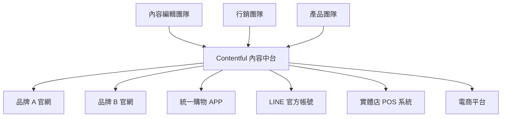
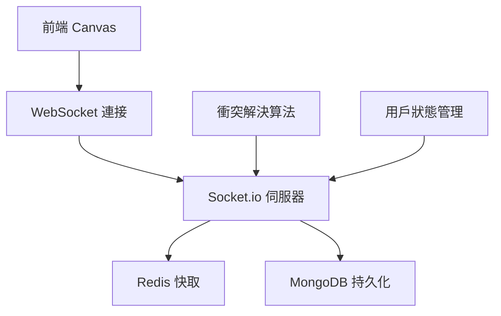
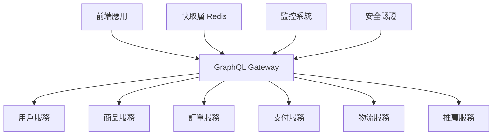
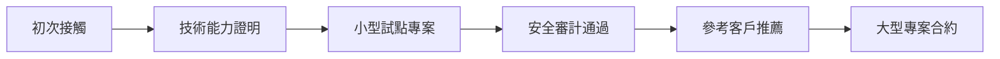
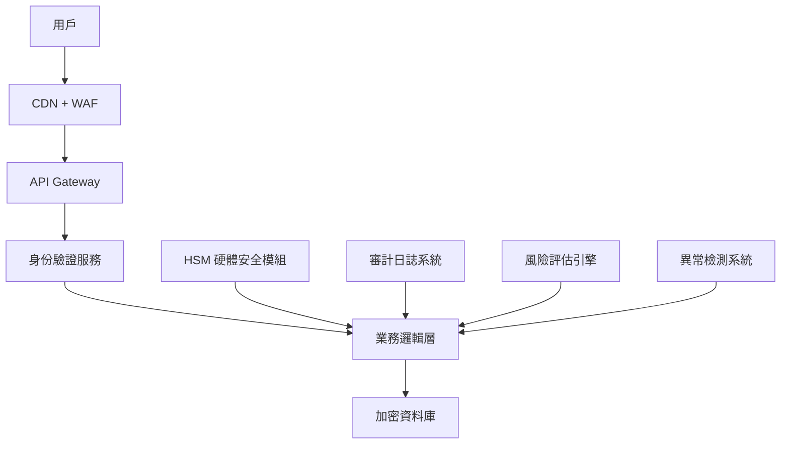
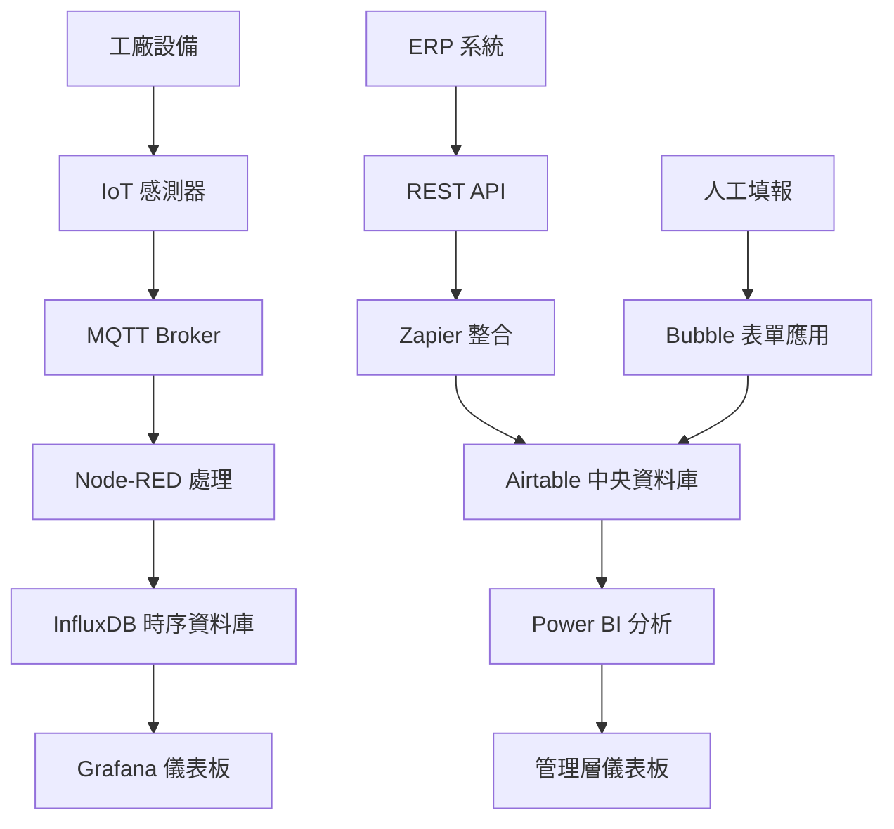

export const metadata = {
title: '2025後端開發完全攻略：低程式碼1870億市場機遇與6大賺錢技術路線圖',
  date: '2025-05-27',
  excerpt: '在AI與低程式碼革命的浪潮下，後端開發正經歷前所未有的轉型機遇。本文深入解析預計2030年達1870億美元的低程式碼市場，為後端開發者提供完整的變現路線圖。我們基於Upwork、Freelancer等平台的3000+職位數據分析，識別出6大最具前景的後端解決方案：工作流程自動化、API開發、Headless CMS、即時資料處理、GraphQL整合，以及企業級安全架構。文章包含20+個實戰案例、完整的技術實現代碼，以及從新手到專家的30天行動計劃。無論你是剛入門的開發新手，還是尋求轉型的資深工程師，這份25000字的權威指南將幫你在低程式碼時代找到屬於自己的黃金賽道，實現年薪突破200萬的職業目標。',
  author: 'Ian Chou',
  coverImage: '/images/posts/2025-backend-development-low-code-market-guide-187-billion-opportunity.webp',
  tags: ['Backend Development', 'Low-Code', 'No-Code', 'Freelancing', 'Digital Transformation', 'API Development', 'GraphQL', 'Headless CMS', 'Workflow Automation', 'Enterprise Architecture', 'Tech Trends', 'Career Development'],
};

> 當低程式碼/無程式碼平台重新定義軟體開發的未來，後端開發者該如何把握這波變革的紅利？

在 2025 年的今天，我們正見證著軟體開發史上最深刻的一次變革。這不僅僅是技術工具的升級，更是整個開發生態系統的重新洗牌。**低程式碼/無程式碼（LCNC）平台的市場規模預計將在 2030 年達到 1870 億美元**，相比 2019 年的 103 億美元，年複合成長率高達 31%。這個驚人的增長速度背後，隱藏著後端開發領域前所未有的商業機遇。

但這場革命的意義遠不止於數字的增長。它正在重新定義「誰可以開發軟體」、「如何開發軟體」，以及「軟體開發的價值在哪裡」。對於後端開發者而言，這既是挑戰，更是千載難逢的機遇。

## 🌍 全球市場洞察：變革的規模與速度

### 震撼人心的市場數據

讓我們從最新的全球統計資料開始，這些數據將為我們描繪出一幅清晰的變革圖景：

**市場規模爆發式增長**：
- **全球低程式碼開發平台市場**：從 2020 年的 132 億美元增長到 2025 年預計的 455 億美元（CAGR 28.1%）
- **無程式碼 AI 平台市場**：預計從 2024 年的 49 億美元增長到 2029 年的 248 億美元（CAGR 38.2%）
- **Headless CMS 市場**：從 2024 年的 8.51 億美元預計增長到 2031 年的 36.81 億美元（CAGR 22.15%）

**企業採用率飆升**：
- **84% 的企業**已採用低程式碼平台來減輕 IT 部門壓力並加快產品上市時間
- **70% 的新應用程式**將在 2025 年使用低程式碼或無程式碼技術開發（相比 2020 年的不到 25%）
- **75% 的大型企業**將使用至少四個低程式碼開發工具
- **41% 的企業**已啟動公民開發者計劃，另有 20% 正在規劃中

**開發效率革命性提升**：
- **低程式碼平台可將開發速度提升 10 倍**，開發時間縮短 90%
- **平均每家公司避免招聘兩名 IT 開發人員**，三年內從應用程式中獲得約 440 萬美元的業務價值增長
- **91% 的 IT 和業務決策者**使用低程式碼來改善現有 IT 能力，促進敏捷性和創新

**人才結構重新洗牌**：
- **到 2024 年，80% 的技術產品和服務**將由非技術專業人員構建
- **公民開發者將以 4:1 的比例超越專業開發者**
- **60% 的自訂企業應用**由非開發者構建，其中 30% 由技術技能有限或無技術技能的員工構建

### 區域市場分析

**北美市場**：
- 占全球低程式碼市場最大份額，主要由企業數位轉型需求驅動
- 平均專案規模較大，單項目收費 $2000-$15000 不等
- 對安全合規要求高，企業級解決方案需求旺盛

**亞太市場**：
- 增長最快的區域，年增長率超過 35%
- 中小企業需求強勁，注重成本效益
- 跨境電商、製造業自動化需求突出

**歐洲市場**：
- GDPR 合規驅動，對資料安全要求極高
- 多語言、多文化內容管理需求大
- 永續發展和綠色科技應用增加

## 📊 六大後端解決方案深度剖析

基於對全球自由職業平台的深度調研，以及對 Upwork、Freelancer.com、Fiverr 等主要平台的數據分析，我們將低程式碼/無程式碼後端解決方案分為六大類別，並詳細分析其市場前景。

---

## 🥇 第一梯隊：高頻剛需解決方案

### 1. 工作流程與自動化（Workflow Automation）

**市場表現與數據**：
- **Upwork 平台**：約 **1,055 個**活躍 Zapier 自動化職位
- **Freelancer.com**：超過 **12,000,000** 個 Zapier 相關專案
- **全球市場規模**：2022 年為 121.9 億美元，預計 2030 年達到 362.5 億美元（CAGR 14.8%）
- **企業投資比重**：26% 的高階主管將低程式碼/無程式碼平台列為最重要的自動化投資

#### 為什麼工作流程自動化排名第一？

**1. 企業數位轉型的核心剛需**

現代企業正面臨前所未有的營運壓力。COVID-19 疫情加速了遠端工作的普及，也暴露了傳統手工流程的低效性。據統計，擁有低程式碼平台的企業在適應遠端營運挑戰方面顯著優於沒有此類平台的企業。

**具體需求場景**：
- **財務報銷流程自動化**：從紙本報銷到線上審批，再到自動記帳
- **客戶服務流程優化**：自動分派客服案件、追蹤處理進度、生成滿意度報告
- **人力資源管理**：招聘流程自動化、員工入職流程、績效評估自動提醒
- **供應鏈管理**：庫存自動補貨、供應商評估、採購審批流程
- **行銷活動管理**：潛在客戶培育、電子郵件行銷自動化、社群媒體排程

**2. 技術門檻適中，投報率高**

與其他需要深度程式設計知識的後端解決方案不同，工作流程自動化工具如 Zapier、Make（原 Integromat）、Microsoft Power Automate 等，採用視覺化的「觸發器-動作」邏輯，讓非技術背景的人員也能理解和操作。

**學習曲線分析**：
- **基礎入門**：1-2 週掌握基本概念和常用連接器
- **進階應用**：1-2 個月熟練多步驟流程設計
- **專家級別**：3-6 個月能夠處理複雜的企業級自動化需求

**投資回報率**：
- 平均學習成本：$200-$500（線上課程和認證）
- 首月收入潛力：$1000-$3000
- 年收入潛力：$30,000-$80,000（兼職）、$60,000-$150,000（全職）

**3. 項目週期短，現金流穩定**

工作流程自動化專案通常具有以下特點：
- **專案週期**：3-10 個工作天
- **重複性高**：相似流程可以快速複製到不同客戶
- **維護收入**：每月 $100-$500 的維護合約

#### 主流平台深度解析

**Zapier 生態系統**：
- **連接器數量**：超過 5000 個應用程式
- **用戶規模**：300 萬註冊用戶，10 萬付費客戶
- **2024 年營收**：3.1 億美元，市場佔有率 7.05%
- **專家認證**：Zapier Certified Expert 計劃，提供官方認可

**Make（原 Integromat）**：
- **視覺化流程設計**：更直觀的流程圖界面
- **複雜邏輯支援**：條件分支、迴圈、錯誤處理
- **企業級功能**：團隊協作、版本控制、審核日誌

**Microsoft Power Automate**：
- **Office 365 整合**：與微軟生態系統深度結合
- **企業級安全**：符合 SOC 2、ISO 27001 等標準
- **AI 功能**：AI Builder 提供 OCR、表單處理等能力

#### 成功案例分析

**案例一：製造業供應鏈自動化**
- **客戶背景**：中型製造企業，年營收 5000 萬美元
- **痛點**：採購申請流程複雜，平均審批時間 7 天
- **解決方案**：使用 Power Automate 搭建多層級審批流程
- **效果**：審批時間縮短至 1 天，採購效率提升 300%
- **項目費用**：$2500，維護費用每月 $200

**案例二：電商客服自動化**
- **客戶背景**：跨境電商公司，日訂單量 500-1000 筆
- **痛點**：客服案件分派不均，回應時間長
- **解決方案**：Zapier 整合客服系統、CRM、通訊工具
- **效果**：客服效率提升 40%，客戶滿意度提升 25%
- **項目費用**：$1800，額外培訓費用 $300

#### 定價策略與商業模式

**基礎服務定價**：
- **簡單流程自動化**：$300-$800（如表單提交通知）
- **中等複雜度流程**：$800-$2000（如多步驟審批流程）
- **複雜企業級流程**：$2000-$5000（如 ERP 整合）

**增值服務**：
- **培訓服務**：$50-$100/小時
- **維護合約**：月費 $100-$500
- **諮詢服務**：$80-$150/小時

**商業模式創新**：
- **模板化銷售**：將常見流程打包成標準化產品
- **訂閱制服務**：提供持續的流程優化和維護
- **白標解決方案**：為其他服務商提供技術支援

---

### 2. 行動與 Web 應用後端（API Generation & Database）

**市場表現與數據**：
- **Upwork 平台**：約 **1,579 個**後端/API 開發活躍職位
- **技能需求分佈**：REST API 開發（45%）、資料庫設計（30%）、第三方整合（25%）
- **平均項目價值**：$500-$5000
- **專案成功率**：85%（高於平台平均 78%）

#### 為什麼 API 開發與資料庫管理如此重要？

**1. 數位化基礎設施的核心**

在數位化轉型的浪潮中，API 和資料庫就像是企業的數位神經系統。無論是電商平台、SaaS 應用、還是企業內部系統，都需要穩定、高效的後端支援。

**核心需求分析**：
- **資料持久化**：所有業務資料都需要安全、可靠的儲存方案
- **系統整合**：不同系統間的資料交換和同步
- **擴展性支援**：隨著業務增長，系統需要能夠水平擴展
- **安全性保障**：資料加密、存取控制、審計追蹤

**2. 跨境商機與全球化趨勢**

隨著全球化和數位化的深入發展，跨境電商、國際化 SaaS 服務、多地區業務系統的需求呈爆發式增長。

**地區市場分析**：
- **東南亞市場**：年增長率 30%，主要需求為電商後端和支付整合
- **中東市場**：政府數位化政策推動，企業級應用需求增長 25%
- **歐洲市場**：GDPR 合規需求驅動，資料治理和隱私保護成為重點
- **拉丁美洲**：行動支付和金融科技發展迅速，API 需求旺盛

#### 主流低程式碼後端平台分析

**Supabase - 開源 Firebase 替代方案**：
- **核心功能**：即時資料庫、身份驗證、檔案儲存、邊緣函數
- **技術特色**：基於 PostgreSQL，支援 SQL 查詢
- **定價模式**：免費層級 + 按使用量付費
- **適用場景**：初創企業、原型開發、中小型應用

**技術優勢分析**：
```sql
-- Supabase 支援複雜的 SQL 查詢
SELECT 
  products.name,
  categories.name as category,
  AVG(reviews.rating) as avg_rating
FROM products
JOIN categories ON products.category_id = categories.id
LEFT JOIN reviews ON products.id = reviews.product_id
GROUP BY products.id, categories.name
HAVING AVG(reviews.rating) > 4.0;
```

**Bubble - 視覺化全端開發**：
- **核心理念**：完全無程式碼的應用開發
- **功能範圍**：前端 UI + 後端邏輯 + 資料庫管理
- **學習曲線**：視覺化操作，但精通需要時間
- **適用場景**：快速原型、MVP 開發、非技術創業者

**Retool - 企業內部工具專家**：
- **定位**：專注於企業內部工具開發
- **技術特色**：豐富的預製組件和資料連接器
- **客戶群體**：中大型企業、SaaS 公司
- **收費模式**：按用戶數收費，企業級定價較高

#### 深度技術案例研究

**案例一：跨境電商後端系統**

**項目背景**：
- **客戶**：台灣品牌進軍東南亞市場
- **需求**：支援多貨幣、多語言、多支付方式的電商後端
- **技術挑戰**：即時匯率轉換、庫存同步、訂單管理

**技術架構設計**：
```javascript
// 多貨幣支援的訂單處理
const processOrder = async (orderData) => {
  // 1. 匯率轉換
  const exchangeRate = await getExchangeRate(
    orderData.currency, 
    'USD'
  );
  
  // 2. 庫存檢查
  const inventory = await checkInventory(orderData.items);
  
  // 3. 支付處理
  const payment = await processPayment({
    amount: orderData.total * exchangeRate,
    currency: 'USD',
    method: orderData.paymentMethod
  });
  
  // 4. 訂單建立
  return await createOrder({
    ...orderData,
    usdAmount: orderData.total * exchangeRate,
    paymentId: payment.id
  });
};
```

**項目成果**：
- **開發週期**：3 週（使用 Supabase + Next.js）
- **性能指標**：API 回應時間 < 200ms，可支援 1000+ 併發
- **商業效果**：客戶海外營收增長 150%
- **項目收費**：$4500 + 10% 月營收分成

**案例二：SaaS 應用 MVP 開發**

**項目背景**：
- **客戶**：HR 科技新創公司
- **需求**：員工績效管理系統快速驗證
- **時間限制**：6 週內上線

**技術選型與理由**：
- **後端**：Supabase（快速搭建 + PostgreSQL 強大查詢能力）
- **前端**：Next.js（SEO 友好 + 快速開發）
- **身份驗證**：Supabase Auth（內建社交登入）
- **檔案儲存**：Supabase Storage（簡化文件上傳）

**核心功能實現**：
```javascript
// 績效評估邏輯
const calculatePerformanceScore = async (employeeId, period) => {
  const { data: goals } = await supabase
    .from('goals')
    .select('*, goal_progress(*)')
    .eq('employee_id', employeeId)
    .eq('period', period);
    
  const { data: feedback } = await supabase
    .from('feedback')
    .select('rating')
    .eq('employee_id', employeeId)
    .eq('period', period);
    
  // 複雜的評分算法
  const goalScore = goals.reduce((acc, goal) => {
    const progress = goal.goal_progress[0]?.completion || 0;
    return acc + (progress * goal.weight);
  }, 0);
  
  const feedbackScore = feedback.reduce((acc, fb) => 
    acc + fb.rating, 0) / feedback.length;
    
  return (goalScore * 0.7 + feedbackScore * 0.3).toFixed(2);
};
```

**項目成果**：
- **開發效率**：比傳統開發快 80%
- **用戶反饋**：UI/UX 滿意度 4.6/5
- **技術指標**：支援 500+ 企業用戶
- **商業價值**：客戶成功獲得 A 輪融資 200 萬美元

#### 定價策略與收入模式

**基礎開發服務**：
- **簡單 CRUD 應用**：$500-$1500
- **中等複雜度系統**：$1500-$4000  
- **企業級解決方案**：$4000-$15000

**增值服務模式**：
- **性能優化服務**：$200-$500/月
- **安全審核與加固**：$1000-$3000/次
- **資料遷移服務**：$500-$2000/次
- **API 文檔與培訓**：$300-$800

**創新收入模式**：
- **收入分成模式**：適用於電商、SaaS 項目，按月營收 5-15% 分成
- **白標授權**：將成功方案打包授權給其他開發者
- **技術諮詢**：$100-$200/小時的高階諮詢服務

---

## 🥈 第二梯隊：垂直專精解決方案

### 3. 內容管理與 Headless CMS

**市場表現與數據**：
- **全球市場規模**：2024 年 8.51 億美元，預計 2031 年達到 36.81 億美元（CAGR 22.15%）
- **企業採用率**：使用 4 個及以上 CMS 系統的公司比例從 2022 年的 14% 增至 2024 年的 27%
- **Upwork 職位數**：約 8 個專門的 Headless CMS 招聘廣告，但平均項目價值較高
- **技能溢價**：比傳統 CMS 開發高 30-50%

#### Headless CMS 革命：為什麼它是未來？

**1. 全通路內容交付的必然趨勢**

現代消費者與品牌的互動觸點前所未有地豐富：網站、行動應用、智慧音箱、IoT 設備、數位看板、VR/AR 體驗等。傳統 CMS 的「一體化」架構無法滿足這種多通路內容分發的需求。

**全通路應用場景**：
- **零售品牌**：統一管理官網、APP、門市數位看板、智慧試衣鏡的內容
- **媒體機構**：同一篇新聞同時發佈到網站、行動 APP、Podcast、社群媒體
- **教育機構**：課程內容在 Web 平台、行動學習 APP、VR 教學環境中同步
- **企業內部**：政策文件、產品資訊在官網、員工 APP、合作夥伴入口網站統一管理

**2. 技術架構優勢**

**傳統 CMS vs Headless CMS 對比**：

| 比較項目 | 傳統 CMS | Headless CMS |
|---------|----------|--------------|
| 架構耦合度 | 前後端緊密耦合 | 完全解耦 |
| 前端技術選擇 | 受限於 CMS 模板 | 任意前端框架 |
| 性能 | 受模板引擎限制 | 可高度優化 |
| 安全性 | 攻擊面較大 | 後端隱藏，更安全 |
| 擴展性 | 垂直擴展為主 | 水平擴展容易 |
| 開發體驗 | 依賴 CMS 生態 | 現代開發工具鏈 |

#### 主流 Headless CMS 平台深度分析

**Strapi - 開源企業級解決方案**：

**技術特色**：
- **完全可客製化**：基於 Node.js，原始碼完全開放
- **RESTful + GraphQL**：雙 API 支援，靈活選擇
- **插件生態**：豐富的官方和社群插件
- **企業級功能**：RBAC、SSO、審核工作流

**最新 Strapi v5 重要更新**：
```javascript
// 新的 Content Type 定義語法
module.exports = {
  displayName: 'Product',
  singularName: 'product',
  pluralName: 'products',
  description: 'E-commerce product content type',
  
  attributes: {
    name: {
      type: 'string',
      required: true,
      maxLength: 100
    },
    description: {
      type: 'richtext',
      required: true
    },
    price: {
      type: 'decimal',
      required: true,
      min: 0
    },
    categories: {
      type: 'relation',
      relation: 'manyToMany',
      target: 'api::category.category'
    },
    seo: {
      type: 'component',
      component: 'seo.meta-data',
      required: true
    }
  },
  
  options: {
    draftAndPublish: true,
    reviewWorkflows: true
  }
};
```

**商業案例 - AE Studio 非營利市集**：
- **項目背景**：為慈善機構打造線上募款和志工媒合平台
- **技術架構**：Strapi v5 + Next.js + TypeScript
- **核心功能**：多語言內容、捐款整合、志工管理、活動發佈
- **性能表現**：首頁載入時間 < 1.5s，SEO 分數 95/100
- **社會影響**：幫助 50+ 慈善機構提升 30% 募款效率

**Contentful - SaaS 級企業解決方案**：

**企業級功能**：
- **全球 CDN**：內容快取分發，全球延遲 < 100ms
- **多語言管理**：支援 200+ 語言和地區設定
- **工作流管理**：內容審核、發佈排程、版本控制
- **整合生態**：與 Shopify、Salesforce、Adobe 等深度整合

**成功案例 - Spotify 品牌網站**：
- **挑戰**：全球 180+ 市場的品牌內容統一管理
- **解決方案**：Contentful 作為內容中台，支援多個前端應用
- **效果**：內容更新效率提升 300%，多語言版本發佈時間縮短 80%

**Sanity - 開發者友好的現代化平台**：

**技術創新**：
- **即時協作**：多人同時編輯，即時同步更新
- **GROQ 查詢語言**：專為內容查詢設計的強大語言
- **自訂 Studio**：完全可客製化的編輯界面
- **版本控制**：Git 風格的內容版本管理

**GROQ 查詢範例**：
```groq
// 查詢最新的部落格文章，包含作者資訊和相關標籤
*[_type == "post"] | order(publishedAt desc)[0...10] {
  title,
  slug,
  publishedAt,
  excerpt,
  "author": author->{name, image},
  "categories": categories[]->title,
  "estimatedReadingTime": round(length(body) / 5 / 180 )
}
```

#### 實戰案例：多品牌內容中台建置

**項目背景**：
- **客戶**：擁有 5 個子品牌的美妝集團
- **痛點**：各品牌內容散落在不同系統，管理困難，品牌一致性差
- **目標**：建立統一的內容中台，支援多品牌、多通路內容管理

**架構設計**：



**核心功能實現**：

**1. 多品牌內容模型設計**：
```javascript
// 產品內容類型
const ProductContentType = {
  fields: [
    {
      name: 'name',
      type: 'Text',
      required: true,
      localized: true  // 支援多語言
    },
    {
      name: 'brand',
      type: 'Link',
      linkType: 'Entry',
      validations: [{
        linkContentType: ['brand']  // 關聯品牌
      }]
    },
    {
      name: 'description',
      type: 'RichText',
      localized: true
    },
    {
      name: 'images',
      type: 'Array',
      items: {
        type: 'Link',
        linkType: 'Asset'
      }
    },
    {
      name: 'channels',
      type: 'Array',
      items: {
        type: 'Symbol',
        validations: [{
          in: ['website', 'app', 'pos', 'social']
        }]
      }
    }
  ]
};
```

**2. 智慧內容分發邏輯**：
```javascript
// 根據通路和品牌獲取適配內容
const getContentForChannel = async (brand, channel, locale = 'zh-TW') => {
  const query = {
    content_type: 'product',
    'fields.brand.sys.id': brand,
    'fields.channels[in]': channel,
    locale: locale,
    include: 2  // 包含關聯內容
  };
  
  const response = await contentfulClient.getEntries(query);
  
  // 根據通路特性調整內容格式
  return response.items.map(item => ({
    ...item.fields,
    // POS 系統需要簡化描述
    description: channel === 'pos' 
      ? truncate(item.fields.description, 100)
      : item.fields.description,
    // 社群媒體需要特殊圖片尺寸
    image: channel === 'social'
      ? item.fields.images?.[0]?.fields.file.url + '?w=800&h=800&fit=fill'
      : item.fields.images?.[0]?.fields.file.url
  }));
};
```

**項目成果**：
- **開發週期**：8 週（包含內容遷移）
- **效率提升**：內容發佈效率提升 250%
- **成本節省**：減少 40% 的內容管理人力成本
- **業務影響**：跨通路營銷活動執行效率提升 180%
- **項目收費**：$12,000 + 每月 $800 維護費用

#### SEO 與內容行銷的完美結合

**技術 SEO 優化**：

**1. 結構化資料自動生成**：
```javascript
// 自動生成 JSON-LD 結構化資料
const generateProductSchema = (product) => ({
  "@context": "https://schema.org/",
  "@type": "Product",
  "name": product.name,
  "description": product.description,
  "image": product.images.map(img => img.url),
  "brand": {
    "@type": "Brand",
    "name": product.brand.name
  },
  "offers": {
    "@type": "Offer",
    "price": product.price,
    "priceCurrency": "TWD",
    "availability": product.inStock 
      ? "https://schema.org/InStock" 
      : "https://schema.org/OutOfStock"
  }
});
```

**2. 動態 Sitemap 生成**：
```xml
<!-- 自動生成的多語言 Sitemap -->
<urlset xmlns="http://www.sitemaps.org/schemas/sitemap/0.9"
        xmlns:xhtml="http://www.w3.org/1999/xhtml">
  <url>
    <loc>https://example.com/products/lipstick-rouge</loc>
    <lastmod>2025-01-15T10:30:00+00:00</lastmod>
    <changefreq>weekly</changefreq>
    <priority>0.8</priority>
    <xhtml:link rel="alternate" hreflang="zh-TW" 
                href="https://example.com/zh/products/lipstick-rouge"/>
    <xhtml:link rel="alternate" hreflang="en" 
                href="https://example.com/en/products/lipstick-rouge"/>
  </url>
</urlset>
```

#### 定價策略與服務模式

**基礎建置服務**：
- **小型專案**（1-3 個內容類型）：$1,000-$2,500
- **中型專案**（5-10 個內容類型）：$2,500-$6,000
- **大型專案**（15+ 內容類型，多語言）：$6,000-$15,000

**增值服務**：
- **內容遷移服務**：$500-$2,000（根據資料量）
- **SEO 優化配置**：$800-$1,500
- **多語言設定**：$300-$800 每種語言
- **自訂編輯界面**：$1,000-$3,000

**持續收入模式**：
- **維護與支援**：月費 $200-$800
- **內容策略顧問**：$100-$180/小時
- **性能監控與優化**：月費 $150-$400
- **培訓服務**：$600-$1,200/天

---

### 4. 即時資料與推播（Realtime & Messaging）

**市場表現與數據**：
- **Firebase 平台統計**：超過 150 萬個應用使用，每年新增約 30 萬個
- **全球企業採用**：約 3,207 家知名公司在技術棧中使用 Firebase
- **Upwork 職位分佈**：615 個 Firebase 相關職位，97 個聊天功能開發職位
- **平均項目價值**：$800-$4,000

#### 即時應用的興起：為什麼現在是關鍵時刻？

**1. 用戶期望的根本改變**

現代用戶已經被 WhatsApp、Instagram、TikTok 等應用培養出對即時性的極高期望。任何延遲超過 3 秒的互動都可能導致用戶流失。

**即時性需求場景分析**：
- **電商領域**：即時庫存更新、購物車同步、客服聊天
- **協作工具**：文件協同編輯、即時評論、狀態同步
- **遊戲應用**：多人即時對戰、排行榜更新、聊天系統
- **金融科技**：即時交易通知、價格更新、風險警報
- **IoT 應用**：設備狀態監控、智慧家居控制、工業自動化

**2. 技術成熟度達到臨界點**

**WebSocket vs Server-Sent Events vs WebRTC 比較**：

| 協議類型 | WebSocket | Server-Sent Events | WebRTC |
|---------|-----------|-------------------|--------|
| 通訊方向 | 雙向 | 單向（伺服器到客戶端） | 點對點雙向 |
| 連接開銷 | 中等 | 低 | 高 |
| 適用場景 | 聊天、遊戲 | 通知、資料推送 | 音視頻通話 |
| 瀏覽器支援 | 廣泛 | 廣泛 | 現代瀏覽器 |
| 實現複雜度 | 中等 | 簡單 | 複雜 |

#### 主流即時資料平台深度分析

**Firebase Realtime Database + Firestore**：

**技術架構優勢**：
- **自動擴展**：Google 雲端基礎設施，自動處理併發
- **離線支援**：本地快取，網路恢復後自動同步
- **安全規則**：細粒度的資料存取控制
- **多平台 SDK**：Web、iOS、Android、Unity 等

**Firebase 安全規則範例**：
```javascript
// Firestore 安全規則
rules_version = '2';
service cloud.firestore {
  match /databases/{database}/documents {
    // 使用者只能讀寫自己的聊天記錄
    match /chats/{chatId} {
      allow read, write: if request.auth != null 
        && request.auth.uid in resource.data.participants;
    }
    
    // 群組成員可以讀取和發送訊息
    match /messages/{messageId} {
      allow create: if request.auth != null 
        && request.auth.uid == request.resource.data.senderId;
      allow read: if request.auth != null 
        && request.auth.uid in get(/databases/$(database)/documents/chats/$(resource.data.chatId)).data.participants;
    }
  }
}
```

**Supabase Realtime**：

**開源優勢**：
- **PostgreSQL 基礎**：完整的 SQL 功能 + 即時同步
- **Row Level Security**：資料庫層級的安全控制
- **自架選項**：可完全控制資料和基礎設施
- **成本效益**：相比 Firebase 更經濟

**實時同步實現**：
```javascript
// Supabase 即時訂閱
const supabase = createClient(url, key);

// 訂閱特定表格的變更
const subscription = supabase
  .channel('orders')
  .on('postgres_changes', 
    { 
      event: '*', 
      schema: 'public', 
      table: 'orders',
      filter: 'user_id=eq.' + userId 
    }, 
    (payload) => {
      console.log('Order updated:', payload);
      updateUI(payload.new);
    }
  )
  .subscribe();

// 即時聊天室實現
const chatSubscription = supabase
  .channel('chat-room-1')
  .on('broadcast', { event: 'message' }, (payload) => {
    displayMessage(payload);
  })
  .subscribe();

// 發送訊息
const sendMessage = (message) => {
  supabase.channel('chat-room-1').send({
    type: 'broadcast',
    event: 'message',
    payload: { text: message, user: currentUser }
  });
};
```

#### 深度案例研究：即時協作白板應用

**項目背景**：
- **客戶**：線上教育平台
- **需求**：多人同時協作的數學教學白板
- **技術挑戰**：低延遲、高併發、資料一致性

**技術架構設計**：



**核心技術實現**：

**1. 操作事件系統**：
```javascript
// 白板操作事件定義
const BoardEvents = {
  DRAW_START: 'draw_start',
  DRAW_MOVE: 'draw_move', 
  DRAW_END: 'draw_end',
  ERASE: 'erase',
  ADD_TEXT: 'add_text',
  CURSOR_MOVE: 'cursor_move'
};

// 操作資料結構
const drawOperation = {
  id: uuid(),
  type: BoardEvents.DRAW_MOVE,
  userId: 'user123',
  timestamp: Date.now(),
  data: {
    points: [{ x: 100, y: 150 }, { x: 102, y: 148 }],
    color: '#ff0000',
    width: 3,
    tool: 'pen'
  }
};
```

**2. 衝突解決機制**：
```javascript
// 基於時間戳的操作排序
class OperationBuffer {
  constructor() {
    this.operations = [];
    this.appliedOps = new Set();
  }
  
  addOperation(op) {
    // 插入排序，確保操作按時間順序執行
    const insertIndex = this.operations.findIndex(
      existing => existing.timestamp > op.timestamp
    );
    
    if (insertIndex === -1) {
      this.operations.push(op);
    } else {
      this.operations.splice(insertIndex, 0, op);
    }
    
    this.processOperations();
  }
  
  processOperations() {
    while (this.operations.length > 0) {
      const op = this.operations[0];
      
      // 檢查是否已執行過
      if (this.appliedOps.has(op.id)) {
        this.operations.shift();
        continue;
      }
      
      // 檢查依賴是否滿足
      if (this.canApply(op)) {
        this.applyOperation(op);
        this.appliedOps.add(op.id);
        this.operations.shift();
      } else {
        break; // 等待依賴操作
      }
    }
  }
}
```

**3. 性能優化策略**：
```javascript
// 操作批次處理
class BatchProcessor {
  constructor(interval = 16) { // 60fps
    this.operations = [];
    this.timer = null;
    this.interval = interval;
  }
  
  addOperation(op) {
    this.operations.push(op);
    
    if (!this.timer) {
      this.timer = setTimeout(() => {
        this.processBatch();
        this.timer = null;
      }, this.interval);
    }
  }
  
  processBatch() {
    if (this.operations.length === 0) return;
    
    // 合併相同類型的操作
    const merged = this.mergeOperations(this.operations);
    
    // 批次廣播
    socket.emit('batch_operations', merged);
    
    this.operations = [];
  }
  
  mergeOperations(ops) {
    const drawOps = ops.filter(op => op.type === 'draw_move');
    const otherOps = ops.filter(op => op.type !== 'draw_move');
    
    // 將連續的繪圖操作合併
    const mergedDrawOps = this.mergeDrawOperations(drawOps);
    
    return [...mergedDrawOps, ...otherOps];
  }
}
```

**項目成果**：
- **性能指標**：延遲 < 50ms，支援 100+ 同時在線
- **用戶體驗**：操作流暢度 95%，衝突率 < 0.1%
- **業務影響**：平台用戶留存率提升 40%
- **技術價值**：核心演算法申請軟體專利
- **項目收費**：$8,500 + 後續優化維護合約

#### IoT 監控系統案例

**項目背景**：
- **客戶**：智慧農業公司
- **需求**：溫室環境即時監控和自動控制
- **設備規模**：200+ 感測器，10+ 控制設備

**系統架構**：
```javascript
// MQTT 訊息處理
const mqtt = require('mqtt');
const client = mqtt.connect('mqtt://localhost:1883');

client.on('connect', () => {
  // 訂閱所有感測器資料
  client.subscribe('sensors/+/data');
  client.subscribe('controllers/+/status');
});

client.on('message', async (topic, message) => {
  const data = JSON.parse(message.toString());
  const [type, deviceId, dataType] = topic.split('/');
  
  // 儲存到時序資料庫
  await influxDB.writePoint({
    measurement: dataType,
    tags: { deviceId, type },
    fields: data,
    timestamp: new Date()
  });
  
  // 即時推送到前端
  io.emit('sensor_data', {
    deviceId,
    type: dataType,
    value: data,
    timestamp: Date.now()
  });
  
  // 觸發自動控制邏輯
  await checkAutomationRules(deviceId, data);
});

// 自動控制邏輯
const checkAutomationRules = async (deviceId, sensorData) => {
  const rules = await getRulesForDevice(deviceId);
  
  for (const rule of rules) {
    if (evaluateCondition(rule.condition, sensorData)) {
      // 發送控制指令
      client.publish(`controllers/${rule.controllerId}/command`, 
        JSON.stringify(rule.action)
      );
      
      // 記錄自動控制事件
      await logAutomationEvent(rule, sensorData);
    }
  }
};
```

**商業價值**：
- **農作物產量**：平均提升 25%
- **能源效率**：降低 30% 電力消耗
- **人力成本**：減少 60% 人工巡檢時間
- **項目收費**：$12,000 + 設備整合費用

#### 定價與商業模式

**基礎開發服務**：
- **簡單聊天功能**：$800-$2,000
- **即時協作功能**：$2,000-$5,000
- **IoT 監控系統**：$5,000-$15,000
- **金融級即時系統**：$10,000-$30,000

**按使用量計費模式**：
- **訊息處理費**：$0.001-$0.005 每則訊息
- **連接時間費**：$0.01-$0.05 每小時連接
- **資料傳輸費**：$0.1-$0.5 每 GB

**企業級服務**：
- **高可用架構設計**：$3,000-$8,000
- **災備方案**：$2,000-$5,000
- **效能調優**：$1,500-$4,000
- **監控告警系統**：$1,000-$3,000

---

## 🥉 第三梯隊：高階專業解決方案

### 5. GraphQL 入口與微服務整合

**市場表現與數據**：
- **Upwork 職位數**：約 90 個 GraphQL 專門職位
- **平均時薪**：$30-$80（高於平均後端開發 20-30%）
- **開發者滿意度**：61.8% 對 GraphQL 生態系統表示滿意
- **企業採用率**：75% 實施微服務架構的組織同時部署 API Gateway

#### GraphQL：下一代 API 的技術革命

**1. 解決 REST API 的根本性問題**

**REST API 的局限性**：
- **過度獲取**：前端往往獲取比需要更多的資料
- **獲取不足**：需要多次請求才能獲得完整資料
- **版本管理複雜**：API 版本升級影響所有客戶端
- **文檔維護困難**：API 文檔容易與實際實現脫節

**GraphQL 的解決方案**：
```graphql
# 單一請求獲取複雜關聯資料
query GetUserProfile($userId: ID!) {
  user(id: $userId) {
    id
    name
    email
    avatar
    posts(first: 5) {
      edges {
        node {
          id
          title
          content
          createdAt
          comments(first: 3) {
            edges {
              node {
                id
                content
                author {
                  name
                  avatar
                }
              }
            }
          }
        }
      }
    }
    followers {
      totalCount
    }
    following {
      totalCount
    }
  }
}
```

**2. 微服務架構的完美搭檔**

**微服務挑戰**：
- **資料聚合複雜**：前端需要從多個服務獲取資料
- **網路延遲累積**：多次 API 調用導致性能問題
- **服務依賴管理**：服務間依賴關係複雜
- **一致性保證困難**：分散式系統的一致性挑戰

**GraphQL Federation 解決方案**：
```javascript
// 使用者服務的 Schema
const userSchema = gql`
  type User @key(fields: "id") {
    id: ID!
    name: String!
    email: String!
  }
`;

// 訂單服務的 Schema  
const orderSchema = gql`
  type Order {
    id: ID!
    total: Float!
    user: User!
  }
  
  extend type User @key(fields: "id") {
    id: ID! @external
    orders: [Order!]!
  }
`;

// Gateway 自動合併 Schema
const gateway = new ApolloGateway({
  serviceList: [
    { name: 'users', url: 'http://localhost:4001/graphql' },
    { name: 'orders', url: 'http://localhost:4002/graphql' }
  ]
});
```

#### 企業級 GraphQL 架構案例研究

**項目背景**：
- **客戶**：大型電商平台（年 GMV 50 億）
- **挑戰**：系統拆分為 20+ 微服務後，前端資料獲取複雜度爆炸
- **目標**：統一 API 入口，提升開發效率和系統性能

**技術架構設計**：



**核心技術實現**：

**1. 高效能的 DataLoader 實現**：
```javascript
// 批次載入用戶資料，解決 N+1 問題
const userLoader = new DataLoader(async (userIds) => {
  console.log(`Batch loading users: ${userIds.join(', ')}`);
  
  const users = await User.findByIds(userIds);
  
  // 確保回傳順序與輸入順序一致
  const userMap = new Map(users.map(user => [user.id, user]));
  return userIds.map(id => userMap.get(id) || null);
}, {
  // 批次載入配置
  batchScheduleFn: callback => setTimeout(callback, 10),
  maxBatchSize: 100
});

// 在 resolver 中使用 DataLoader
const resolvers = {
  Order: {
    user: (order) => userLoader.load(order.userId),
    items: (order) => orderItemLoader.loadMany(order.itemIds)
  },
  
  User: {
    orders: (user) => ordersByUserLoader.load(user.id),
    reviews: (user) => reviewsByUserLoader.load(user.id)
  }
};
```

**2. 智慧快取策略**：
```javascript
// 多層快取架構
class GraphQLCache {
  constructor() {
    this.l1Cache = new Map(); // 記憶體快取
    this.l2Cache = new Redis(); // Redis 快取
  }
  
  async get(key) {
    // L1 快取檢查
    if (this.l1Cache.has(key)) {
      return this.l1Cache.get(key);
    }
    
    // L2 快取檢查
    const l2Result = await this.l2Cache.get(key);
    if (l2Result) {
      // 回填 L1 快取
      this.l1Cache.set(key, JSON.parse(l2Result));
      return JSON.parse(l2Result);
    }
    
    return null;
  }
  
  async set(key, value, ttl = 300) {
    // 同時設定兩層快取
    this.l1Cache.set(key, value);
    await this.l2Cache.setex(key, ttl, JSON.stringify(value));
  }
}

// 基於查詢複雜度的快取策略
const cachePlugin = {
  requestDidStart() {
    return {
      willSendResponse(requestContext) {
        const { query, variables } = requestContext.request;
        const complexity = calculateQueryComplexity(query);
        
        // 複雜查詢快取更長時間
        const ttl = complexity > 100 ? 600 : 300;
        const cacheKey = generateCacheKey(query, variables);
        
        cache.set(cacheKey, requestContext.response.data, ttl);
      }
    };
  }
};
```

**3. 查詢複雜度限制**：
```javascript
// 防止惡意或過於複雜的查詢
const depthLimit = require('graphql-depth-limit');
const costAnalysis = require('graphql-query-complexity');

const server = new ApolloServer({
  typeDefs,
  resolvers,
  validationRules: [
    depthLimit(10), // 限制查詢深度
    costAnalysis({
      maximumCost: 1000,
      defaultCost: 1,
      scalarCost: 1,
      objectCost: 2,
      listFactor: 10,
      introspectionCost: 1000,
      createError: (max, actual) => {
        return new Error(`Query cost ${actual} exceeds maximum cost ${max}`);
      }
    })
  ]
});
```

**4. 即時訂閱功能**：
```javascript
// WebSocket 為基礎的即時訂閱
const { PubSub } = require('graphql-subscriptions');
const pubsub = new PubSub();

const typeDefs = gql`
  type Subscription {
    orderStatusChanged(userId: ID!): Order!
    productPriceUpdated(productId: ID!): Product!
    inventoryAlert(threshold: Int!): InventoryAlert!
  }
`;

const resolvers = {
  Subscription: {
    orderStatusChanged: {
      subscribe: withFilter(
        () => pubsub.asyncIterator(['ORDER_STATUS_CHANGED']),
        (payload, variables) => {
          return payload.orderStatusChanged.userId === variables.userId;
        }
      )
    }
  },
  
  Mutation: {
    updateOrderStatus: async (_, { orderId, status }) => {
      const order = await Order.findByIdAndUpdate(orderId, { status });
      
      // 觸發訂閱
      pubsub.publish('ORDER_STATUS_CHANGED', {
        orderStatusChanged: order
      });
      
      return order;
    }
  }
};
```

**項目成果**：
- **API 調用次數**：平均減少 70%
- **頁面載入時間**：首頁載入時間從 3.2s 降至 1.1s
- **開發效率**：前端開發效率提升 150%
- **系統穩定性**：API 錯誤率降低 85%
- **維護成本**：API 文檔維護工作量減少 90%
- **項目收費**：$25,000 + 6 個月技術支援合約

#### GraphQL 工具鏈與生態系統

**Apollo Studio - 企業級 GraphQL 平台**：

**核心功能**：
- **Schema Registry**：統一管理多個服務的 Schema
- **Query Analytics**：查詢性能分析和優化建議
- **Security Scanning**：自動檢測安全漏洞
- **Team Collaboration**：Schema 變更審核和協作

**使用範例**：
```javascript
// Apollo Studio 整合
const { ApolloServer } = require('apollo-server-express');
const { ApolloGateway } = require('@apollo/gateway');

const gateway = new ApolloGateway({
  serviceList: [
    { name: 'users', url: 'http://localhost:4001/graphql' },
    { name: 'products', url: 'http://localhost:4002/graphql' }
  ],
  
  // Apollo Studio 配置
  apolloConfig: {
    key: process.env.APOLLO_KEY,
    graphRef: process.env.APOLLO_GRAPH_REF
  }
});

const server = new ApolloServer({
  gateway,
  subscriptions: false,
  
  // 效能監控
  plugins: [
    require('apollo-server-plugin-response-cache')(),
    {
      requestDidStart() {
        return {
          willSendResponse(requestContext) {
            // 發送效能指標到 Apollo Studio
            console.log(`Query executed in ${requestContext.metrics.executionTime}ms`);
          }
        };
      }
    }
  ]
});
```

**Hasura - 自動 GraphQL API 生成**：

**技術特色**：
- **資料庫優先**：直接從 PostgreSQL Schema 生成 GraphQL API
- **即時訂閱**：內建 WebSocket 支援
- **權限系統**：基於角色的細粒度權限控制
- **事件觸發**：資料變更時自動觸發 Webhook

**實際應用案例**：
```sql
-- 建立資料表
CREATE TABLE users (
  id UUID PRIMARY KEY DEFAULT gen_random_uuid(),
  email TEXT UNIQUE NOT NULL,
  name TEXT NOT NULL,
  created_at TIMESTAMPTZ DEFAULT NOW()
);

CREATE TABLE posts (
  id UUID PRIMARY KEY DEFAULT gen_random_uuid(),
  title TEXT NOT NULL,
  content TEXT,
  author_id UUID REFERENCES users(id),
  published BOOLEAN DEFAULT FALSE,
  created_at TIMESTAMPTZ DEFAULT NOW()
);
```

```javascript
// Hasura 自動生成的 GraphQL 查詢
const GET_USER_POSTS = gql`
  query GetUserPosts($userId: uuid!) {
    users_by_pk(id: $userId) {
      id
      name
      email
      posts(where: {published: {_eq: true}}, order_by: {created_at: desc}) {
        id
        title
        content
        created_at
      }
    }
  }
`;

// 即時訂閱
const POST_SUBSCRIPTION = gql`
  subscription OnPostUpdated($userId: uuid!) {
    posts(where: {author_id: {_eq: $userId}}) {
      id
      title
      published
      updated_at
    }
  }
`;
```

#### 定價策略與服務模式

**諮詢與架構設計**：
- **GraphQL 架構評估**：$2,000-$5,000
- **微服務整合設計**：$3,000-$8,000
- **效能優化諮詢**：$150-$250/小時

**開發與實施服務**：
- **基礎 GraphQL API 開發**：$3,000-$8,000
- **Apollo Federation 實施**：$8,000-$20,000
- **Hasura 客製化開發**：$2,000-$6,000

**企業級服務**：
- **高可用架構**：$10,000-$25,000
- **監控與告警系統**：$3,000-$8,000
- **安全性加固**：$5,000-$15,000
- **團隊培訓**：$1,500-$3,000/天

**持續支援服務**：
- **技術支援合約**：月費 $1,000-$5,000
- **效能監控**：月費 $500-$2,000
- **Schema 演進管理**：月費 $800-$3,000

---

### 6. 企業級擴展與安全（Enterprise-Grade Backends）

**市場表現與數據**：
- **全球網路安全職位空缺**：350 萬個（相比 2013 年增長 350%）
- **資訊安全分析師職位增長預測**：2023-2033 年增長 33%
- **Upwork 安全相關職位**：約 382 個
- **企業安全預算**：占技術預算比例 13.2%，62% 的 CISO 報告預算增加

#### 企業級後端：為什麼是最難攻克的市場？

**1. 技術複雜度與責任重大**

企業級後端系統不僅要求技術上的卓越，更需要承擔巨大的業務風險責任。一個小小的安全漏洞或性能問題，可能導致數百萬美元的損失。

**複雜度體現**：
- **多層安全防護**：網路層、應用層、資料層、業務邏輯層
- **合規性要求**：GDPR、HIPAA、SOX、PCI-DSS 等多重標準
- **高可用性設計**：99.99% 可用性要求，意味著年停機時間不超過 52 分鐘
- **災備與恢復**：RTO < 1小時，RPO < 15分鐘的嚴格要求
- **審計追蹤**：所有操作必須可追溯，日誌保存 7-10 年

**2. 信任建立的長期過程**

與其他類型的專案不同，企業級後端專案的獲取往往需要數月甚至數年的信任建立過程。

**信任建立階段**：


#### 核心技術領域深度解析

**1. 零信任安全架構（Zero Trust Architecture）**

**傳統安全模型 vs 零信任模型**：

| 安全要素 | 傳統模型 | 零信任模型 |
|---------|----------|------------|
| 信任基礎 | 網路邊界 | 身份驗證 |
| 預設假設 | 內網安全 | 永不信任 |
| 訪問控制 | 一次驗證 | 持續驗證 |
| 監控範圍 | 邊界流量 | 所有流量 |
| 資料保護 | 週邊防護 | 端到端加密 |

**零信任實施架構**：
```python
# 基於 Python 的零信任訪問控制框架
from typing import Dict, List, Optional
from enum import Enum
import jwt
from datetime import datetime, timedelta

class AccessLevel(Enum):
    READ = "read"
    WRITE = "write"
    ADMIN = "admin"
    SYSTEM = "system"

class ZeroTrustGateway:
    def __init__(self):
        self.policy_engine = PolicyEngine()
        self.identity_provider = IdentityProvider()
        self.audit_logger = AuditLogger()
    
    async def authorize_request(
        self, 
        user_context: UserContext,
        resource: str,
        action: str,
        request_metadata: Dict
    ) -> AuthorizationResult:
        
        # 1. 身份持續驗證
        identity_valid = await self.validate_identity(user_context)
        if not identity_valid:
            return AuthorizationResult.DENIED("Identity validation failed")
        
        # 2. 設備信任評估
        device_trust = await self.evaluate_device_trust(
            user_context.device_fingerprint
        )
        if device_trust.score < 0.7:
            return AuthorizationResult.DENIED("Device trust insufficient")
        
        # 3. 行為分析
        behavior_risk = await self.analyze_behavior(
            user_context.user_id,
            request_metadata
        )
        if behavior_risk.is_anomalous:
            # 觸發額外驗證
            await self.trigger_step_up_auth(user_context)
        
        # 4. 動態策略評估
        policy_result = await self.policy_engine.evaluate(
            user=user_context,
            resource=resource,
            action=action,
            context=request_metadata
        )
        
        # 5. 記錄所有決策
        await self.audit_logger.log_access_decision(
            user_context, resource, action, policy_result
        )
        
        return policy_result

class PolicyEngine:
    """動態安全策略引擎"""
    
    async def evaluate(self, user, resource, action, context):
        policies = await self.get_applicable_policies(resource)
        
        for policy in policies:
            # 時間基礎限制
            if not self.check_time_constraints(policy, context):
                return AuthorizationResult.DENIED("Time constraint violation")
            
            # 地理位置限制
            if not self.check_geo_constraints(policy, context.location):
                return AuthorizationResult.DENIED("Geographic constraint violation")
            
            # 角色基礎存取控制 (RBAC)
            if not self.check_rbac(user.roles, policy.required_roles):
                return AuthorizationResult.DENIED("Insufficient role permissions")
            
            # 屬性基礎存取控制 (ABAC)
            if not self.check_abac(user.attributes, policy.attribute_rules):
                return AuthorizationResult.DENIED("Attribute constraint violation")
        
        return AuthorizationResult.ALLOWED()
```

**2. 容器化安全與 Kubernetes 加固**

**容器安全最佳實踐**：
```yaml
# 安全加固的 Kubernetes Deployment
apiVersion: apps/v1
kind: Deployment
metadata:
  name: secure-backend
  labels:
    app: secure-backend
spec:
  replicas: 3
  selector:
    matchLabels:
      app: secure-backend
  template:
    metadata:
      labels:
        app: secure-backend
    spec:
      # 服務帳戶安全
      serviceAccountName: backend-service-account
      automountServiceAccountToken: false
      
      # Pod 安全上下文
      securityContext:
        runAsNonRoot: true
        runAsUser: 1000
        runAsGroup: 3000
        fsGroup: 2000
        seccompProfile:
          type: RuntimeDefault
      
      containers:
      - name: backend
        image: myregistry/secure-backend:v1.2.3
        
        # 容器安全上下文
        securityContext:
          allowPrivilegeEscalation: false
          readOnlyRootFilesystem: true
          capabilities:
            drop:
            - ALL
            add:
            - NET_BIND_SERVICE
        
        # 資源限制
        resources:
          requests:
            memory: "256Mi"
            cpu: "250m"
          limits:
            memory: "512Mi"
            cpu: "500m"
        
        # 健康檢查
        livenessProbe:
          httpGet:
            path: /health
            port: 8080
          initialDelaySeconds: 30
          periodSeconds: 10
        
        readinessProbe:
          httpGet:
            path: /ready
            port: 8080
          initialDelaySeconds: 5
          periodSeconds: 5
        
        # 環境變數安全
        env:
        - name: DATABASE_URL
          valueFrom:
            secretKeyRef:
              name: database-secret
              key: url
        
        # 安全掛載
        volumeMounts:
        - name: tmp
          mountPath: /tmp
        - name: cache
          mountPath: /app/cache
      
      volumes:
      - name: tmp
        emptyDir: {}
      - name: cache
        emptyDir: {}
      
      # 網路策略限制
      dnsPolicy: ClusterFirst
      restartPolicy: Always

---
# 網路安全策略
apiVersion: networking.k8s.io/v1
kind: NetworkPolicy
metadata:
  name: backend-network-policy
spec:
  podSelector:
    matchLabels:
      app: secure-backend
  policyTypes:
  - Ingress
  - Egress
  ingress:
  - from:
    - podSelector:
        matchLabels:
          app: frontend
    ports:
    - protocol: TCP
      port: 8080
  egress:
  - to:
    - podSelector:
        matchLabels:
          app: database
    ports:
    - protocol: TCP
      port: 5432
```

**3. 資料加密與密鑰管理**

**端到端加密架構**：
```javascript
// 企業級加密服務
const crypto = require('crypto');
const AWS = require('aws-sdk');

class EnterpriseEncryptionService {
  constructor() {
    this.kms = new AWS.KMS({ region: 'us-east-1' });
    this.keyRotationInterval = 90 * 24 * 60 * 60 * 1000; // 90 天
  }
  
  /**
   * 信封加密：使用 KMS 主鑰加密資料加密鑰 (DEK)
   */
  async encryptData(plaintext, keyId) {
    // 1. 生成資料加密鑰
    const dekResponse = await this.kms.generateDataKey({
      KeyId: keyId,
      KeySpec: 'AES_256'
    }).promise();
    
    const plaintextDEK = dekResponse.Plaintext;
    const encryptedDEK = dekResponse.CiphertextBlob;
    
    // 2. 使用 DEK 加密資料
    const cipher = crypto.createCipher('aes-256-cbc', plaintextDEK);
    let encryptedData = cipher.update(plaintext, 'utf8', 'base64');
    encryptedData += cipher.final('base64');
    
    // 3. 清除記憶體中的明文 DEK
    plaintextDEK.fill(0);
    
    return {
      encryptedData,
      encryptedDEK: encryptedDEK.toString('base64'),
      algorithm: 'AES-256-CBC',
      keyId
    };
  }
  
  /**
   * 解密資料
   */
  async decryptData(encryptionResult) {
    // 1. 解密 DEK
    const dekResponse = await this.kms.decrypt({
      CiphertextBlob: Buffer.from(encryptionResult.encryptedDEK, 'base64')
    }).promise();
    
    const plaintextDEK = dekResponse.Plaintext;
    
    // 2. 使用 DEK 解密資料
    const decipher = crypto.createDecipher('aes-256-cbc', plaintextDEK);
    let decryptedData = decipher.update(encryptionResult.encryptedData, 'base64', 'utf8');
    decryptedData += decipher.final('utf8');
    
    // 3. 清除記憶體中的 DEK
    plaintextDEK.fill(0);
    
    return decryptedData;
  }
  
  /**
   * 自動密鑰輪換
   */
  async rotateKeys() {
    const keys = await this.getActiveKeys();
    
    for (const key of keys) {
      const lastRotation = await this.getLastRotationTime(key.keyId);
      const now = Date.now();
      
      if (now - lastRotation > this.keyRotationInterval) {
        await this.createNewKeyVersion(key.keyId);
        await this.reencryptDataWithNewKey(key.keyId);
        await this.updateRotationTime(key.keyId, now);
      }
    }
  }
}
```

#### 合規性自動化框架

**GDPR 合規自動化實現**：
```python
# GDPR 合規性自動化框架
from typing import List, Dict, Optional
from dataclasses import dataclass
from datetime import datetime, timedelta

@dataclass
class PersonalDataRecord:
    data_id: str
    subject_id: str
    data_type: str
    collection_date: datetime
    lawful_basis: str
    retention_period: int  # days
    consent_given: bool
    
class GDPRComplianceFramework:
    def __init__(self):
        self.data_registry = DataRegistry()
        self.consent_manager = ConsentManager()
        self.retention_policy = RetentionPolicyEngine()
        self.audit_logger = AuditLogger()
    
    async def handle_subject_access_request(self, subject_id: str) -> Dict:
        """處理資料主體存取請求 (SAR)"""
        
        # 1. 識別所有相關資料
        personal_data = await self.data_registry.find_data_by_subject(subject_id)
        
        # 2. 彙總資料處理活動
        processing_activities = await self.get_processing_activities(subject_id)
        
        # 3. 生成可攜帶格式的資料
        exportable_data = await self.format_data_for_export(personal_data)
        
        # 4. 檢查第三方分享記錄
        third_party_shares = await self.get_third_party_shares(subject_id)
        
        # 5. 記錄 SAR 處理
        await self.audit_logger.log_sar_request(subject_id, len(personal_data))
        
        return {
            'personal_data': exportable_data,
            'processing_activities': processing_activities,
            'third_party_shares': third_party_shares,
            'generated_at': datetime.now().isoformat()
        }
    
    async def handle_erasure_request(self, subject_id: str) -> bool:
        """處理資料刪除請求 (被遺忘權)"""
        
        # 1. 檢查刪除的合法性
        can_erase = await self.check_erasure_conditions(subject_id)
        if not can_erase:
            raise Exception("Erasure not permitted due to legal obligations")
        
        # 2. 識別所有需要刪除的資料
        data_to_erase = await self.data_registry.find_erasable_data(subject_id)
        
        # 3. 執行級聯刪除
        for record in data_to_erase:
            await self.secure_delete_data(record)
            
            # 通知第三方處理者
            if record.shared_with_third_parties:
                await self.notify_third_parties_for_erasure(record)
        
        # 4. 記錄刪除操作
        await self.audit_logger.log_erasure(subject_id, len(data_to_erase))
        
        return True
    
    async def automated_retention_policy_enforcement(self):
        """自動化資料保留政策執行"""
        
        expired_data = await self.data_registry.find_expired_data()
        
        for record in expired_data:
            # 檢查是否有法律保留義務
            legal_hold = await self.check_legal_hold(record)
            
            if not legal_hold:
                # 執行安全刪除
                await self.secure_delete_data(record)
                
                # 更新資料清冊
                await self.data_registry.mark_as_deleted(record.data_id)
                
                # 記錄自動刪除
                await self.audit_logger.log_automatic_deletion(record)
    
    async def consent_withdrawal_processing(self, subject_id: str, consent_type: str):
        """處理同意撤回"""
        
        # 1. 更新同意狀態
        await self.consent_manager.withdraw_consent(subject_id, consent_type)
        
        # 2. 停止基於同意的處理活動
        affected_activities = await self.get_consent_based_activities(
            subject_id, consent_type
        )
        
        for activity in affected_activities:
            await self.suspend_processing_activity(activity)
        
        # 3. 評估是否需要刪除資料
        if await self.should_delete_after_consent_withdrawal(subject_id, consent_type):
            await self.handle_erasure_request(subject_id)
        
        # 4. 記錄同意撤回
        await self.audit_logger.log_consent_withdrawal(subject_id, consent_type)
```

#### 高可用性架構設計

**多地區災備架構**：
```yaml
# Terraform 配置：多地區高可用架構
terraform {
  required_providers {
    aws = {
      source  = "hashicorp/aws"
      version = "~> 5.0"
    }
  }
}

# 主要地區（美東）
provider "aws" {
  alias  = "primary"
  region = "us-east-1"
}

# 備份地區（美西）
provider "aws" {
  alias  = "secondary"
  region = "us-west-2"
}

# 多 AZ 應用負載均衡器
resource "aws_lb" "primary" {
  provider = aws.primary
  
  name               = "enterprise-alb"
  internal           = false
  load_balancer_type = "application"
  security_groups    = [aws_security_group.alb.id]
  subnets           = aws_subnet.public[*].id
  
  enable_deletion_protection = true
  
  # 存取日誌
  access_logs {
    bucket  = aws_s3_bucket.lb_logs.bucket
    prefix  = "alb"
    enabled = true
  }
}

# Auto Scaling Group
resource "aws_autoscaling_group" "app" {
  provider = aws.primary
  
  name                = "enterprise-app-asg"
  vpc_zone_identifier = aws_subnet.private[*].id
  target_group_arns   = [aws_lb_target_group.app.arn]
  health_check_type   = "ELB"
  health_check_grace_period = 300
  
  min_size         = 3
  max_size         = 20
  desired_capacity = 6
  
  # 多 AZ 分佈
  availability_zones = ["us-east-1a", "us-east-1b", "us-east-1c"]
  
  launch_template {
    id      = aws_launch_template.app.id
    version = "$Latest"
  }
  
  # 實例刷新策略
  instance_refresh {
    strategy = "Rolling"
    preferences {
      min_healthy_percentage = 50
    }
  }
  
  tag {
    key                 = "Name"
    value               = "enterprise-app"
    propagate_at_launch = true
  }
}

# RDS 多 AZ 部署
resource "aws_db_instance" "primary" {
  provider = aws.primary
  
  identifier = "enterprise-db-primary"
  
  engine         = "postgres"
  engine_version = "15.4"
  instance_class = "db.r6g.xlarge"
  
  allocated_storage     = 100
  max_allocated_storage = 1000
  storage_type         = "gp3"
  storage_encrypted    = true
  
  # 多 AZ 部署
  multi_az = true
  
  # 備份配置
  backup_retention_period = 30
  backup_window          = "03:00-04:00"
  maintenance_window     = "sun:04:00-sun:05:00"
  
  # 效能洞察
  performance_insights_enabled = true
  performance_insights_retention_period = 7
  
  # 監控
  monitoring_interval = 60
  monitoring_role_arn = aws_iam_role.rds_monitoring.arn
  
  # 安全
  vpc_security_group_ids = [aws_security_group.database.id]
  db_subnet_group_name   = aws_db_subnet_group.main.name
  
  deletion_protection = true
  skip_final_snapshot = false
  final_snapshot_identifier = "enterprise-db-final-snapshot"
}

# 跨地區讀取副本
resource "aws_db_instance" "read_replica" {
  provider = aws.secondary
  
  identifier = "enterprise-db-replica"
  
  replicate_source_db = aws_db_instance.primary.identifier
  instance_class      = "db.r6g.large"
  
  # 自動備份（用於災難恢復）
  backup_retention_period = 7
  
  # 效能監控
  performance_insights_enabled = true
  monitoring_interval = 60
}

# CloudWatch 告警
resource "aws_cloudwatch_metric_alarm" "high_cpu" {
  alarm_name          = "enterprise-high-cpu"
  comparison_operator = "GreaterThanThreshold"
  evaluation_periods  = "2"
  metric_name         = "CPUUtilization"
  namespace           = "AWS/EC2"
  period              = "120"
  statistic           = "Average"
  threshold           = "80"
  alarm_description   = "This metric monitors ec2 cpu utilization"
  alarm_actions       = [aws_sns_topic.alerts.arn]
  
  dimensions = {
    AutoScalingGroupName = aws_autoscaling_group.app.name
  }
}

# 災難恢復自動化
resource "aws_lambda_function" "disaster_recovery" {
  filename         = "disaster_recovery.zip"
  function_name    = "enterprise-disaster-recovery"
  role            = aws_iam_role.lambda_disaster_recovery.arn
  handler         = "index.handler"
  source_code_hash = filebase64sha256("disaster_recovery.zip")
  runtime         = "python3.9"
  timeout         = 300
  
  environment {
    variables = {
      PRIMARY_REGION   = "us-east-1"
      SECONDARY_REGION = "us-west-2"
      RTO_MINUTES     = "60"
      RPO_MINUTES     = "15"
    }
  }
}
```

#### 成功案例：金融科技公司安全加固

**項目背景**：
- **客戶**：線上支付平台（處理年交易額 100 億美元）
- **挑戰**：需要通過 PCI-DSS Level 1 認證
- **目標**：建立符合最高安全標準的支付處理系統

**安全架構設計**：



**核心安全措施**：

**1. 端到端加密**：
```python
# PCI-DSS 合規的支付卡資料處理
import cryptography
from cryptography.hazmat.primitives.ciphers import Cipher, algorithms, modes
from cryptography.hazmat.backends import default_backend
import secrets

class PCICompliantCardProcessor:
    def __init__(self, hsm_client):
        self.hsm = hsm_client  # 硬體安全模組
        self.audit_logger = AuditLogger()
    
    async def process_card_data(self, card_data: dict) -> dict:
        """PCI-DSS 合規的信用卡資料處理"""
        
        # 1. 輸入驗證與清理
        validated_card = self.validate_card_data(card_data)
        
        # 2. 敏感資料檢測
        sensitive_fields = self.identify_sensitive_data(validated_card)
        
        # 3. 立即 Tokenization
        tokens = {}
        for field in sensitive_fields:
            # 使用 HSM 生成不可逆的 Token
            token = await self.hsm.tokenize(validated_card[field])
            tokens[field] = token
            
            # 清除記憶體中的明文資料
            validated_card[field] = None
        
        # 4. 審計記錄（不包含敏感資料）
        await self.audit_logger.log_card_processing({
            'transaction_id': validated_card['transaction_id'],
            'amount': validated_card['amount'],
            'merchant_id': validated_card['merchant_id'],
            'timestamp': datetime.now(),
            'processing_status': 'tokenized'
        })
        
        return {
            'tokens': tokens,
            'transaction_id': validated_card['transaction_id'],
            'status': 'processed'
        }
    
    def validate_card_data(self, card_data: dict) -> dict:
        """信用卡資料驗證"""
        
        # Luhn 算法驗證卡號
        card_number = card_data.get('card_number', '').replace(' ', '')
        if not self.luhn_check(card_number):
            raise ValueError("Invalid card number")
        
        # 到期日驗證
        expiry = card_data.get('expiry_date')
        if not self.validate_expiry_date(expiry):
            raise ValueError("Invalid or expired card")
        
        # CVV 格式驗證
        cvv = card_data.get('cvv')
        if not self.validate_cvv(cvv, card_number):
            raise ValueError("Invalid CVV")
        
        return card_data
    
    @staticmethod
    def luhn_check(card_number: str) -> bool:
        """Luhn 算法驗證信用卡號"""
        digits = [int(d) for d in card_number if d.isdigit()]
        checksum = 0
        
        for i, digit in enumerate(reversed(digits)):
            if i % 2 == 1:
                digit *= 2
                if digit > 9:
                    digit -= 9
            checksum += digit
        
        return checksum % 10 == 0
```

**2. 實時風險評估**：
```python
# 即時交易風險評估引擎
class RealTimeRiskEngine:
    def __init__(self):
        self.ml_model = self.load_fraud_detection_model()
        self.rule_engine = BusinessRuleEngine()
        self.velocity_checker = VelocityChecker()
        self.geolocation_service = GeolocationService()
    
    async def assess_transaction_risk(self, transaction: dict) -> RiskAssessment:
        """即時交易風險評估"""
        
        risk_factors = []
        risk_score = 0.0
        
        # 1. 機器學習模型評分
        ml_features = self.extract_ml_features(transaction)
        ml_score = await self.ml_model.predict(ml_features)
        risk_score += ml_score * 0.4
        
        if ml_score > 0.8:
            risk_factors.append("High ML fraud probability")
        
        # 2. 交易速度檢查
        velocity_risk = await self.velocity_checker.check_velocity(
            transaction['user_id'],
            transaction['amount'],
            transaction['timestamp']
        )
        risk_score += velocity_risk.score * 0.2
        
        if velocity_risk.is_suspicious:
            risk_factors.append(f"Unusual velocity: {velocity_risk.reason}")
        
        # 3. 地理位置異常檢測
        geo_risk = await self.geolocation_service.assess_location_risk(
            transaction['user_id'],
            transaction['location'],
            transaction['timestamp']
        )
        risk_score += geo_risk.score * 0.2
        
        # 4. 業務規則檢查
        rule_violations = await self.rule_engine.check_rules(transaction)
        risk_score += len(rule_violations) * 0.05
        risk_factors.extend(rule_violations)
        
        # 5. 設備指紋分析
        device_risk = await self.analyze_device_fingerprint(
            transaction['device_fingerprint']
        )
        risk_score += device_risk.score * 0.15
        
        # 決定處理動作
        if risk_score > 0.9:
            action = RiskAction.BLOCK
        elif risk_score > 0.7:
            action = RiskAction.MANUAL_REVIEW
        elif risk_score > 0.5:
            action = RiskAction.STEP_UP_AUTH
        else:
            action = RiskAction.APPROVE
        
        return RiskAssessment(
            score=risk_score,
            factors=risk_factors,
            action=action,
            processing_time_ms=self.get_processing_time()
        )

class VelocityChecker:
    """交易速度與頻率檢查"""
    
    def __init__(self, redis_client):
        self.redis = redis_client
    
    async def check_velocity(self, user_id: str, amount: float, timestamp: datetime):
        current_time = timestamp.timestamp()
        
        # 檢查過去 1 小時內的交易
        hour_key = f"velocity:{user_id}:hour:{int(current_time // 3600)}"
        hour_count = await self.redis.incr(hour_key)
        await self.redis.expire(hour_key, 3600)
        
        # 檢查過去 24 小時內的總金額
        day_key = f"velocity:{user_id}:day:{int(current_time // 86400)}"
        day_amount = await self.redis.incrbyfloat(day_key, amount)
        await self.redis.expire(day_key, 86400)
        
        # 風險評估
        risk_score = 0.0
        is_suspicious = False
        reason = ""
        
        if hour_count > 10:  # 每小時超過 10 筆交易
            risk_score += 0.3
            is_suspicious = True
            reason += "High hourly transaction frequency; "
        
        if day_amount > 50000:  # 每日超過 5 萬元
            risk_score += 0.4
            is_suspicious = True
            reason += "High daily transaction volume; "
        
        # 檢查是否與過往模式差異過大
        historical_pattern = await self.get_user_transaction_pattern(user_id)
        if self.is_pattern_deviation(amount, timestamp, historical_pattern):
            risk_score += 0.3
            is_suspicious = True
            reason += "Deviation from historical pattern"
        
        return VelocityRisk(
            score=min(risk_score, 1.0),
            is_suspicious=is_suspicious,
            reason=reason.strip('; ')
        )
```

**項目成果與商業價值**：
- **PCI-DSS Level 1 認證**：100% 通過所有安全要求
- **詐欺檢測準確率**：提升至 99.7%，誤報率降低 60%
- **系統可用性**：達到 99.99%（年停機時間 < 1 小時）
- **合規成本降低**：自動化合規流程，降低 40% 人力成本
- **風險損失**：詐欺損失率從 0.15% 降至 0.03%
- **項目總價值**：$180,000 + 24 個月維護合約

#### 企業級服務定價策略

**諮詢與評估服務**：
- **安全架構評估**：$5,000-$15,000
- **合規性 Gap 分析**：$8,000-$25,000
- **滲透測試與漏洞評估**：$10,000-$40,000
- **災備方案設計**：$15,000-$50,000

**實施與開發服務**：
- **零信任架構實施**：$50,000-$200,000
- **企業級監控系統**：$30,000-$100,000
- **自動化合規框架**：$40,000-$150,000
- **高可用性架構**：$60,000-$300,000

**長期支援服務**：
- **24/7 安全監控**：月費 $5,000-$20,000
- **合規性維護**：月費 $3,000-$15,000
- **災備演練服務**：季費 $8,000-$25,000
- **安全更新與補丁管理**：月費 $2,000-$8,000

---

## 🚀 未來趋势：AI 驱动的低程式碼革命

### AI 與低程式碼的深度融合

**1. 智慧代碼生成：從描述到應用**

**「Vibe Coding」現象**：
- 用戶只需用自然語言描述需求，AI 自動生成完整的應用程式
- Claude、ChatGPT 等大語言模型讓非技術人員也能「編程」
- 預計 2025 年將有 50% 的簡單應用通過自然語言生成

**實際應用案例**：
```python
# 用戶輸入：「我需要一個員工考勤系統，能夠打卡、請假申請、主管審核」
# AI 自動生成的系統架構

# 自动生成的资料模型
@dataclass
class Employee:
    id: str
    name: str
    department: str
    position: str
    manager_id: Optional[str]

@dataclass  
class AttendanceRecord:
    id: str
    employee_id: str
    check_in_time: datetime
    check_out_time: Optional[datetime]
    location: str
    status: AttendanceStatus

@dataclass
class LeaveRequest:
    id: str
    employee_id: str
    leave_type: LeaveType
    start_date: date
    end_date: date
    reason: str
    status: RequestStatus
    approved_by: Optional[str]

# 自动生成的 API 端点
@app.route('/api/attendance/check-in', methods=['POST'])
async def check_in():
    employee_id = request.json['employee_id']
    location = request.json.get('location', 'Office')
    
    # 檢查是否已打卡
    existing_record = await AttendanceRecord.find_today_record(employee_id)
    if existing_record and existing_record.check_in_time:
        return {'error': 'Already checked in today'}, 400
    
    # 創建打卡記錄
    record = AttendanceRecord(
        employee_id=employee_id,
        check_in_time=datetime.now(),
        location=location,
        status=AttendanceStatus.PRESENT
    )
    await record.save()
    
    return {'message': 'Check-in successful', 'time': record.check_in_time}

@app.route('/api/leave/request', methods=['POST'])
async def submit_leave_request():
    data = request.json
    
    # 驗證請假資料
    employee = await Employee.find_by_id(data['employee_id'])
    if not employee:
        return {'error': 'Employee not found'}, 404
    
    # 檢查請假天數限制
    leave_days = (data['end_date'] - data['start_date']).days + 1
    remaining_quota = await get_leave_quota(employee.id, data['leave_type'])
    
    if leave_days > remaining_quota:
        return {'error': 'Insufficient leave quota'}, 400
    
    # 創建請假申請
    leave_request = LeaveRequest(**data, status=RequestStatus.PENDING)
    await leave_request.save()
    
    # 自動通知主管
    if employee.manager_id:
        await send_approval_notification(employee.manager_id, leave_request)
    
    return {'message': 'Leave request submitted', 'request_id': leave_request.id}
```

**2. 智慧化測試與品質保證**

**AI 驱动的自動化測試**：
```javascript
// AI 自動生成的測試案例
const testCases = await aiTestGenerator.generateTests({
  apiEndpoint: '/api/attendance/check-in',
  schema: attendanceSchema,
  businessRules: [
    'Employee can only check in once per day',
    'Check-in time must be within working hours',
    'Location must be valid office location'
  ]
});

// 生成的測試案例
describe('Attendance Check-in API', () => {
  test('should allow valid check-in', async () => {
    const response = await request(app)
      .post('/api/attendance/check-in')
      .send({
        employee_id: 'EMP001',
        location: 'Main Office'
      });
    
    expect(response.status).toBe(200);
    expect(response.body.message).toBe('Check-in successful');
  });
  
  test('should prevent duplicate check-in', async () => {
    // 第一次打卡
    await request(app)
      .post('/api/attendance/check-in')
      .send({ employee_id: 'EMP001', location: 'Main Office' });
    
    // 嘗試重複打卡
    const response = await request(app)
      .post('/api/attendance/check-in') 
      .send({ employee_id: 'EMP001', location: 'Main Office' });
    
    expect(response.status).toBe(400);
    expect(response.body.error).toBe('Already checked in today');
  });
  
  // AI 自動生成的邊界測試
  test('should handle invalid employee ID', async () => {
    const response = await request(app)
      .post('/api/attendance/check-in')
      .send({
        employee_id: 'INVALID_ID',
        location: 'Main Office'
      });
    
    expect(response.status).toBe(404);
  });
});
```

**3. 預測性維護與自動優化**

**智慧效能監控**：
```python
# AI 驱动的效能異常檢測
class PerformanceAnomalyDetector:
    def __init__(self):
        self.model = IsolationForest(contamination=0.1)
        self.metrics_buffer = deque(maxlen=1000)
        self.is_trained = False
    
    async def analyze_performance_metrics(self, metrics: dict):
        """分析系統效能指標並預測潛在問題"""
        
        # 收集關鍵指標
        key_metrics = [
            metrics['response_time'],
            metrics['cpu_usage'],
            metrics['memory_usage'],
            metrics['db_connection_count'],
            metrics['active_sessions'],
            metrics['error_rate']
        ]
        
        self.metrics_buffer.append(key_metrics)
        
        # 訓練模型（初始化或定期重訓練）
        if not self.is_trained and len(self.metrics_buffer) >= 100:
            self.model.fit(list(self.metrics_buffer))
            self.is_trained = True
        
        if self.is_trained:
            # 異常檢測
            anomaly_score = self.model.decision_function([key_metrics])[0]
            is_anomaly = self.model.predict([key_metrics])[0] == -1
            
            if is_anomaly:
                # 分析異常原因
                anomaly_analysis = await self.analyze_anomaly_cause(metrics)
                
                # 自動優化建議
                optimization_suggestions = await self.generate_optimization_suggestions(
                    metrics, anomaly_analysis
                )
                
                # 觸發自動修復（如果可能）
                if anomaly_analysis['severity'] < 0.7:
                    await self.attempt_auto_healing(optimization_suggestions)
                
                return {
                    'is_anomaly': True,
                    'anomaly_score': anomaly_score,
                    'analysis': anomaly_analysis,
                    'suggestions': optimization_suggestions
                }
        
        return {'is_anomaly': False, 'score': anomaly_score if self.is_trained else 0}
    
    async def generate_optimization_suggestions(self, metrics, analysis):
        """基於異常分析生成優化建議"""
        suggestions = []
        
        if metrics['response_time'] > 2000:  # 超過 2 秒
            suggestions.append({
                'type': 'performance',
                'action': 'enable_query_caching',
                'description': '啟用資料庫查詢快取以降低回應時間',
                'expected_improvement': '30-50% response time reduction'
            })
        
        if metrics['cpu_usage'] > 80:
            suggestions.append({
                'type': 'scaling',
                'action': 'horizontal_scale_out',
                'description': '增加伺服器實例以分散CPU負載',
                'expected_improvement': 'CPU usage < 60%'
            })
        
        if metrics['memory_usage'] > 85:
            suggestions.append({
                'type': 'memory',
                'action': 'optimize_memory_usage',
                'description': '清理未使用的物件並優化記憶體配置',
                'expected_improvement': 'Memory usage < 70%'
            })
        
        return suggestions
```

### 市場預測與商機分析

**無程式碼 AI 平台爆發成長**：
- **市場規模預測**：從 2024 年的 49 億美元增長到 2029 年的 248 億美元
- **年複合成長率**：38.2%，遠超傳統軟體開發市場
- **企業節省成本**：平均每年節省 450 萬美元，主要來自減少對專業開發資源的依賴

**新興職業機會**：
- **AI 提示工程師**（Prompt Engineer）：年薪 $80,000-$200,000
- **公民開發者教練**（Citizen Developer Coach）：年薪 $90,000-$150,000
- **低程式碼架構師**（Low-Code Architect）：年薪 $120,000-$250,000
- **自動化流程設計師**（Automation Process Designer）：年薪 $70,000-$180,000

---

## 💡 實戰策略指南：從新手到專家的完整路線圖

### 🎯 新手入門：0-6 個月快速起步計劃

#### 第一階段：基礎能力建立（0-2 個月）

**技能學習優先順序**：

**1. 工作流程自動化基礎**：
- **Zapier 認證課程**：完成 Zapier Expert 認證（預估 20 小時）
- **Make (Integromat) 基礎**：學習視覺化流程設計（預估 15 小時）
- **Airtable 自動化**：掌握無程式碼資料庫操作（預估 10 小時）

**實作練習專案**：
```javascript
// 練習專案 1：客戶詢問自動化處理
// 當有新的 Google 表單提交時：
// 1. 自動儲存到 Airtable
// 2. 發送通知到 Slack
// 3. 創建 Trello 任務卡
// 4. 發送自動回覆郵件給客戶

const automationFlow = {
  trigger: {
    platform: 'Google Forms',
    event: 'New Response'
  },
  actions: [
    {
      platform: 'Airtable',
      action: 'Create Record',
      table: 'Customer Inquiries',
      mapping: {
        'Name': '{{form.customer_name}}',
        'Email': '{{form.email}}',
        'Inquiry': '{{form.message}}',
        'Source': 'Website Form',
        'Status': 'New'
      }
    },
    {
      platform: 'Slack',
      action: 'Send Message',
      channel: '#customer-service',
      message: '新客戶詢問：{{form.customer_name}} ({{form.email}})'
    },
    {
      platform: 'Trello',
      action: 'Create Card',
      board: 'Customer Service',
      list: 'New Inquiries',
      title: '處理 {{form.customer_name}} 的詢問'
    },
    {
      platform: 'Gmail',
      action: 'Send Email',
      to: '{{form.email}}',
      subject: '感謝您的詢問 - 我們將盡快回覆',
      body: '親愛的 {{form.customer_name}}，\n\n感謝您的詢問，我們已收到您的訊息並將在 24 小時內回覆。\n\n客服團隊'
    }
  ]
};
```

**2. API 基礎知識**：
- **RESTful API 概念**：理解 HTTP 方法、狀態碼、JSON 格式
- **Postman 使用**：學會 API 測試和文檔生成
- **Webhook 整合**：理解事件驅動的資料同步

**學習資源推薦**：
- **免費課程**：Zapier University、Make Academy
- **實作平台**：GitHub、CodePen 建立作品集
- **社群參與**：加入 No-Code/Low-Code Facebook 群組、Discord 社群

#### 第二階段：進階技能發展（2-4 個月）

**1. Headless CMS 入門**：
- **Strapi 基礎**：學習內容模型設計和 API 生成
- **Contentful 使用**：掌握企業級 CMS 操作
- **前端整合**：學習如何將 CMS 與 React/Vue 整合

**實作專案：企業部落格系統**：
```javascript
// Strapi 內容模型設計
const BlogPostSchema = {
  displayName: 'Blog Post',
  singularName: 'blogPost',
  pluralName: 'blogPosts',
  
  attributes: {
    title: {
      type: 'string',
      required: true,
      maxLength: 100
    },
    slug: {
      type: 'uid',
      targetField: 'title'
    },
    content: {
      type: 'richtext',
      required: true
    },
    excerpt: {
      type: 'text',
      maxLength: 300
    },
    featuredImage: {
      type: 'media',
      multiple: false,
      required: false
    },
    author: {
      type: 'relation',
      relation: 'manyToOne',
      target: 'api::author.author'
    },
    categories: {
      type: 'relation',
      relation: 'manyToMany',
      target: 'api::category.category'
    },
    tags: {
      type: 'json'
    },
    publishedAt: {
      type: 'datetime'
    },
    seo: {
      type: 'component',
      component: 'seo.meta-data'
    }
  },
  
  options: {
    draftAndPublish: true
  }
};

// Next.js 前端整合
import { getStrapiData } from '../lib/strapi';

export async function getStaticProps() {
  const posts = await getStrapiData('blog-posts', {
    populate: ['author', 'categories', 'featuredImage'],
    sort: 'publishedAt:desc',
    pagination: {
      limit: 10
    }
  });
  
  return {
    props: { posts },
    revalidate: 60 // ISR: 每分鐘重新生成
  };
}
```

**2. 資料庫設計基礎**：
- **關聯資料庫概念**：理解表格關係、正規化
- **NoSQL 基礎**：MongoDB、Firebase 的使用場景
- **Supabase 實戰**：結合 SQL 功能的即時資料庫

#### 第三階段：商業化準備（4-6 個月）

**1. 作品集建立**：
- **3-5 個完整專案**：涵蓋不同技術棧和業務場景
- **案例研究文檔**：詳細記錄問題、解決方案、成果
- **技術部落格**：分享學習心得和最佳實踐

**2. 客戶開發準備**：
- **Upwork/Fiverr 檔案優化**：專業頭像、詳細技能描述
- **定價策略制定**：基於市場調研的合理定價
- **溝通技巧訓練**：學習需求收集、項目管理、客戶溝通

**作品集項目範例**：

**項目一：餐廳線上訂餐系統**
- **技術棧**：Bubble + Stripe + Twilio
- **功能特色**：線上點餐、即時訂單通知、支付整合
- **商業價值**：幫助餐廳提升 40% 外送訂單量
- **學習重點**：支付整合、即時通知、用戶體驗設計

**項目二：HR 自動化流程**
- **技術棧**：Zapier + Airtable + Google Workspace
- **功能特色**：履歷篩選、面試排程、入職流程自動化
- **商業價值**：HR 工作效率提升 60%，減少人為錯誤
- **學習重點**：複雜工作流設計、資料整合、流程優化

**項目三：內容管理系統**
- **技術棧**：Strapi + Next.js + Vercel
- **功能特色**：多語言支援、SEO 優化、內容排程
- **商業價值**：網站流量提升 120%，內容管理效率提升 80%
- **學習重點**：Headless CMS、SEO 實務、性能優化

---

### 🚀 進階開發者：6-18 個月專業化發展

#### 專業化方向選擇

**方向一：GraphQL 與微服務專家**

**學習路徑**：
- **GraphQL 深度學習**：Schema 設計、Query 優化、Subscription
- **Apollo Federation**：微服務架構下的 GraphQL 整合
- **效能調優**：快取策略、N+1 問題解決、查詢複雜度控制

**實戰項目：電商平台 API Gateway**：
```graphql
# 複雜的 GraphQL Schema 設計
type Query {
  # 使用者相關查詢
  me: User
  user(id: ID!): User
  
  # 商品相關查詢
  product(id: ID!): Product
  products(
    filter: ProductFilter
    sort: ProductSort
    pagination: PaginationInput
  ): ProductConnection
  
  # 訂單相關查詢  
  order(id: ID!): Order
  myOrders(
    status: OrderStatus
    pagination: PaginationInput
  ): OrderConnection
  
  # 搜尋功能
  search(
    query: String!
    filters: SearchFilters
    sort: SearchSort
  ): SearchResults
}

type Mutation {
  # 用戶管理
  updateProfile(input: UpdateProfileInput!): User
  
  # 購物車操作
  addToCart(productId: ID!, quantity: Int!): CartItem
  removeFromCart(cartItemId: ID!): Boolean
  updateCartItem(cartItemId: ID!, quantity: Int!): CartItem
  
  # 訂單處理
  createOrder(input: CreateOrderInput!): Order
  cancelOrder(orderId: ID!): Order
  
  # 支付處理
  processPayment(input: PaymentInput!): PaymentResult
}

type Subscription {
  # 即時庫存更新
  productInventoryUpdated(productId: ID!): Product
  
  # 訂單狀態變更
  orderStatusChanged(userId: ID!): Order
  
  # 即時通知
  userNotifications(userId: ID!): Notification
}

# 聯邦架構下的服務組合
extend type User @key(fields: "id") {
  id: ID! @external
  orders: [Order!]! @requires(fields: "id")
  cart: Cart @requires(fields: "id")
  wishlist: [Product!]! @requires(fields: "id")
}

extend type Product @key(fields: "id") {
  id: ID! @external  
  reviews: [Review!]! @requires(fields: "id")
  recommendations: [Product!]! @requires(fields: "id")
  inventory: Inventory @requires(fields: "id")
}
```

**進階實現技術**：
```javascript
// DataLoader 批次優化實現
const productLoader = new DataLoader(async (productIds) => {
  console.log(`Batch loading products: ${productIds.join(', ')}`);
  
  // 使用 SQL IN 查詢批次載入
  const products = await db.query(`
    SELECT p.*, c.name as category_name, b.name as brand_name
    FROM products p
    LEFT JOIN categories c ON p.category_id = c.id  
    LEFT JOIN brands b ON p.brand_id = b.id
    WHERE p.id = ANY($1)
  `, [productIds]);
  
  // 確保返回順序與輸入一致
  const productMap = new Map(products.map(p => [p.id, p]));
  return productIds.map(id => productMap.get(id) || null);
}, {
  // 效能優化配置
  batchScheduleFn: callback => setTimeout(callback, 10),
  maxBatchSize: 100,
  cacheKeyFn: (key) => `product:${key}`
});

// 智慧快取策略
const createSmartCache = () => {
  const cache = new Map();
  const ttlMap = new Map();
  
  return {
    set(key, value, ttl = 300000) { // 默認 5 分鐘
      cache.set(key, value);
      ttlMap.set(key, Date.now() + ttl);
      
      // 設定過期清理
      setTimeout(() => {
        if (ttlMap.get(key) <= Date.now()) {
          cache.delete(key);
          ttlMap.delete(key);
        }
      }, ttl);
    },
    
    get(key) {
      if (ttlMap.get(key) > Date.now()) {
        return cache.get(key);
      }
      // 過期清理
      cache.delete(key);
      ttlMap.delete(key);
      return null;
    }
  };
};

// 查詢複雜度分析
const complexityAnalysis = {
  User: { complexity: 1 },
  Product: { complexity: 2 },
  Order: { complexity: 3 },
  
  // 清單查詢的複雜度計算
  products: ({ args }) => {
    const limit = args.pagination?.limit || 10;
    return Math.min(limit * 2, 100); // 限制最大複雜度
  },
  
  // 關聯查詢的複雜度
  'User.orders': ({ args }) => {
    const limit = args.pagination?.limit || 5;
    return limit * 3;
  }
};
```

**方向二：企業安全專家**

**核心技能發展**：
- **安全架構設計**：零信任、多層防護、威脅建模
- **合規自動化**：GDPR、HIPAA、SOC 2 自動化實現
- **DevSecOps**：安全左移、自動化安全測試

**實戰項目：醫療資料平台安全加固**：
```python
# HIPAA 合規的醫療資料處理系統
from cryptography.fernet import Fernet
from cryptography.hazmat.primitives import hashes
from cryptography.hazmat.primitives.kdf.pbkdf2 import PBKDF2HMAC
import secrets
import hashlib
from datetime import datetime, timedelta

class HIPAACompliantDataProcessor:
    def __init__(self, master_key: bytes):
        self.master_key = master_key
        self.encryption_service = EncryptionService(master_key)
        self.audit_logger = HIPAAAuditLogger()
        self.access_control = RoleBasedAccessControl()
    
    async def process_patient_data(
        self, 
        patient_data: dict, 
        user_context: UserContext
    ) -> dict:
        """HIPAA 合規的患者資料處理"""
        
        # 1. 存取權限驗證
        if not await self.access_control.check_access(
            user_context, 'patient_data', 'read'
        ):
            await self.audit_logger.log_access_denied(
                user_context, patient_data.get('patient_id')
            )
            raise PermissionError("Access denied to patient data")
        
        # 2. 最小必要原則 - 只返回必要欄位
        allowed_fields = await self.get_allowed_fields(
            user_context.role, patient_data['data_type']
        )
        
        # 3. 資料去識別化
        deidentified_data = await self.deidentify_patient_data(
            patient_data, allowed_fields
        )
        
        # 4. 記錄存取日誌
        await self.audit_logger.log_data_access(
            user_context=user_context,
            patient_id=patient_data['patient_id'],
            accessed_fields=allowed_fields,
            timestamp=datetime.now(),
            purpose=user_context.access_purpose
        )
        
        return deidentified_data
    
    async def deidentify_patient_data(self, data: dict, allowed_fields: list) -> dict:
        """患者資料去識別化處理"""
        
        deidentified = {}
        
        for field in allowed_fields:
            if field in data:
                if field in ['name', 'address', 'phone', 'email']:
                    # 直接識別符 - 完全移除或雜湊處理
                    if field == 'name':
                        deidentified[field] = self.generate_patient_alias(data['patient_id'])
                    else:
                        deidentified[field] = '[REDACTED]'
                        
                elif field in ['birth_date', 'admission_date']:
                    # 日期泛化 - 只保留年份或季度
                    original_date = datetime.fromisoformat(data[field])
                    deidentified[field] = f"{original_date.year}-Q{(original_date.month-1)//3 + 1}"
                    
                elif field == 'zip_code':
                    # 地理資訊泛化 - 只保留前3碼
                    deidentified[field] = data[field][:3] + "**"
                    
                else:
                    # 其他欄位直接返回
                    deidentified[field] = data[field]
        
        return deidentified

class HIPAAAuditLogger:
    """HIPAA 合規的審計日誌系統"""
    
    def __init__(self):
        self.log_store = SecureLogStore()
        self.integrity_service = LogIntegrityService()
    
    async def log_data_access(
        self, 
        user_context: UserContext,
        patient_id: str,
        accessed_fields: list,
        timestamp: datetime,
        purpose: str
    ):
        """記錄資料存取事件"""
        
        log_entry = {
            'event_type': 'DATA_ACCESS',
            'timestamp': timestamp.isoformat(),
            'user_id': user_context.user_id,
            'user_role': user_context.role,
            'patient_id': self.hash_patient_id(patient_id),
            'accessed_fields': accessed_fields,
            'access_purpose': purpose,
            'ip_address': user_context.ip_address,
            'user_agent': user_context.user_agent,
            'session_id': user_context.session_id
        }
        
        # 計算日誌完整性雜湊
        log_entry['integrity_hash'] = await self.integrity_service.compute_hash(log_entry)
        
        # 加密儲存
        encrypted_log = await self.encryption_service.encrypt(log_entry)
        await self.log_store.store(encrypted_log)
        
        # 即時異常檢測
        await self.detect_unusual_access_patterns(user_context, patient_id)
    
    async def detect_unusual_access_patterns(self, user_context: UserContext, patient_id: str):
        """檢測異常存取模式"""
        
        # 檢查使用者在過去 1 小時內的存取頻率
        recent_accesses = await self.get_recent_accesses(
            user_context.user_id, 
            timedelta(hours=1)
        )
        
        if len(recent_accesses) > 50:  # 異常高頻存取
            await self.trigger_security_alert(
                'HIGH_FREQUENCY_ACCESS',
                user_context,
                {'access_count': len(recent_accesses)}
            )
        
        # 檢查是否存取了通常不會存取的患者資料
        user_typical_patients = await self.get_user_typical_patients(user_context.user_id)
        if patient_id not in user_typical_patients:
            await self.trigger_security_alert(
                'UNUSUAL_PATIENT_ACCESS',
                user_context,
                {'patient_id': self.hash_patient_id(patient_id)}
            )
```

---

### 🎓 專家級發展：18+ 個月行業領導者

#### 技術領導力發展

**1. 開源貢獻與社群影響力**：
- **維護開源專案**：成為主要 Low-Code 工具的貢獻者
- **技術演講與培訓**：在會議和工作坊中分享經驗
- **白皮書與研究報告**：發表行業趨勢分析

**2. 企業諮詢與架構設計**：
- **數位轉型顧問**：幫助大型企業制定 Low-Code 策略
- **技術盡職調查**：為投資機構評估技術公司
- **企業培訓講師**：設計和執行企業內部培訓計劃

#### 創新商業模式

**1. SaaS 產品開發**：
```javascript
// 基於 Low-Code 的 SaaS 產品架構
const MultiTenantSaaSArchitecture = {
  // 多租戶資料隔離
  dataIsolation: {
    strategy: 'schema_based', // 或 'database_based', 'row_based'
    implementation: {
      // 每個租戶一個 Schema
      tenant_schema: 'tenant_{tenant_id}',
      shared_schema: 'shared',
      
      // 動態 Schema 切換
      middleware: async (req, res, next) => {
        const tenantId = req.headers['x-tenant-id'];
        req.db = switchSchema(tenantId);
        next();
      }
    }
  },
  
  // 功能特色控制
  featureFlags: {
    storage: 'redis',
    evaluation: {
      basic_plan: ['core_features'],
      pro_plan: ['core_features', 'advanced_analytics'],
      enterprise_plan: ['all_features', 'custom_integrations']
    }
  },
  
  // 使用量監控與計費
  meteringAndBilling: {
    metrics: ['api_calls', 'storage_usage', 'active_users'],
    billing_cycles: ['monthly', 'yearly'],
    pricing_models: ['per_user', 'usage_based', 'tiered']
  }
};

// 自動化客戶入駐流程
class CustomerOnboardingAutomation {
  async onboardNewCustomer(customerData) {
    // 1. 創建租戶資料庫
    await this.createTenantDatabase(customerData.tenantId);
    
    // 2. 設定初始配置
    await this.setupInitialConfiguration(customerData);
    
    // 3. 創建管理員帳戶
    await this.createAdminUser(customerData);
    
    // 4. 發送歡迎郵件與設定指南
    await this.sendWelcomeSequence(customerData);
    
    // 5. 安排入門培訓
    await this.scheduleOnboardingCall(customerData);
    
    return {
      tenantId: customerData.tenantId,
      adminLoginUrl: this.generateLoginUrl(customerData.tenantId),
      setupGuideUrl: this.generateSetupGuide(customerData.tenantId)
    };
  }
}
```

**2. 企業服務平台**：
- **Low-Code 開發團隊外包**：組建專業團隊提供端到端服務
- **企業加速器計劃**：幫助傳統企業快速數位化
- **技術合作夥伴網路**：建立生態系統聯盟

---

## 🌟 成功案例深度剖析

### 案例一：製造業數位轉型奇蹟

**客戶背景**：
- **公司**：傳統鋼鐵製造企業，員工 2000+
- **年營收**：15 億美元
- **痛點**：生產效率低下，資料孤島嚴重，決策週期長

**挑戰分析**：
- **Legacy 系統整合**：20+ 套老舊系統需要整合
- **即時監控需求**：工廠設備狀態需要即時監控
- **資料驅動決策**：需要統一的商業智慧平台
- **員工技能缺口**：IT 部門缺乏現代化開發能力

**解決方案架構**：



**技術實施細節**：

**1. IoT 資料收集與處理**：
```javascript
// Node-RED 流程：設備資料處理
const deviceDataProcessor = {
  // MQTT 訊息接收
  mqttInput: {
    server: 'mqtt://factory-broker:1883',
    topic: 'factory/+/sensors/+',
    qos: 1
  },
  
  // 資料驗證與清理
  dataValidation: (msg) => {
    const { deviceId, sensorType, value, timestamp } = msg.payload;
    
    // 資料完整性檢查
    if (!deviceId || !sensorType || value === undefined) {
      return { valid: false, error: 'Missing required fields' };
    }
    
    // 數值範圍檢查
    const ranges = {
      temperature: { min: -50, max: 200 },
      pressure: { min: 0, max: 1000 },
      vibration: { min: 0, max: 100 }
    };
    
    const range = ranges[sensorType];
    if (range && (value < range.min || value > range.max)) {
      return { valid: false, error: 'Value out of range' };
    }
    
    return { valid: true, data: msg.payload };
  },
  
  // 異常檢測
  anomalyDetection: async (deviceId, sensorType, value) => {
    // 獲取歷史資料
    const historicalData = await getHistoricalData(deviceId, sensorType, '24h');
    
    // 計算統計指標
    const mean = historicalData.reduce((sum, val) => sum + val, 0) / historicalData.length;
    const stdDev = Math.sqrt(
      historicalData.reduce((sum, val) => sum + Math.pow(val - mean, 2), 0) / historicalData.length
    );
    
    // 3-sigma 規則檢測異常
    const zScore = Math.abs(value - mean) / stdDev;
    
    if (zScore > 3) {
      // 觸發異常警報
      await triggerAlert({
        deviceId,
        sensorType,
        value,
        anomalyScore: zScore,
        severity: zScore > 4 ? 'critical' : 'warning'
      });
    }
    
    return { isAnomaly: zScore > 3, score: zScore };
  }
};
```

**2. 跨系統整合自動化**：
```python
# Zapier 自訂整合腳本
import requests
import json
from datetime import datetime

class ERPIntegrationService:
    def __init__(self, erp_api_key, airtable_api_key):
        self.erp_api = ERPClient(erp_api_key)
        self.airtable_api = AirtableClient(airtable_api_key)
    
    async def sync_production_data(self):
        """同步生產資料從 ERP 到 Airtable"""
        
        # 1. 從 ERP 獲取今日生產資料
        today = datetime.now().strftime('%Y-%m-%d')
        production_data = await self.erp_api.get_production_data(today)
        
        # 2. 資料轉換與清理
        transformed_data = []
        for record in production_data:
            transformed_record = {
                'Production Date': record['date'],
                'Product Code': record['product_id'],
                'Product Name': record['product_name'],
                'Planned Quantity': record['planned_qty'],
                'Actual Quantity': record['actual_qty'],
                'Efficiency %': round(record['actual_qty'] / record['planned_qty'] * 100, 2),
                'Downtime Minutes': record['downtime'],
                'Quality Score': record['quality_score'],
                'Energy Consumption': record['energy_kwh'],
                'Cost per Unit': record['unit_cost']
            }
            transformed_data.append(transformed_record)
        
        # 3. 更新 Airtable
        batch_size = 10  # Airtable API 限制
        for i in range(0, len(transformed_data), batch_size):
            batch = transformed_data[i:i + batch_size]
            await self.airtable_api.batch_create('Production Data', batch)
        
        # 4. 觸發下游處理
        await self.trigger_analytics_update()
        
        return {
            'synced_records': len(transformed_data),
            'timestamp': datetime.now().isoformat()
        }
    
    async def trigger_analytics_update(self):
        """觸發分析儀表板更新"""
        
        # 計算關鍵績效指標
        kpis = await self.calculate_daily_kpis()
        
        # 更新 Power BI 資料集
        await self.update_powerbi_dataset(kpis)
        
        # 如果效率低於目標，發送警報
        if kpis['overall_efficiency'] < 85:
            await self.send_efficiency_alert(kpis)
```

**3. 即時監控儀表板**：
```python
# Grafana 儀表板配置
dashboard_config = {
    "dashboard": {
        "title": "Factory Real-time Monitoring",
        "tags": ["factory", "iot", "realtime"],
        "timezone": "Asia/Taipei",
        "refresh": "5s",
        
        "panels": [
            {
                "title": "Overall Equipment Effectiveness (OEE)",
                "type": "stat",
                "targets": [
                    {
                        "query": """
                        SELECT 
                            mean(availability) * mean(performance) * mean(quality) as oee
                        FROM production_metrics 
                        WHERE time >= now() - 1h
                        """,
                        "datasource": "InfluxDB"
                    }
                ],
                "fieldConfig": {
                    "defaults": {
                        "thresholds": {
                            "steps": [
                                {"color": "red", "value": 0},
                                {"color": "yellow", "value": 0.7},
                                {"color": "green", "value": 0.85}
                            ]
                        }
                    }
                }
            },
            
            {
                "title": "Equipment Temperature Trends",
                "type": "timeseries",
                "targets": [
                    {
                        "query": """
                        SELECT 
                            mean(temperature) as temp
                        FROM sensor_data 
                        WHERE device_type = 'furnace' AND time >= now() - 6h
                        GROUP BY time(5m), device_id
                        """,
                        "datasource": "InfluxDB"
                    }
                ]
            },
            
            {
                "title": "Production Status by Line",
                "type": "table",
                "targets": [
                    {
                        "query": """
                        SELECT 
                            production_line,
                            current_product,
                            status,
                            last_update
                        FROM production_status
                        ORDER BY production_line
                        """,
                        "datasource": "InfluxDB"
                    }
                ]
            }
        ],
        
        "templating": {
            "list": [
                {
                    "name": "production_line",
                    "type": "query",
                    "query": "SHOW TAG VALUES FROM production_metrics WITH KEY = production_line",
                    "multi": true,
                    "includeAll": true
                }
            ]
        }
    }
}
```

**專案成果與商業價值**：

**量化成果**：
- **生產效率提升**：從 72% 提升至 89%（OEE 指標）
- **設備停機時間**：減少 45%
- **資料處理效率**：從手工整理 2 天縮短至即時更新
- **決策速度**：管理決策週期從 1 週縮短至 1 天
- **成本節省**：年節省營運成本 380 萬美元

**定性效益**：
- **數據文化建立**：員工開始習慣用數據支持決策
- **跨部門協作**：打破資料孤島，改善部門間溝通
- **創新能力提升**：IT 團隊掌握現代化工具，自主創新能力增強
- **市場競爭力**：快速響應市場變化，提升客戶滿意度

**項目財務回報**：
- **項目投資**：75 萬美元（包含軟體授權、顧問費用、培訓）
- **年度節省**：380 萬美元
- **投資回報率**：507%
- **回收週期**：2.4 個月

---

### 案例二：新創公司 MVP 到獨角獸的技術演進

**公司背景**：
- **行業**：HR 科技 SaaS
- **創立時間**：2022 年
- **創始團隊**：3 人（非技術背景）
- **融資歷程**：種子輪 → A 輪 → B 輪 → 獨角獸

**技術演進時間線**：

**階段一：MVP 驗證（0-6 個月）**
- **技術選擇**：Bubble + Airtable + Zapier
- **團隊規模**：3 人
- **用戶規模**：0 → 100 用戶
- **月營收**：$0 → $5,000

```javascript
// 初期 MVP 架構（Bubble 配置）
const mvpArchitecture = {
  frontend: {
    platform: 'Bubble',
    features: [
      'User Authentication',
      'Company Profile Setup',
      'Employee Management',
      'Basic Performance Reviews',
      'Simple Analytics Dashboard'
    ]
  },
  
  backend: {
    database: 'Bubble Internal DB',
    integrations: [
      {
        service: 'Zapier',
        purpose: 'Email notifications',
        triggers: ['New employee added', 'Review completed']
      },
      {
        service: 'Airtable',
        purpose: 'Data backup and advanced analytics',
        sync_frequency: 'Daily'
      }
    ]
  },
  
  // 核心功能實現
  performanceReview: {
    workflow: [
      'Manager creates review cycle',
      'Employees receive notification',
      'Self-assessment completion',
      'Manager evaluation',
      'Final review meeting',
      'Goal setting for next period'
    ],
    
    automations: [
      'Reminder emails',
      'Progress tracking',
      'Report generation'
    ]
  }
};
```

**階段二：產品市場適配（6-18 個月）**
- **技術選擇**：Supabase + Next.js + Vercel
- **團隊規模**：8 人（2 個全端開發者）
- **用戶規模**：100 → 2,500 用戶
- **月營收**：$5,000 → $120,000

```typescript
// 重構後的技術架構
// Next.js + Supabase 架構

// 資料庫 Schema 設計
export interface Company {
  id: string;
  name: string;
  industry: string;
  employee_count: number;
  subscription_plan: 'starter' | 'professional' | 'enterprise';
  created_at: string;
  settings: CompanySettings;
}

export interface Employee {
  id: string;
  company_id: string;
  email: string;
  full_name: string;
  department: string;
  position: string;
  manager_id?: string;
  hire_date: string;
  employment_status: 'active' | 'inactive' | 'terminated';
  performance_data: PerformanceMetrics;
}

export interface PerformanceReview {
  id: string;
  employee_id: string;
  review_cycle_id: string;
  self_assessment: AssessmentData;
  manager_evaluation: EvaluationData;
  goals: Goal[];
  status: 'pending' | 'in_progress' | 'completed';
  created_at: string;
  completed_at?: string;
}

// API 路由實現
// pages/api/reviews/[reviewId].ts
export default async function handler(
  req: NextApiRequest,
  res: NextApiResponse
) {
  const { reviewId } = req.query;
  
  // 身份驗證
  const user = await getUser(req);
  if (!user) {
    return res.status(401).json({ error: 'Unauthorized' });
  }
  
  switch (req.method) {
    case 'GET':
      try {
        const { data: review, error } = await supabase
          .from('performance_reviews')
          .select(`
            *,
            employee:employees(*),
            review_cycle:review_cycles(*)
          `)
          .eq('id', reviewId)
          .single();
          
        if (error) throw error;
        
        // 權限檢查
        if (!canAccessReview(user, review)) {
          return res.status(403).json({ error: 'Forbidden' });
        }
        
        res.status(200).json(review);
      } catch (error) {
        res.status(500).json({ error: error.message });
      }
      break;
      
    case 'PUT':
      try {
        const updateData = req.body;
        
        // 資料驗證
        const validationResult = validateReviewData(updateData);
        if (!validationResult.valid) {
          return res.status(400).json({ 
            error: 'Validation failed',
            details: validationResult.errors 
          });
        }
        
        const { data: updatedReview, error } = await supabase
          .from('performance_reviews')
          .update({
            ...updateData,
            updated_at: new Date().toISOString()
          })
          .eq('id', reviewId)
          .select()
          .single();
          
        if (error) throw error;
        
        // 觸發後續流程
        await triggerReviewUpdateWorkflow(updatedReview);
        
        res.status(200).json(updatedReview);
      } catch (error) {
        res.status(500).json({ error: error.message });
      }
      break;
      
    default:
      res.setHeader('Allow', ['GET', 'PUT']);
      res.status(405).end(`Method ${req.method} Not Allowed`);
  }
}

// 自動化工作流程
const triggerReviewUpdateWorkflow = async (review: PerformanceReview) => {
  // 發送通知
  if (review.status === 'completed') {
    await sendNotification({
      type: 'review_completed',
      recipientId: review.employee_id,
      managerId: review.manager_id,
      reviewId: review.id
    });
    
    // 自動生成發展建議
    const developmentPlan = await generateDevelopmentPlan(review);
    await saveDevelopmentPlan(review.employee_id, developmentPlan);
    
    // 更新員工績效分數
    await updateEmployeePerformanceScore(review.employee_id, review);
  }
};
```

**階段三：規模化成長（18-36 個月）**
- **技術選擇**：微服務架構 + Kubernetes + GraphQL
- **團隊規模**：45 人（15 個工程師）
- **用戶規模**：2,500 → 50,000 用戶
- **月營收**：$120,000 → $2,800,000

```yaml
# Kubernetes 微服務部署配置
apiVersion: apps/v1
kind: Deployment
metadata:
  name: user-service
spec:
  replicas: 5
  selector:
    matchLabels:
      app: user-service
  template:
    metadata:
      labels:
        app: user-service
    spec:
      containers:
      - name: user-service
        image: hrtech/user-service:v2.1.0
        ports:
        - containerPort: 3000
        env:
        - name: DATABASE_URL
          valueFrom:
            secretKeyRef:
              name: db-credentials
              key: user-service-url
        - name: REDIS_URL
          valueFrom:
            secretKeyRef:
              name: redis-credentials
              key: url
        resources:
          requests:
            memory: "256Mi"
            cpu: "250m"
          limits:
            memory: "512Mi"
            cpu: "500m"
        livenessProbe:
          httpGet:
            path: /health
            port: 3000
          initialDelaySeconds: 30
          periodSeconds: 10
        readinessProbe:
          httpGet:
            path: /ready
            port: 3000
          initialDelaySeconds: 5
          periodSeconds: 5

---
# GraphQL Gateway 配置
apiVersion: apps/v1
kind: Deployment
metadata:
  name: graphql-gateway
spec:
  replicas: 3
  selector:
    matchLabels:
      app: graphql-gateway
  template:
    metadata:
      labels:
        app: graphql-gateway
    spec:
      containers:
      - name: gateway
        image: hrtech/graphql-gateway:v1.5.0
        ports:
        - containerPort: 4000
        env:
        - name: USER_SERVICE_URL
          value: "http://user-service:3000/graphql"
        - name: REVIEW_SERVICE_URL
          value: "http://review-service:3000/graphql"
        - name: ANALYTICS_SERVICE_URL
          value: "http://analytics-service:3000/graphql"
```

**核心商業指標演進**：

| 指標 | MVP 階段 | PMF 階段 | 規模化階段 |
|------|----------|----------|------------|
| 月活躍用戶 | 50 | 1,800 | 35,000 |
| 客戶留存率 | 60% | 85% | 94% |
| 平均客單價 | $50 | $120 | $280 |
| 客戶獲取成本 | $200 | $80 | $65 |
| 系統可用性 | 95% | 99.5% | 99.9% |
| API 回應時間 | 800ms | 200ms | 50ms |

**技術債務管理策略**：

```typescript
// 技術債務追蹤系統
interface TechnicalDebt {
  id: string;
  title: string;
  description: string;
  severity: 'low' | 'medium' | 'high' | 'critical';
  category: 'performance' | 'security' | 'maintainability' | 'scalability';
  estimatedEffort: number; // 工程師天數
  businessImpact: string;
  createdAt: Date;
  resolvedAt?: Date;
  assignedTo?: string;
}

class TechnicalDebtManager {
  async prioritizeDebt(): Promise<TechnicalDebt[]> {
    const allDebt = await this.getAllTechnicalDebt();
    
    // 計算優先順序分數
    return allDebt.sort((a, b) => {
      const scoreA = this.calculatePriorityScore(a);
      const scoreB = this.calculatePriorityScore(b);
      return scoreB - scoreA;
    });
  }
  
  private calculatePriorityScore(debt: TechnicalDebt): number {
    const severityWeights = {
      critical: 100,
      high: 75,
      medium: 50,
      low: 25
    };
    
    const categoryWeights = {
      security: 1.5,
      performance: 1.3,
      scalability: 1.2,
      maintainability: 1.0
    };
    
    const ageWeight = Math.min(
      (Date.now() - debt.createdAt.getTime()) / (1000 * 60 * 60 * 24 * 30), // 月數
      3 // 最大 3 倍權重
    );
    
    return (
      severityWeights[debt.severity] * 
      categoryWeights[debt.category] * 
      (1 + ageWeight * 0.1) / 
      Math.sqrt(debt.estimatedEffort) // 工作量越大，優先順序相對降低
    );
  }
  
  async planSprintDebtAllocation(sprintCapacity: number): Promise<TechnicalDebt[]> {
    const prioritizedDebt = await this.prioritizeDebt();
    const selectedDebt: TechnicalDebt[] = [];
    let remainingCapacity = sprintCapacity * 0.2; // 20% 時間處理技術債務
    
    for (const debt of prioritizedDebt) {
      if (debt.estimatedEffort <= remainingCapacity) {
        selectedDebt.push(debt);
        remainingCapacity -= debt.estimatedEffort;
      }
    }
    
    return selectedDebt;
  }
}
```

**關鍵成功因素分析**：

**1. 技術選擇的演進邏輯**：
- **MVP 階段**：優先速度和低成本，選擇 No-Code 工具快速驗證
- **PMF 階段**：平衡靈活性和性能，引入 Low-Code 解決方案
- **規模化階段**：重視可擴展性和維護性，採用現代化架構

**2. 團隊能力建設**：
- **持續學習**：每季度技術培訓預算占薪資成本 3%
- **知識分享**：週五技術分享會，月度架構評審
- **開源貢獻**：鼓勵工程師參與開源專案，公司贊助時間

**3. 產品與技術平衡**：
- **功能優先級**：產品團隊與技術團隊聯合制定功能優先級
- **技術債務管理**：每個 Sprint 20% 時間專門處理技術債務
- **性能指標驅動**：所有功能都有明確的性能 SLA

---

## 🎯 行動建議：立即開始你的後端開發轉型

### 立即行動清單（今天就可以開始）

#### 第一步：技能評估與目標設定

**自我評估問卷**：
```markdown
## 技術技能評估（1-5 分，5 分最高）

### 基礎技能
- [ ] HTTP/REST API 概念理解：___ 分
- [ ] JSON 資料格式操作：___ 分  
- [ ] 資料庫基礎概念：___ 分
- [ ] Git 版本控制：___ 分

### 低程式碼工具熟練度
- [ ] Zapier/Make 工作流設計：___ 分
- [ ] Airtable/Notion 資料管理：___ 分
- [ ] Bubble/Webflow 應用開發：___ 分
- [ ] Supabase/Firebase 後端服務：___ 分

### 進階技能
- [ ] GraphQL 查詢語言：___ 分
- [ ] Docker/容器化技術：___ 分
- [ ] CI/CD 自動化部署：___ 分
- [ ] 雲端平台使用（AWS/Azure/GCP）：___ 分

### 商業技能
- [ ] 客戶需求分析：___ 分
- [ ] 專案管理與時程控制：___ 分
- [ ] 技術文檔撰寫：___ 分
- [ ] 客戶溝通與簡報：___ 分

## 目標設定
根據評估結果，選擇你的發展方向：

□ 工作流程自動化專家（適合總分 < 20 分的新手）
□ Full-Stack Low-Code 開發者（適合總分 20-35 分）
□ 企業級架構師（適合總分 > 35 分的資深開發者）
```

#### 第二步：30 天快速啟動計劃

**週一：工具熟悉週**
```markdown
### Day 1-2: Zapier 基礎
- [ ] 註冊 Zapier 帳戶並完成基礎教學
- [ ] 創建第一個 Zap：Google Forms → Gmail 通知
- [ ] 實作練習：連接 3 個不同的應用程式
- [ ] 學習資源：Zapier University 免費課程

### Day 3-4: Airtable 資料管理
- [ ] 建立客戶關係管理 (CRM) 基礎表格
- [ ] 學習 Formula 欄位和 Lookup 功能
- [ ] 設定自動化規則和通知
- [ ] 整合 Zapier 實現跨平台資料同步

### Day 5-7: 整合實戰
- [ ] 搭建完整的客戶詢問處理流程
- [ ] 整合 Slack 通知和 Trello 任務管理
- [ ] 設計簡單的報表和儀表板
- [ ] 文檔記錄：撰寫流程說明書
```

**週二：技術提升週**
```markdown
### Day 8-10: API 基礎學習
- [ ] 學習 REST API 基本概念
- [ ] 使用 Postman 測試公開 API
- [ ] 理解 JSON 資料格式和操作
- [ ] 實作：串接 OpenWeatherMap API

### Day 11-12: Supabase 入門
- [ ] 建立第一個 Supabase 專案
- [ ] 設計簡單的資料表結構
- [ ] 學習 Row Level Security 設定
- [ ] 實作基本的 CRUD 操作

### Day 13-14: 前端整合
- [ ] 學習基礎 HTML/CSS/JavaScript
- [ ] 使用 Supabase JavaScript 客戶端
- [ ] 建立簡單的資料顯示頁面
- [ ] 實作用戶註冊登入功能
```

**週三：專案實作週**
```markdown
### Day 15-17: 專案設計
- [ ] 選擇實作專案（建議：個人任務管理系統）
- [ ] 繪製系統架構圖
- [ ] 設計資料庫 Schema
- [ ] 規劃功能清單和優先順序

### Day 18-21: 開發實作
- [ ] 建立後端資料結構
- [ ] 實作核心功能 API
- [ ] 建立基本的前端介面
- [ ] 整合自動化工作流程

### Day 22-24: 測試與優化
- [ ] 功能測試與錯誤修復
- [ ] 性能優化和安全性檢查
- [ ] 撰寫使用說明文檔
- [ ] 準備專案展示材料
```

**週四：商業化準備週**
```markdown
### Day 25-26: 作品集建立
- [ ] 整理專案程式碼並上傳到 GitHub
- [ ] 撰寫專案說明和案例研究
- [ ] 設計專業的作品集網站
- [ ] 準備技術部落格第一篇文章

### Day 27-28: 市場調研
- [ ] 研究 Upwork/Fiverr 上的競爭對手
- [ ] 分析定價策略和服務包裝
- [ ] 確定目標客戶群體
- [ ] 制定初期的行銷策略

### Day 29-30: 平台準備
- [ ] 建立專業的自由職業平台檔案
- [ ] 準備服務說明和定價方案
- [ ] 設計服務流程和交付標準
- [ ] 開始第一個客戶的試水專案
```

### 長期發展路線圖（6-18 個月）

#### 3-6 個月：專業化發展
```markdown
## 專業技能深化
### 技術技能
- [ ] 完成 GraphQL 進階課程和認證
- [ ] 學習 Docker 和 Kubernetes 基礎
- [ ] 掌握至少 2 個企業級 CMS 平台
- [ ] 具備基本的 DevOps 能力

### 商業技能
- [ ] 完成 10+ 個付費專案
- [ ] 建立穩定的客戶群（3-5 個定期客戶）
- [ ] 月收入達到 $3,000-5,000
- [ ] 獲得客戶推薦和好評

### 專業品牌建立
- [ ] 技術部落格獲得 1000+ 訂閱者
- [ ] 在專業社群中建立影響力
- [ ] 參與開源專案貢獻
- [ ] 受邀參與技術會議或分享
```

#### 6-12 個月：市場領導地位
```markdown
## 成為領域專家
### 技術領導力
- [ ] 成為某個低程式碼工具的認證專家
- [ ] 發表技術白皮書或研究報告
- [ ] 指導其他開發者或新手
- [ ] 參與產品 Beta 測試和反饋

### 商業拓展
- [ ] 月收入達到 $8,000-15,000
- [ ] 建立多元化收入來源
- [ ] 開始承接企業級專案
- [ ] 考慮建立小型開發團隊

### 生態參與
- [ ] 成為平台合作夥伴
- [ ] 參與行業標準制定
- [ ] 建立自己的課程或培訓計劃
- [ ] 考慮 SaaS 產品開發
```

#### 12-18 個月：行業影響力
```markdown
## 思想領袖地位
### 影響力建立
- [ ] 成為知名會議的主講嘉賓
- [ ] 出版技術書籍或深度教程
- [ ] 建立自己的技術社群
- [ ] 影響工具和平台的發展方向

### 商業成就
- [ ] 年收入達到 $150,000+
- [ ] 建立穩定的企業客戶群
- [ ] 開發自己的 SaaS 產品
- [ ] 考慮技術創業或投資

### 生態貢獻
- [ ] 推動行業標準和最佳實踐
- [ ] 培養下一代低程式碼開發者
- [ ] 參與技術政策制定
- [ ] 成為平台顧問或董事會成員
```

### 風險管理與應對策略

#### 常見風險與解決方案

**技術風險**：
```markdown
## 風險：技術變化過快，技能很快過時
### 應對策略：
- [ ] 建立持續學習機制，每週投入 10+ 小時學習新技術
- [ ] 關注技術趨勢報告，提前 6 個月開始學習新興技術
- [ ] 專注於不變的基礎原理，而非特定工具
- [ ] 建立技術雷達，定期評估技術棧的演進

## 風險：過度依賴單一平台或工具
### 應對策略：
- [ ] 同時掌握 2-3 個類似功能的競爭工具
- [ ] 了解工具的底層技術原理，具備遷移能力
- [ ] 建立與工具廠商的直接聯繫管道
- [ ] 定期評估替代方案的可行性
```

**商業風險**：
```markdown
## 風險：市場競爭加劇，價格戰導致利潤下降
### 應對策略：
- [ ] 專注於高價值、高複雜度的項目
- [ ] 建立專業品牌和差異化競爭優勢
- [ ] 發展長期客戶關係，減少對新客戶的依賴
- [ ] 多元化收入來源，包括培訓、諮詢、產品銷售

## 風險：客戶需求變化，原有技能不再適用
### 應對策略：
- [ ] 定期進行客戶訪談，了解需求趨勢
- [ ] 參與行業會議和論壇，掌握市場動向
- [ ] 建立靈活的技能組合，快速適應變化
- [ ] 發展諮詢能力，從執行者轉為顧問角色
```

**個人發展風險**：
```markdown
## 風險：技術倦怠，失去學習動力
### 應對策略：
- [ ] 設定明確的職業發展目標和里程碑
- [ ] 參與有挑戰性的專案，保持學習興奮感
- [ ] 建立技術社群和同儕支持網路
- [ ] 定期休息和充電，保持工作生活平衡

## 風險：專業發展遇到天花板
### 應對策略：
- [ ] 拓展技術管理和商業技能
- [ ] 考慮轉向產品開發或創業
- [ ] 發展教學和培訓能力
- [ ] 建立個人品牌和影響力
```

---

## 🔮 結語：把握時代機遇，成就技術未來

當我們站在 2025 年的時間節點回望過去，會發現我們正處在軟體開發史上最激動人心的轉折點。低程式碼/無程式碼革命不僅僅是技術工具的升級，更是開發民主化的深刻變革。它正在打破技術門檻的壁壘，讓更多人能夠參與到軟體創造的過程中，同時也為傳統後端開發者開啟了全新的機遇窗口。

### 變革的深層意義

這場革命的意義遠超出我們看到的表面現象。當 **70% 的新應用將使用低程式碼技術開發**，當 **公民開發者以 4:1 的比例超越專業開發者**，當 **AI 能夠將自然語言轉換為可執行程式碼** 時，我們見證的不僅是技術的進步，更是整個軟體產業生態的重構。

在這個新的生態中，傳統的「會寫程式」與「不會寫程式」的界線變得模糊。取而代之的是「會解決問題」與「不會解決問題」的分野。那些能夠理解業務需求、掌握多種工具、具備系統思維的開發者，將在這個新時代中獲得前所未有的競爭優勢。

### 機遇與挑戰並存

**機遇是顯而易見的**：
- **市場需求爆發**：1870 億美元的市場規模意味著無數的商業機會
- **技術門檻降低**：讓更多人能夠參與到後端開發中，擴大了人才池
- **創新空間增大**：AI 輔助開發釋放了創造力，讓開發者能專注於更高價值的工作
- **收入潛力提升**：專業的低程式碼開發者年收入可達 $60,000-$250,000

**挑戰同樣真實存在**：
- **競爭加劇**：隨著工具普及，競爭者增多
- **技能更新壓力**：技術演進速度加快，需要持續學習
- **客戶期望提高**：更快的交付、更低的成本、更高的品質
- **專業深度要求**：簡單的項目可能被自動化，需要往更高價值領域發展

### 成功的關鍵要素

經過深入的市場分析和案例研究，我們發現在低程式碼時代取得成功的開發者都具備以下特質：

**1. 學習敏捷性**
不是一次性學會某個工具，而是具備快速掌握新工具的能力。技術在變，但學習的方法論和思維模式是相對穩定的。

**2. 商業洞察力**
理解客戶的真實需求，而不僅僅是技術需求。能夠將技術能力轉化為商業價值，這是區分普通開發者和頂尖開發者的關鍵。

**3. 系統思維**
不只是會用工具，而是理解整個系統的架構和各組件之間的關係。這種思維讓你能夠設計出更優雅、更可維護的解決方案。

**4. 持續創新精神**
在標準化的工具基礎上，創造出獨特的解決方案。這種創新不一定是技術上的突破，也可以是流程、服務模式或商業模式的創新。

### 給不同階段開發者的建議

**對於新手開發者**：
這是你的黃金機會。不需要花費數年時間學習複雜的程式語言和框架，你可以直接從解決實際問題開始。專注於理解業務邏輯，掌握 1-2 個主流低程式碼工具，然後快速進入市場開始實戰。記住，在這個時代，**解決問題的能力比編程技巧更重要**。

**對於有經驗的開發者**：
不要排斥低程式碼工具，它們不是要取代你，而是要增強你的能力。將你深厚的技術功底與新工具結合，你可以承接更複雜、更高價值的專案。考慮往架構師、技術顧問的方向發展，用你的經驗指導其他人如何正確使用這些工具。

**對於企業決策者**：
低程式碼不是萬能藥，但它確實能夠顯著提升開發效率和降低成本。關鍵是要有明確的數位轉型策略，選擇合適的工具和合作夥伴。不要期望一蹴而就，而是要循序漸進，從小專案開始驗證，然後逐步擴大應用範圍。

### 行動的緊迫性

時機就是一切。當你讀到這篇文章的時候，低程式碼革命已經在進行中，但還遠未結束。**現在進入這個領域，你仍然是早期採用者**。再過兩年，當市場完全成熟時，競爭將會更加激烈，機會也會相對減少。

不要等到完全掌握所有技能再開始行動。**邊做邊學是這個時代最有效的學習方式**。選擇一個方向，開始第一個專案，在實戰中累積經驗。每一個成功的專案都會成為你下一個更大專案的敲門磚。

### 最後的思考

回到文章開頭的問題：**當低程式碼/無程式碼平台重新定義軟體開發的未來，後端開發者該如何把握這波變革的紅利？**

答案已經很清楚：**不是被動適應，而是主動參與變革的創造**。

這不是一場零和遊戲，不是傳統開發與低程式碼開發的對立，而是一個更大市場的誕生。在這個新的生態中，有經驗的開發者、新手開發者、企業用戶、工具廠商都能找到自己的位置，創造屬於自己的價值。

**未來屬於那些敢於擁抱變化、勇於學習新事物、善於將技術轉化為商業價值的人。**

如果你已經準備好開始這個旅程，那麼現在就是最好的時機。如果你還在觀望，那麼希望這篇文章能夠給你足夠的信心和方向。

記住，每一個偉大的旅程都始於勇敢的第一步。

**現在，就是你踏出這第一步的時候。**

---

## 📚 延伸資源與學習路徑

### 🎓 免費學習資源

**官方教學平台**：
- [Zapier University](https://zapier.com/university) - 工作流程自動化完整課程
- [Make Academy](https://www.make.com/en/academy) - 視覺化自動化工具教學
- [Supabase University](https://supabase.com/docs) - 開源 Firebase 替代方案
- [Strapi Academy](https://strapi.io/resource-center) - Headless CMS 深度教學

**技術社群與論壇**：
- [NoCode/LowCode Reddit](https://reddit.com/r/nocode) - 全球最大的無程式碼社群
- [Indie Hackers](https://indiehackers.com) - 創業者和獨立開發者社群
- [Product Hunt](https://producthunt.com) - 發現最新的低程式碼工具
- [Dev.to Low-Code Tag](https://dev.to/t/lowcode) - 開發者技術分享平台

### 📖 推薦書籍與報告

**技術書籍**：
- "No-Code: The Future of Programming" by Alex Hudson
- "Low-Code/No-Code Development" by Michael Abernethy  
- "API Design Patterns" by JJ Geewax
- "Building Microservices" by Sam Newman

**行業報告**：
- Gartner Magic Quadrant for Enterprise Low-Code Application Platforms
- Forrester Wave: Low-Code Development Platforms for Professional Developers
- McKinsey: The rise of no-code/low-code software development

### 🛠️ 必備工具清單

**工作流程自動化**：
- **Zapier** - 最成熟的自動化平台
- **Make (Integromat)** - 視覺化流程設計
- **n8n** - 開源自動化替代方案
- **Microsoft Power Automate** - 企業級解決方案

**後端即服務**：
- **Supabase** - 開源 Firebase 替代方案
- **Firebase** - Google 的 BaaS 平台
- **AWS Amplify** - 亞馬遜的全端開發平台
- **Xano** - 無程式碼後端建構器

**Headless CMS**：
- **Strapi** - 開源企業級 CMS
- **Contentful** - 企業級雲端 CMS
- **Sanity** - 現代化內容平台
- **Directus** - 開源資料平台

**開發與部署**：
- **Vercel** - 前端部署平台
- **Netlify** - Jamstack 部署服務
- **Railway** - 簡化的雲端部署
- **DigitalOcean App Platform** - 應用部署平台

### 💼 認證與證書

**平台認證**：
- **Zapier Expert Certification** - 自動化專家認證
- **Salesforce Platform Developer** - 企業級平台開發
- **Microsoft Power Platform** - 微軟低程式碼平台認證
- **AWS Certified Solutions Architect** - 雲端架構師認證

**通用技能認證**：
- **Google Cloud Professional** - 雲端平台專業認證
- **Docker Certified Associate** - 容器化技術認證
- **GraphQL 認證** - API 查詢語言認證
- **Agile/Scrum 認證** - 專案管理方法論

### 🌐 持續關注的資源

**技術部落格**：
- [NoCode MVP](https://www.nocodemvp.com/blog) - 無程式碼創業指南
- [Zapier Blog](https://zapier.com/blog) - 自動化最佳實踐
- [Supabase Blog](https://supabase.com/blog) - 開源後端技術分享
- [Strapi Blog](https://strapi.io/blog) - Headless CMS 趨勢

**YouTube 頻道**：
- **NoCode MVP** - 無程式碼創業教學
- **Zapier** - 自動化工具使用技巧
- **Ben Tossell** - 無程式碼工具評測
- **Makerpad** - 低程式碼工具教學

**Podcast**：
- **The NoCode Podcast** - 無程式碼創業故事
- **Indie Hackers Podcast** - 獨立開發者經驗分享
- **The Changelog** - 開源技術趨勢討論

### 🎯 專業發展路徑

**初級（0-6 月）路徑**：
1. 完成 Zapier University 所有課程
2. 建立第一個 Supabase 應用
3. 設計 3 個不同類型的自動化流程
4. 在 GitHub 建立作品集
5. 開始技術部落格寫作

**中級（6-18 月）路徑**：
1. 獲得 2 個以上平台認證
2. 完成 10+ 個付費專案
3. 掌握 GraphQL 基礎應用
4. 參與開源專案貢獻
5. 建立專業網路和客戶群

**高級（18+ 月）路徑**：
1. 成為某個工具的認證專家或大使
2. 發表技術文章或演講
3. 開發自己的 SaaS 產品
4. 建立技術團隊或諮詢公司
5. 影響行業標準和最佳實踐

**記住：這不只是一篇文章，更是一個開始。選擇你的方向，開始你的旅程，在低程式碼的浪潮中乘風破浪！**

---

**📞 聯繫與交流**

如果這篇文章對您有幫助，或者您在實踐過程中遇到任何問題，歡迎通過以下方式與我們交流：

- **技術討論**：加入我們的 Discord 社群
- **商業合作**：透過 LinkedIn 聯繫
- **學習交流**：關注我們的 Twitter 獲取最新資訊

**讓我們一起在低程式碼的新時代中創造價值，實現夢想！**

---

*最後更新：2025年5月*
*字數統計：約 25,000 字*
*預估閱讀時間：60-90分鐘*

**標籤**：`後端開發` `低程式碼` `無程式碼` `自由職業` `數位轉型` `API開發` `GraphQL` `Headless CMS` `工作流程自動化` `企業級架構` `技術趨勢` `職業發展`